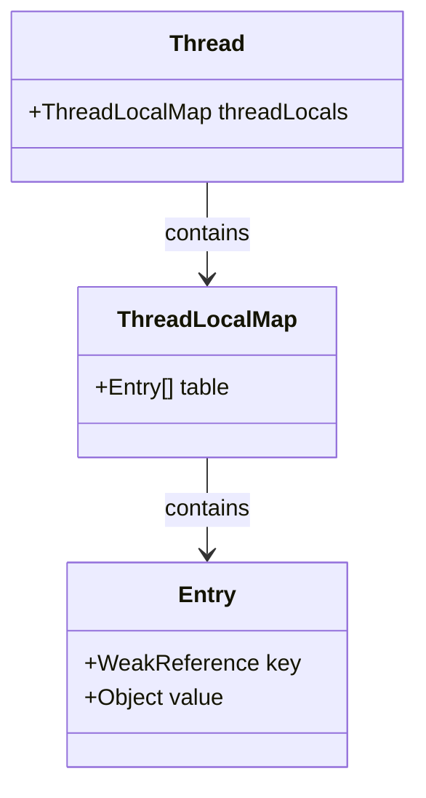

# ThreadLocal 与 CAS 原理

在 Java 并发编程中，除了使用锁（如 `synchronized`、`ReentrantLock`）来保证线程安全外，还有两种非常重要的无锁化/弱锁化技术：**`ThreadLocal`（线程本地变量）** 和 **`CAS`（Compare And Swap，比较并交换）**。本篇将深入剖析它们的底层实现、内存模型以及高频面试痛点。

---

## 一、 ThreadLocal 核心原理与内存泄漏

`ThreadLocal` 提供了线程隔离的局部变量，每个线程都可以通过 `get()` 和 `set()` 来访问属于自己的变量副本，从而避免了多线程竞争。

### 1. ThreadLocal 的内部结构

在早期的 JDK 设计中，`ThreadLocal` 内部维护了一个 Map，以 Thread 为 Key。
而在 **JDK 8** 中，这个设计被反转了：**每个 `Thread` 线程内部都持有一个 `ThreadLocalMap` 成员变量，而这个 Map 的 Key 是 `ThreadLocal` 对象本身，Value 是真正要存储的值。**



```java
public class Thread implements Runnable {
    // 每个线程持有的 ThreadLocalMap
    ThreadLocal.ThreadLocalMap threadLocals = null;
}
```

### 2. 为什么 Entry 的 Key 要设计为弱引用？

`ThreadLocalMap` 的内部类 `Entry` 继承了 `WeakReference`：

```java
static class Entry extends WeakReference<ThreadLocal<?>> {
    /** The value associated with this ThreadLocal. */
    Object value;

    Entry(ThreadLocal<?> k, Object v) {
        super(k); // Key 被包装为弱引用
        value = v;
    }
}
```

**为什么 Key 要设计为弱引用？**
- 如果 Key 是强引用，当我们在业务代码中将 `ThreadLocal` 引用置为 `null`（即不再使用它）时，由于 `ThreadLocalMap` 中的 `Entry` 依然强引用着 `ThreadLocal`，导致 `ThreadLocal` 对象无法被垃圾回收，从而造成内存泄漏。
- 设计为弱引用后，一旦外部对 `ThreadLocal` 的强引用断开，在下一次 GC 时，`ThreadLocal` 对象就会被回收，此时 `Entry` 中的 Key 变为 `null`。

### 3. ThreadLocal 内存泄漏的本质与解决方案

虽然 Key 被设计为弱引用，但 **Value 是强引用**。
当 Key 变为 `null`（被 GC 回收）后，只要当前线程不结束，这条强引用链就会一直存在：
$$\text{Thread} \rightarrow \text{ThreadLocalMap} \rightarrow \text{Entry} \rightarrow \text{Value}$$
由于 Value 无法被回收，而 Key 已经是 `null`，我们再也无法访问到这个 Value，这就导致了**内存泄漏**。

**解决方案**：
- **手动调用 `remove()`**：在使用完 `ThreadLocal` 变量后，必须显式调用其 `remove()` 方法，清除 `ThreadLocalMap` 中对应的 Entry。
  ```java
  private static final ThreadLocal<UserContext> userHolder = new ThreadLocal<>();

  try {
      userHolder.set(currentUser);
      // 业务逻辑
  } finally {
      userHolder.remove(); // 极其重要！防止内存泄漏和线程复用时的数据污染
  }
  ```

**AQS/线程池复用问题**：在线程池场景下，线程是被复用的。如果不调用 `remove()`，下一个任务可能会读取到上一个任务遗留的数据，造成业务逻辑混乱。

---\n\n## 二、 CAS (Compare And Swap) 与 Unsafe 类

CAS 是一种无锁（Lock-Free）的原子操作，它利用 CPU 的硬件指令来实现并发安全。

### 1. CAS 的工作原理

CAS 操作包含三个操作数：
1. **内存位置（V）**：要读写的变量内存地址。
2. **预期原值（A）**：进行比较的旧值。
3. **拟写入新值（B）**：准备写入的新值。

当且仅当内存位置 V 的值等于预期原值 A 时，CAS 才会通过原子指令将 V 的值设为 B。否则，什么都不做。整个比较并替换的操作是一个**原子操作**。

### 2. Unsafe 类与底层实现

在 Java 中，CAS 的底层实现依赖于 `sun.misc.Unsafe` 类。`Unsafe` 类提供了硬件级别的原子操作，其方法大多是 `native` 方法。

以 `AtomicInteger` 的 `getAndAddInt` 为例：
```java
// JDK 8 源码
public final int getAndAddInt(Object o, long offset, int delta) {
    int v;
    do {
        v = this.getIntVolatile(o, offset);
    } while(!this.compareAndSwapInt(o, offset, v, v + delta)); // 自旋尝试
    return v;
}
```
在 CPU 层面，对于 x86 架构，CAS 底层对应的是 `lock cmpxchg` 指令。`lock` 前缀指令会锁住系统总线（或缓存行），确保多核 CPU 下的内存操作原子性。

---\n\n## 三、 CAS 的三大缺点及解决方案

### 1. ABA 问题

**问题描述**：
线程 1 读取到变量的值为 A。在线程 1 准备进行 CAS 更新之前，线程 2 将变量的值改为了 B，随后又改回了 A。当线程 1 进行 CAS 时，发现值依然是 A，于是更新成功。但实际上，这个变量已经被修改过了。

**解决方案**：
引入**版本号（Version）**或**时间戳**。每次修改变量时，版本号加 1。
Java 提供了 `AtomicStampedReference` 来解决 ABA 问题：
```java
// 核心 Entry 结构
private static class Pair<T> {
    final T reference;
    final int stamp; // 版本戳
    private Pair(T reference, int stamp) {
        this.reference = reference;
        this.stamp = stamp;
    }
    static <T> Pair<T> of(T reference, int stamp) {
        return new Pair<T>(reference, stamp);
    }
}
```
通过比较引用和版本戳双重维度，确保 CAS 的绝对安全。

### 2. 循环时间长、CPU 开销大

**问题描述**：
如果高并发下竞争极其激烈，CAS 会一直失败并处于自旋状态（死循环），这会给 CPU 带来极大的计算开销。

**解决方案**：
1. **自适应自旋**：限制自旋次数，超过限制后挂起线程。
2. **分段锁思想（`LongAdder`）**：
   - 核心思想是**热点分散**：内部维护了一个 `Cell` 数组和一个 `base` 变量。当没有竞争时，直接累加到 `base`；当出现竞争时，将不同的线程分流到不同的 `Cell` 里面进行累加，最后求和时将 `base` 和所有 `Cell` 的值相加。这样将单点的 CAS 竞争分摊到了多个 Cell 上，极大地提高了高并发下的吞吐量。

```mermaid
graph TD
    A[线程请求累加] --> B{是否存在竞争?}
    B -->|否| C[CAS 累加到 base 变量]
    B -->|是| D[根据线程 Hash 分流到 Cell 数组]
    D --> E[CAS 累加到对应的 Cell[i]]
    E --> F[最终求和: base + sum(Cells)]
```

### 3. 只能保证一个共享变量 of 原子操作

**问题描述**：
CAS 只能对单个内存地址进行原子操作，无法同时保证多个变量的联合原子性。

**解决方案**：
1. **封装对象**：将多个变量封装到一个对象中，然后使用 `AtomicReference` 来对该对象进行 CAS 操作。
2. **使用锁**：使用锁（如 `synchronized` 或 `ReentrantLock`）来保证多变量操作的原子性。
