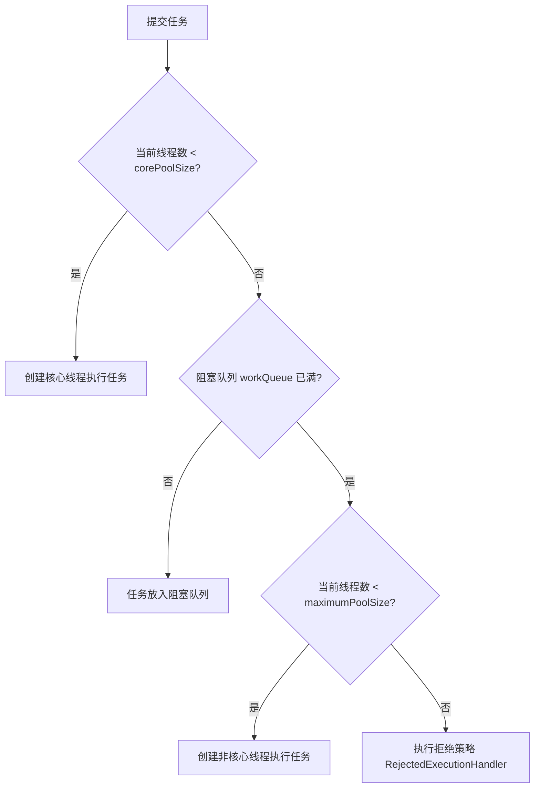

# 线程池深度解析与调优

在 Java 高并发应用中，线程池是管理和复用线程的核心利器。合理配置线程池参数、理解其工作原理以及掌握动态调优手段，是高级 Java 工程师的必备技能。

---

## 一、 线程池核心参数与工作流程

Java 中的线程池核心实现类是 `ThreadPoolExecutor`。

### 1. 核心参数（7 大参数）

```java
public ThreadPoolExecutor(
    int corePoolSize,               //

   int maximumPoolSize,            //

   long keepAliveTime,             //

   TimeUnit unit,                  //

   BlockingQueue<Runnable> workQueue, //

   ThreadFactory threadFactory,    //

   RejectedExecutionHandler handler //

```

1. **`corePoolSize`**：线程池中常驻的核心线程数。即使这些线程处于空闲状态，也不会被销毁（除非设置了 `allowCoreThreadTimeOut`）

**`maximumPoolSize`**：线程池允许创建的最大线程数。当队列满且已创建线程数小于最大线程数时，会继续创建新线程

**`keepAliveTime`**：非核心线程闲置时的存活时间。当线程池中的线程数大于 `corePoolSize` 时，多余的空闲线程在存活时间达到后会被销毁

**`unit`**：`keepAliveTime` 的时间单位

**`workQueue`**：存放待执行任务的阻塞队列

**`threadFactory`**：用于创建新线程的工厂，可以自定义线程名称、守护进程属性等

**`handler`**：当线程池和队列都满了之后的任务拒绝策略。

### 2. 线程池工作流程



> **注意**：线程池在刚创建时，内部默认是没有线程的。只有当任务提交进来时，才会开始创建线程。如果想提前创建核心线程，可以调用 `prestartAllCoreThreads()`。

---

## 二、 阻塞队列与拒绝策略

### 1. 常见阻塞队列（`BlockingQueue`）

- **`ArrayBlockingQueue`**：基于数组的有界阻塞队列，按 FIFO 排序。必须指定大小

**`LinkedBlockingQueue`**：基于链表的阻塞队列，按 FIFO 排序。默认大小为 `Integer.MAX_VALUE`（无界），在高并发下极易导致 OOM，因此**必须手动指定容量**

**`SynchronousQueue`**：不存储元素的阻塞队列。每个插入操作必须等待另一个线程的移除操作，吞吐量极高。`Executors.newCachedThreadPool()` 使用的就是它

**`PriorityBlockingQueue`**：支持优先级排序的无界阻塞队列。

### 2. 内置拒绝策略（`RejectedExecutionHandler`）

- **`AbortPolicy`（默认）**：直接抛出 `RejectedExecutionException` 异常，阻止系统正常运行

**`CallerRunsPolicy`**：“调用者运行”策略。该策略既不会抛弃任务，也不会抛出异常，而是将任务回退给提交任务的线程（如主线程）去执行

**`DiscardOldestPolicy`**：丢弃队列中等待最久的任务，然后重新尝试提交当前任务

**`DiscardPolicy`**：直接丢弃任务，不予任何处理也不抛出异常。

---

## 三、 线程池大小如何合理配置？

线程池大小配置不当，要么导致 CPU 频繁切换上下文（线程数过多），要么导致系统资源无法充分利用（线程数过少）。

### 1. 经典估算公式

根据任务的属性，可以将任务分为 **CPU 密集型** 和 **IO 密集型**：

 **特点**：任务主要消耗 CPU 资源，几乎没有阻塞

**配置公式**：$$\text{线程数} = \text{CPU 核心数} + 1$

**原理**：额外多配置一个线程是为了防止线程因为偶发的页缺失、线程暂停等原因导致 CPU 空闲，保证 CPU 的高利用率。

 **特点**：任务在执行过程中，大部分时间都在等待 IO 操作完成，CPU 处于空闲状态

**配置公式**：$$\text{线程数} = \text{CPU 核心数} \times \left(1 + \frac{\text{线程等待时间}}{\text{线程 CPU 计算时间}}\right)$

**简化公式**：$$\text{线程数} = 2 \times \text{CPU 核心数}$$

### 2. 经典公式的局限性与现代解决方案

**局限性**：在实际生产环境中，一个应用往往混合了多种任务，且流量是动态变化的。静态配置的参数很难在所有场景下都达到最优。


核心思想：不写死线程池参数，而是将 `corePoolSize`、`maximumPoolSize` 和 `workQueue` 的容量等参数接入配置中心（如 Nacos、Apollo）

`ThreadPoolExecutor` 提供了对应的 Setter 方法，允许在运行时动态修改：


- `setKeepAliveTime(long, TimeUnit)

**注意**：`LinkedBlockingQueue` 的 `capacity` 字段是 `final` 修饰的，无法直接修改。如果需要动态修改队列大小，需要自定义一个可修改容量的队列（如重写 `LinkedBlockingQueue`）。

---

## 四、 线程池源码级细节与常见坑

### 1. 线程池状态控制：`ctl` 的妙用

`ThreadPoolExecutor` 内部使用一个 `AtomicInteger` 类型的 `ctl` 变量，同时保存了**线程池运行状态（runState）**和**有效线程数（workerCount）**：

- 高 3 位保存 `runState`

低 29 位保存 `workerCount`。

```java
private final AtomicInteger ctl = new AtomicInteger(ctlOf(RUNNING, 0));
private static final int COUNT_BITS = Integer.SIZE

rivate static final int COUNT_MASK = (1 << COUNT_BITS) - 1; // 0x1fffffff

// 线程池的 5 种状态
private static final int RUNNING    = -1 << COUNT_BITS; // 接受新任务并处理队列任务
private static final int SHUTDOWN   =  0 << COUNT_BITS; // 不接受新任务，但处理队列任务
private static final int STOP       =  1 << COUNT_BITS; // 不接受新任务，不处理队列任务，并中断正在执行的任务
private static final int TIDYING    =  2 << COUNT_BITS; // 所有任务已终止，workerCount 为 0，即将调用 terminated()
private static final int TERMINATED =  3 << COUNT_BITS; // terminated() 执行完毕
```

### 2. 避坑指南

 **问题**：`Executors.newFixedThreadPool` 和 `newSingleThreadExecutor` 默认使用的 `LinkedBlockingQueue` 是无界的，容易堆积任务导致 OOM。`Executors.newCachedThreadPool` 允许的最大线程数是 `Integer.MAX_VALUE`，容易创建大量线程导致 OOM

**解法**：强制使用 `ThreadPoolExecutor` 手动创建，明确指定队列大小和拒绝策略。

 **问题**：使用 `submit(Runnable)` 提交任务时，如果任务内部抛出异常，该异常会被封装在 `Future` 中，如果不调用 `future.get()`，异常信息将完全丢失

**解法**：


 1. 自定义 `ThreadFactory`，设置 `UncaughtExceptionHandler`。

 **问题**：在方法内部临时创建线程池，方法执行完后，如果线程池没有显式调用 `shutdown()`，线程池中的核心线程会一直存活，导致线程池对象和类加载器无法被 GC 回收

**解法**：将线程池定义为单例或全局变量；如果必须在方法内使用，确保在 `finally` 块中调用 `shutdown()`。
