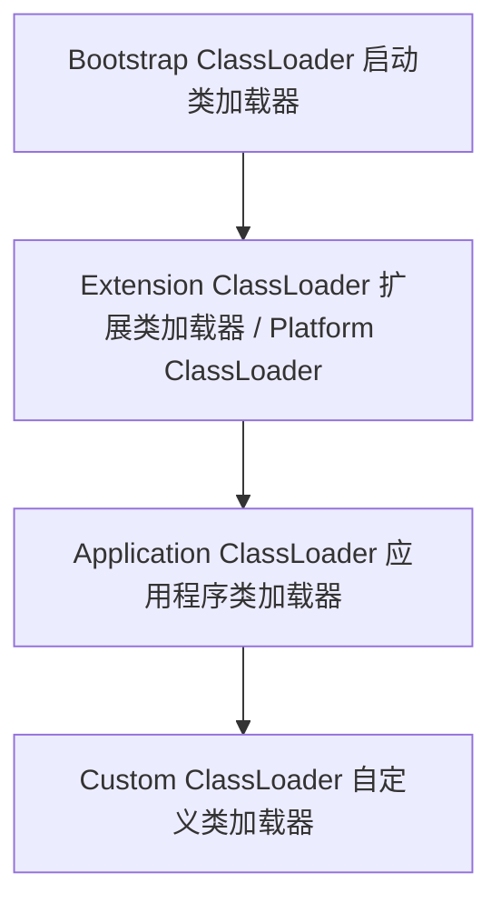

# 类加载机制与字节码技术

Java 的“一次编写，到处运行”（Write Once, Run Anywhere）特性，得益于 JVM 规范、Class 字节码文件以及类加载机制。深入理解类加载的双亲委派模型、如何破坏该模型，以及字节码插桩技术，是资深 Java 工程师的必备底蕴。

---

## 一、 类加载过程深度解析

一个 `.class` 文件被加载到 JVM 内存中，到卸载出内存，它的整个生命周期包括以下 7 个阶段：


其中，**验证、准备、解析**这三个阶段统称为**连接（Linking）**。

### 1. 核心阶段细节

**加载（Loading）**：
- 通过类的全限定名获取定义此类的二进制字节流，并将这个字节流所代表的静态存储结构转化为方法区（元空间）的运行时数据结构，在堆中生成一个代表该类的 `java.lang.Class` 对象。

**准备（Preparation）**：
- 为类的**静态变量（static）**分配内存并设置**默认初始值**（如 `int` 设为 `0`，引用类型设为 `null`）。
- > **注意**：如果是 `public static final int value = 123;`，在准备阶段 `value` 就会被直接初始化为 `123`（因为被 `final` 修饰的常量在编译时就生成了 ConstantValue 属性）。而如果是 `public static int value = 123;`，在准备阶段 `value` 的值是 `0`，在初始化阶段才会变为 `123`。

**解析（Resolution）**：
- 将常量池内的符号引用替换为直接引用（如方法名、类名转换为内存中的直接指针）。

**初始化（Initialization）**：
- 执行类构造器 `<clinit>()` 方法的过程。该方法是由编译器自动收集类中所有静态变量的赋值动作 and 静态代码块（`static {}`）合并产生的。**这是类加载过程中，用户代码真正开始执行的阶段。**

---

## 二、 双亲委派模型及其破坏

JVM 中存在多种类加载器，它们之间呈树状层次结构：



### 1. 双亲委派模型的工作原理

当一个类加载器收到类加载请求时，它首先不会自己去尝试加载这个类，而是把这个请求委派给父类加载器去完成。每一个层次的类加载器都是如此。因此，所有的加载请求最终都应该传送到顶层的启动类加载器中。只有当父加载器反馈自己无法完成这个加载请求（它的搜索范围中没有找到所需的类）时，子加载器才会尝试自己去加载。

**双亲委派模型的好处**：
1. **安全性**：防止核心 API 被篡改。例如，用户自定义了一个 `java.lang.String` 类，双亲委派机制会保证最终加载的是 JDK 自带的 String 类，而不是用户自定义的，从而避免了安全隐患。
2. **避免重复加载**：保证同一个类在 JVM 中只被加载一次。

---\n\n### 2. 破坏双亲委派模型的三种场景

虽然双亲委派模型是推荐的，但在某些特定场景下，为了实现特定的功能，必须破坏它。

**第一种场景：SPI（Service Provider Interface）机制（如 JDBC）**：
- **问题**：核心类 `java.sql.DriverManager` 是由 **Bootstrap ClassLoader** 加载的。但具体的数据库驱动（如 `com.mysql.cj.jdbc.Driver`）是由第三方厂商提供的，存放在 classpath 中，只能由 **Application ClassLoader** 加载。Bootstrap ClassLoader 无法直接加载 classpath 下的类，这就产生了“越界”问题。
- **解决办法**：引入**线程上下文类加载器（Thread Context ClassLoader）**。`DriverManager` 内部通过 `Thread.currentThread().getContextClassLoader()` 获取当前线程的类加载器（默认是 Application ClassLoader），从而逆向委派子类加载器去加载第三方驱动，打破了双亲委派的自下而上委派规则。

**第二种场景：Tomcat 的类加载机制**：
- Tomcat 作为一个 Web 容器，需要解决以下问题：
  1. 容器本身的类库要与应用的类库**隔离**。
  2. 不同的 Web 应用之间的类库要**隔离**。
  3. 不同的 Web 应用之间可以**共享**某些类库。
- **Tomcat 的类加载器结构**：
  ```mermaid
  graph TD
      A[Common ClassLoader] --> B[Catalina ClassLoader 容器私有]
      A --> C[Shared ClassLoader 共享]
      C --> D[WebApp ClassLoader 应用1]
      C --> E[WebApp ClassLoader 应用2]
  ```
  `WebAppClassLoader` 优先加载自己目录下的类（`/WEB-INF/classes`），如果找不到才委派给父加载器，这直接违背了双亲委派模型中“优先委派给父加载器”的原则。

---

## 三、 字节码技术与动态代理

Java 字节码技术允许我们在编译期或运行期动态修改、生成 Class 字节码，从而实现 AOP、动态代理、热部署等高级功能。

### 1. JDK 动态代理与 CGLIB 动态代理的区别

| 维度 | JDK 动态代理 | CGLIB 动态代理 |
| :--- | :--- | :--- |
| **实现原理** | 基于接口实现。动态生成一个实现目标接口的代理类。 | 基于继承实现。动态生成一个继承目标类的子类。 |
| **限制** | 目标类**必须实现至少一个接口**，否则无法使用。 | 目标类和目标方法**不能被 `final` 修饰**，否则无法继承或重写。 |
| **底层技术** | 利用反射机制和 `Proxy`、`InvocationHandler` 生成字节码。 | 利用 ASM 字节码框架，动态生成子类并重写方法。 |
| **执行效率** | JDK 8+ 进行了极大优化，执行效率与 CGLIB 相当甚至略高。 | 动态生成子类，首次生成较慢，但后续调用效率高。 |

### 2. 字节码插桩技术（ASM / Javassist）

字节码插桩是指在不修改 Java 源代码的情况下，直接在编译后的 `.class` 字节码文件中插入特定的字节码指令，从而改变程序的行为。

- **ASM**：一个轻量级、高性能的字节码操作框架。它直接以二进制形式操作字节码，采用访问者模式（Visitor Pattern），学习曲线陡峭，但性能极高。Spring、CGLIB、Fastjson 等底层都依赖 ASM

**Javassist**：一个开源的分析和编辑 Java 字节码的类库。它最大的特点是**可以直接使用 Java 代码字符串来修改字节码**，无需理解底层的 JVM 指令，使用非常简单

**Java Agent（探针）**：
