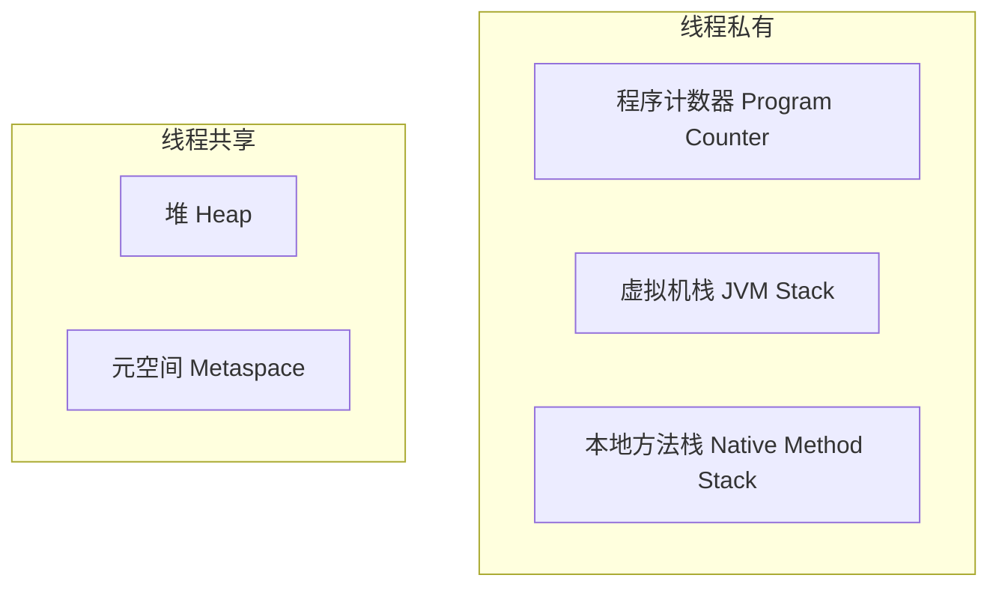
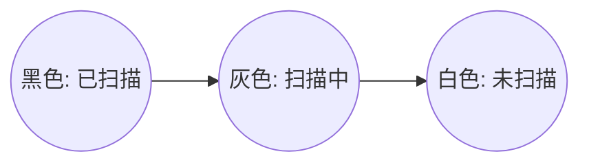
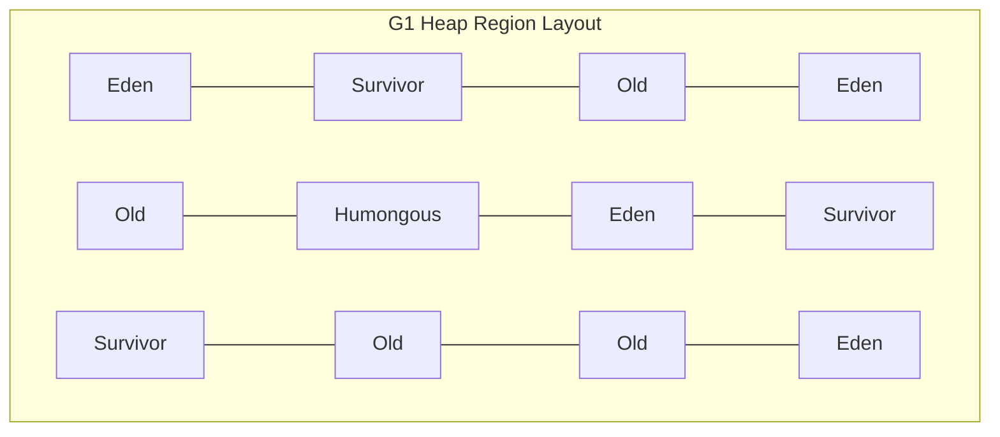

# JVM 内存模型与垃圾回收机制

JVM（Java Virtual Machine）是 Java 程序的运行基石。深入理解 JVM 的内存划分、垃圾回收（GC）算法以及现代垃圾收集器（如 G1、ZGC）的底层原理，是区分初中级与高级/资深 Java 开发的关键。

---

## 一、 JVM 内存模型深度剖析

根据 JVM 规范，运行时数据区（Runtime Data Area）主要划分为以下几个区域：

### 1. 堆外内存与元空间（Metaspace）

在 JDK 8 中，永久代（PermGen）被彻底废除，取而代之的是**元空间（Metaspace）**

**根本区别**：永久代使用的是 JVM 的堆内存，而元空间使用的是**本地内存（Native Memory）**

**引入元空间的原因**：

 1. **简化 GC**：永久代的垃圾回收效率极低，合并到元空间后，类元数据的生命周期与类加载器一致，释放时机更清晰，简化了垃圾回收逻辑。

 2. **避免 OOM**：由于永久代大小受限于 `-XX:MaxPermSize`，在动态生成类较多的场景下极易发生 OOM。而元空间默认只受限于本地物理内存大小。

### 2. 堆外内存（Direct Memory）

堆外内存不属于 JVM 运行时数据区，而是通过 JNI（Java Native Interface）直接在物理内存中分配

**分配方式**：通过 `ByteBuffer.allocateDirect(int)` 或 `sun.misc.Unsafe` 分配

**优点**：避免了在 Java 堆和系统内核缓冲区之间来回复制数据，实现了**零拷贝（Zero-Copy）**，极大地提高了 I/O 性能（如 Netty 广泛使用）

**缺点**：分配和释放的开销较大，且不受 JVM 垃圾回收器的直接控制，容易发生内存泄漏。

---

## 二、 垃圾回收算法与三色标记

### 1. 垃圾判定标准

- **引用计数法**：给对象添加一个引用计数器，每当有一个地方引用它，计数器加 1；引用失效时减 1。**缺点**：无法解决循环引用问题。
- **可达性分析算法（JVM 采用）**：从一系列被称为 **`GC Roots`** 的根对象开始向下搜索，如果一个对象到 `GC Roots` 没有任何引用链相连，则证明此对象是不可用的。

**哪些对象可以作为 GC Roots？**

1. 虚拟机栈（栈帧中的本地变量表）中引用的对象。
2. 方法区中类静态属性引用的对象。
3. 方法区中常量引用的对象（如字符串常量池里的引用）。
4. 本地方法栈中 JNI（Native 方法）引用的对象。
5. JVM 内部的引用，如基本数据类型对应的 Class 对象，常驻异常对象（NullPointerException 等），系统类加载器。

### 2. 三色标记算法（Three-Color Marking）

现代并发垃圾收集器（如 CMS、G1、ZGC）在标记阶段都使用了**三色标记算法**，将对象分为三种颜色：

- **白色**：表示对象尚未被垃圾收集器访问过。在可达性分析开始阶段，所有对象都是白色。若在分析结束时仍为白色，说明不可达，即为垃圾。
- **灰色**：表示对象已被垃圾收集器访问过，但该对象上至少存在一个引用还没有被扫描过。
- **黑色**：表示对象已被垃圾收集器访问过，且该对象的所有引用都已被扫描过。黑色对象是存活的，不能直接指向白色对象（除非中间有灰色对象）。

并发标记阶段，用户线程和 GC 线程并发运行，可能会出现以下情况：

1. 灰色对象断开了对白色对象的引用。
2. 黑色对象重新建立了对该白色对象的引用。

由于黑色对象不会再被扫描，这会导致该白色对象被漏标，最终被错误地回收，导致系统崩溃。

**解决方案**：

- **原始快照（SATB, Snapshot At The Beginning）**：G1 采用。当灰色对象要断开对白色对象的引用时，将这个要断开的引用记录下来。并发标记结束后，以这些记录中的对象为根重新扫描一次。
- **增量更新（Incremental Update）**：CMS 采用。当黑色对象插入指向白色对象的新引用时，将这个新引用记录下来。并发标记结束后，以这些黑色对象为根重新扫描一次。

---\n\n## 三、 现代垃圾收集器：G1 与 ZGC

### 1. G1 (Garbage-First) 收集器

G1 是一款面向服务端应用的垃圾收集器，旨在实现**可预测的停顿时间（Pause Prediction Model）**。

- **内存布局**：G1 彻底放弃了传统的物理分代，而是将整个堆内存划分为大小相等的独立区域（**Region**，1MB~32MB）。每个 Region 可以在运行时动态扮演 **Eden**、**Survivor** 或 **Old** 角色。此外，还有专门存放超大对象的 **Humongous** 区域

**回收机制**：G1 会跟踪各个 Region 里面的垃圾堆积价值（回收所获得的空间大小以及回收所需时间的经验值），在后台维护一个优先级列表，每次根据用户设定的最大 GC 停顿时间（`-XX:MaxGCPauseMillis`），优先回收价值最大的 Region（这也是 Garbage-First 名字的由来）。

### 2. ZGC (Z Garbage Collector) 收集器

ZGC 是 JDK 11 引入的低延迟垃圾收集器（在 JDK 15 中转正），其核心目标是将 **STW（Stop-The-World）停顿时间控制在 10ms（甚至 1ms）以内**，且停顿时间不随堆大小的增加而增加。

**核心黑科技**：

- **染色指针（Colored Pointers）**：在 64 位系统下，ZGC 仅使用 42 位来寻址（支持 4TB 内存，JDK 13 扩展到 16TB），并利用高 4 位来存储 GC 标记信息（Marked0, Marked1, Remapped, Finalizable）。
- **读屏障（Read Barrier）**：读屏障会检查指针的染色位。如果发现对象已经被移动了（正在进行垃圾回收和整理），读屏障会根据转发表（Forwarding Table）自动将指针更新为移动后的新地址。这被称为**自愈（Self-Healing）**。
- **并发整理（Concurrent Compact）**：传统的收集器在整理内存碎片时需要 STW。而 ZGC 配合染色指针和读屏障，实现了**与用户线程并发进行的对象移动和整理**，从而消除了整理阶段的停顿。

---\n\n## 四、 高频面试题与追问

### 1. 为什么 ZGC 的停顿时间能控制在 10ms 以内？

**答**：ZGC 的几乎所有阶段都是并发执行的，包括并发标记、并发准备、并发重定位（整理）等。它的 STW 阶段非常短暂，仅仅用于初始标记、再标记和初始转移等极少数需要同步的初始化操作。这些操作的耗时只与 GC Roots 的数量有关，而与堆内存的大小、堆中对象的数量无关。因此，即使是 1TB 的大堆，ZGC 也能将停顿时间控制在极低水平。

### 2. 什么是 Minor GC、Major GC、Full GC？

**答**：

- **Minor GC / Young GC**：只收集新生代（Eden 和 Survivor）的垃圾回收。
- **Major GC / Old GC**：只收集老年代的垃圾回收（目前只有 CMS 收集器有单独收集老年代的行为）。
- **Full GC**：收集整个 Java 堆和方法区（元空间）的垃圾回收。会导致长时间的 STW，应尽量避免。

### 3. 触发 Full GC 的常见原因有哪些？

**答**：

1. **老年代空间不足**：大对象直接进入老年代，或者长期存活的对象晋升到老年代，导致老年代空间不足。
2. **元空间（Metaspace）空间不足**：动态生成了大量的类，导致元空间达到阈值。
3. **空间分配担保失败**：Promotion Failure 或 Concurrent Mode Failure（CMS 收集器特有）。
4. **显式调用 `System.gc()`**：代码中手动调用了 `System.gc()`（建议通过 `-XX:+DisableExplicitGC` 禁用）。
