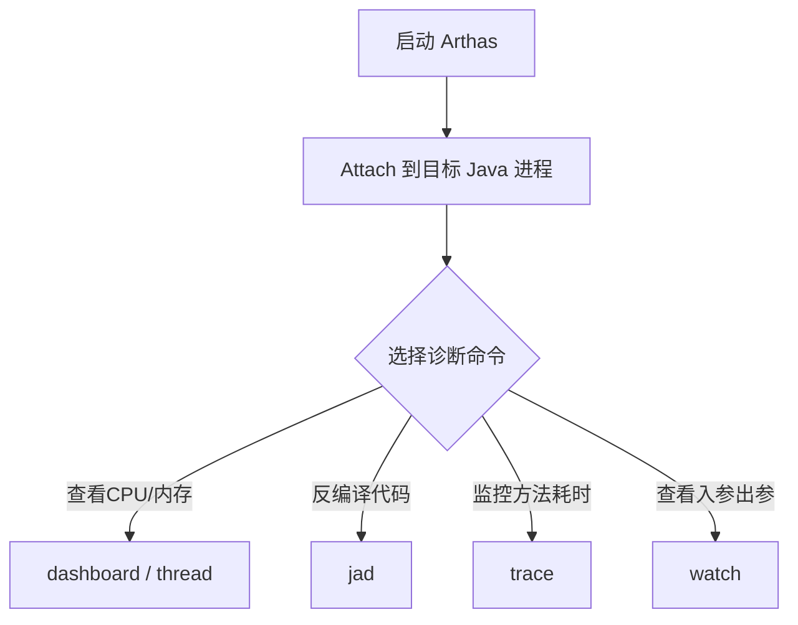

# JVM 调优实战与 Arthas 工具使用

在实际生产环境中，JVM 性能调优和线上故障排查（如 CPU 飙高、内存泄漏、OOM、频繁 Full GC）是高级 Java 工程师的核心竞争力。本篇将结合实战场景，详细介绍排查思路、常用命令以及阿里开源的神器 **Arthas** 的使用。

---

## 一、 线上故障排查思路

### 1. CPU 飙高（100%）排查步骤

当线上服务器 CPU 突然飙高时，通常是因为某个线程在执行死循环、频繁 GC 或者有高并发的密集计算。

  使用 `top` 命令，找出消耗 CPU 最高的 Java 进程 PID。
   ```bash
   top
   ``

**定位高 CPU 线程**：
   使用 `top -Hp <PID>` 展示该进程下所有线程的 CPU 消耗情况，找出最耗 CPU 的线程 TID。
   ```bash
   top -Hp 12345
   ``

**进制转换**：
   将十进制的线程 TID 转换为十六进制（因为 Java 线程栈中的 nid 是十六进制表示的）。
   ```bash
   printf "%x\n" 12346  # 假设 TID 为 12346，输出为 303a
   ``

**打印线程栈**：
   使用 `jstack <PID>` 导出线程栈，并通过 `grep` 过滤出对应的十六进制线程 ID。
   ```bash
   jstack 12345 | grep -A 20 0x303a
   ``

**分析代码**：
   根据打印出的堆栈信息，定位到具体的类和行号，分析是否存在死循环、死锁或不合理的算法。

---

### 2. 内存溢出（OOM）与频繁 Full GC 排查步骤

- `java.lang.OutOfMemoryError: Java heap space`：堆内存溢出。通常是因为内存泄漏、大对象未释放或并发量过大

`java.lang.OutOfMemoryError: Metaspace`：元空间溢出。通常是因为动态生成了太多的类（如 CGLIB 动态代理、未限制大小的 Groovy 脚本）

`java.lang.OutOfMemoryError: Unable to create new native thread`：无法创建更多本地线程。通常是因为线程未及时关闭，或者系统限制了最大线程数。


    ```bash
     -XX:+HeapDumpOnOutOfMemoryError -XX:HeapDumpPath=/tmp/heapdump.hprof
     ```


    ```bash
     jmap -dump:format=b,file=/tmp/heapdump.hprof <PID>
     ``

**使用分析工具**：


- 沿着引用链（Path to GC Roots）向上寻找，找出是谁持有这些对象导致无法被回收。

---

## 二、 JVM 常用命令行工具

JDK 自带了许多强大的命令行工具，位于 `bin` 目录下：

| 工具名称 | 主要功能 | 常用命令示例 |
| :--- | :--- | :--- |
| **`jps`** | 查看正在运行的 Java 进程 PID 及主类名 | `jps -l` |
| **`jstat`** | 监视 JVM 内存、垃圾回收（GC）运行状态 | `jstat -gcutil <PID> 1000 10` (每秒打印一次，共10次) |
| **`jinfo`** | 查看和动态修改 JVM 配置参数 | `jinfo -flag MaxHeapSize <PID>` |
| **`jmap`** | 导出堆内存快照（Heap Dump）或查看内存占用 | `jmap -dump:format=b,file=heap.hprof <PID>` |
| **`jstack`** | 导出线程栈，排查死锁和 CPU 飙高 | `jstack -l <PID>` |

---

## 三、 Arthas 线上诊断神器

**Arthas** 是阿里开源的 Java 诊断工具，采用字节码插桩技术，支持在不重启服务、不修改代码的情况下，动态诊断线上问题。



### 1. 核心命令实战

入 `dashboard`，可以一览系统的整体运行状态，包括线程、内存、GC、Runtime 信息。

 `thread`：列出所有线程

`thread -b`：**一键找出当前阻塞其他线程的死锁线程**（极度实用）

`thread 51`：查看线程 ID 为 51 的详细堆栈

`thread -n 3`：找出最忙的 3 个线程，并打印堆栈（相当于 Linux 下排查 CPU 飙高的前四步）。

上运行的代码和本地不一致？怀疑打包错了？
```bash
jad com.example.demo.controller.UserController
```
直接将 JVM 中加载的类反编译为源码，确认线上运行的代码版本。

需加日志，动态查看方法的输入输出：
```bash
watch com.example.demo.service.UserService getUser "{params, returnObj, throwExp}" -x 2
``

`-x 2`：指定展开层级为 2，方便查看复杂的对象结构。

口响应慢？用 `trace` 找出性能瓶颈：
```bash
trace com.example.demo.controller.UserController getUser
```
Arthas 会打印出 `getUser` 方法内部调用的每一个子方法的耗时，并用红色高亮标出最耗时的步骤。

---

## 四、 真实调优案例分析

### 案例：某电商系统频繁 Full GC 导致接口超时

控报警显示，某微服务接口平均响应时间从 50ms 飙升至 2000ms，CPU 使用率达到 90%。

. 使用 `jstat -gcutil <PID> 1000` 观察，发现 **FGC（Full GC）** 计数每分钟增加 5 次，且每次 FGC 后，老年代（O）的内存占用几乎没有下降（保持在 85% 以上）

使用 Arthas 的 `dashboard` 观察，确认老年代内存已满

导出堆快照并用 MAT 分析，发现内存中存在大量的 `LocalCache` 对象，其内部持有一个 `ConcurrentHashMap`

追溯代码，发现开发人员为了提高性能，设计了一个本地缓存，但**未设置最大容量和过期淘汰机制**。随着商品数据的不断加载，缓存无限膨胀，最终塞满老年代，导致频繁 Full GC。

. 紧急情况下，先重启服务释放内存

修改代码，将本地缓存替换为 **Caffeine** 或 **Guava Cache**，并严格限制最大容量（如 `maximumSize(10000)`）和写入后过期时间

重新发布后，老年代内存稳定在 30% 左右，Full GC 频率降为每天 1 次以下，接口响应恢复正常。
