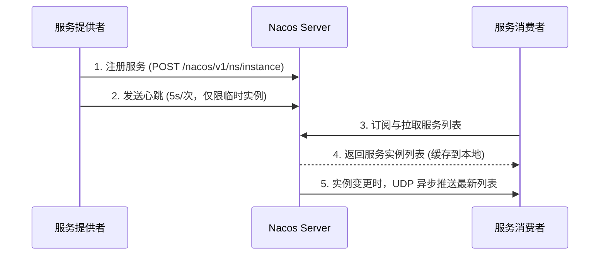

# Spring Boot 自动装配与微服务组件原理

Spring Boot 的出现极大地简化了 Java 应用的搭建和开发，其核心在于**自动装配（Auto-Configuration）**。而在微服务架构中，注册中心（如 Nacos）和限流熔断器（如 Sentinel）则是保障系统高可用的核心组件。

---

## 一、 Spring Boot 自动装配原理

Spring Boot 的核心注解是 `@SpringBootApplication`，它实际上是一个复合注解，最关键的三个子注解为：
1. `@SpringBootConfiguration`（标识这是一个配置类）
2. `@ComponentScan`（扫描包）
3. `@EnableAutoConfiguration`（**自动装配的核心入口**）

```mermaid
graph TD
    A[@SpringBootApplication] --> B[@EnableAutoConfiguration]
    B --> C[@Import AutoConfigurationImportSelector.class]
    C --> D[selectImports 方法]
    D --> E[SpringFactoriesLoader / ImportCandidates]
    E --> F[加载 META-INF/spring.factories 或 META-INF/spring/org.springframework.boot.autoconfigure.AutoConfiguration.imports]
    F --> G[按 @ConditionalOnXxx 条件过滤]
    G --> H[注入到 Spring 容器]
```

### 1. 核心源码分析

自动装配的秘密隐藏在 `@EnableAutoConfiguration` 导入的 `AutoConfigurationImportSelector` 类中：

```java
public class AutoConfigurationImportSelector implements DeferredImportSelector, BeanClassLoaderAware,
        ResourceLoaderAware, BeanFactoryAware, EnvironmentAware, Ordered {
            
    @Override
    public String[] selectImports(AnnotationMetadata annotationMetadata) {
        if (!isEnabled(annotationMetadata)) {
            return NO_IMPORTS;
        }
        // 1. 获取自动装配的配置信息
        AutoConfigurationEntry autoConfigurationEntry = getAutoConfigurationEntry(annotationMetadata);
        return StringUtils.toStringArray(autoConfigurationEntry.getConfigurations());
    }

    protected AutoConfigurationEntry getAutoConfigurationEntry(AnnotationMetadata annotationMetadata) {
        if (!isEnabled(annotationMetadata)) {
            return EMPTY_ENTRY;
        }
        AnnotationAttributes attributes = getAttributes(annotationMetadata);
        // 2. 核心步骤：加载所有的候选配置类
        // 在 Spring Boot 2.7 之前，使用 SpringFactoriesLoader 加载 META-INF/spring.factories
        // 在 Spring Boot 2.7+ / 3.x 中，加载 META-INF/spring/org.springframework.boot.autoconfigure.AutoConfiguration.imports
        List<String> configurations = getCandidateConfigurations(annotationMetadata, attributes);
        
        // 3. 去重、排除不需要的配置
        configurations = removeDuplicates(configurations);
        Set<String> exclusions = getExclusions(annotationMetadata, attributes);
        configurations.removeAll(exclusions);
        
        // 4. 核心步骤：根据 @Conditional 注解进行条件过滤（按需加载）
        configurations = filter(configurations, argument);
        
        return new AutoConfigurationEntry(configurations, exclusions);
    }
}
```

### 2. 条件注解（`@Conditional`）的妙用

Spring Boot 并不是盲目地把所有候选配置类都注入容器，而是通过 `@Conditional` 派生注解进行按需加载：
- `@ConditionalOnClass`：当 Classpath 下存在指定的 Class 时，配置类才生效（如存在 `RedisOperations.class` 才装配 Redis）。
- `@ConditionalOnMissingBean`：当容器中不存在指定的 Bean 时，配置类才生效（允许用户自定义 Bean 来覆盖默认装配）。
- `@ConditionalOnProperty`：当配置文件中指定的属性达到特定值时，配置类才生效。

---

## 二、 Nacos 注册中心底层原理

Nacos（Dynamic Naming and Configuration Service）是阿里开源的、构建云原生应用的关键动态服务发现、配置管理和服务管理平台。

### 1. 服务注册与发现流程



### 2. 核心机制：心跳与健康检查

Nacos 将服务实例分为**临时实例**和**持久实例**：
- **临时实例（默认）**：
  - 采用**客户端主动上报**（心跳机制，默认 5 秒一次）。
  - 如果 Nacos Server 超过 15 秒未收到心跳，会将实例标记为不健康；超过 30 秒未收到心跳，直接剔除该实例。
- **持久实例**：
  - 采用**服务端主动探测**（如 TCP/HTTP/MySQL 探测）。
  - 即使实例不健康，Nacos 也不会剔除它，只会将其标记为不健康，等待其恢复。

### 3. 一致性协议：Distro 与 Raft

Nacos 支持 AP（高可用）和 CP（强一致性）模式的切换：
- **AP 模式（Distro 协议）**：用于服务发现。
  - Distro 是阿里自研的专为临时实例设计的轻量级一致性协议。
  - 每个 Nacos 节点负责一部分服务的写入，写成功后异步同步给其他节点。非主节点也支持读写，保证了极高的写入吞吐量。
- **CP 模式（Raft 协议）**：用于配置管理和持久实例。
  - 保证数据的强一致性，必须有半数以上节点写入成功才算成功。

---

## 三、 Sentinel 限流熔断算法

Sentinel 是阿里开源的分布式系统的流量防卫兵，其核心功能是限流、熔断降级和系统自适应保护。

### 1. 限流算法

Sentinel 提供了多种限流算法，最核心的是**滑动时间窗口算法**和**令牌桶/漏桶算法**。

#### ① 滑动时间窗口（Sliding Window）
- **原理**：将一个大周期（如 1 秒）拆分为多个小窗口（如 5 个 200ms 的窗口）。随着时间的流逝，窗口向右滑动，丢弃最左侧的过期窗口，统计当前滑动窗口内的请求总数。
- **优点**：解决了固定窗口算法在窗口临界点流量翻倍（临界突变）的问题。

```mermaid
gantt
    title 滑动时间窗口 (1s 划分为 5 个 200ms 桶)
    dateFormat  X
    axisFormat %s
    section 窗口
    Bucket 1 (0-200ms) :active, 0, 2
    Bucket 2 (200-400ms) :active, 2, 4
    Bucket 3 (400-600ms) :active, 4, 6
    Bucket 4 (600-800ms) :active, 6, 8
    Bucket 5 (800-1000ms) :active, 8, 10
```



#### ② 令牌桶算法（Token Bucket）
- **原理**：系统以恒定的速率往桶里放入令牌，桶满时令牌溢出。请求到来时必须先从桶里获取令牌，拿到令牌才能通过，拿不到则被限流。
- **特点**：**允许某种程度的突发流量**（只要桶里有现成的令牌）。

#### ③ 漏桶算法（Leaky Bucket）
- **原理**：水（请求）流入漏桶，漏桶以恒定的速率出水（处理请求）。如果流入的水量超过了桶的容量，则溢出（拒绝请求）。
- **特点**：**平滑流量**。无论请求多么汹涌，输出速率永远恒定，无法应对突发流量。

### 2. 熔断降级策略

Sentinel 在调用链路中，如果发现某个资源出现不稳定（如响应时间变长或异常比例升高），会在接下来的时间降级该方法，直接返回降级数据，避免雪崩。

- **慢调用比例 (SLOW_REQUEST_RATIO)**：当方法的响应时间大于设定的 RT 阈值的比例超过限制，触发熔断。
- **异常比例 (ERROR_RATIO)**：当单位统计时间内，方法抛出异常的比例超过阈值，触发熔断。
- **异常数 (ERROR_COUNT)**：当单位统计时间内，方法抛出异常的绝对数量超过阈值，触发熔断。
