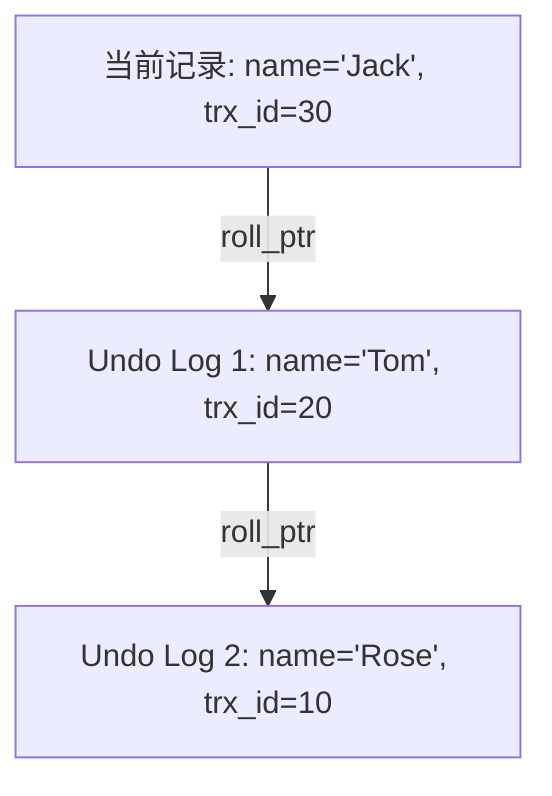

# MySQL MVCC 机制与锁机制

在数据库并发控制中，如何保证多个事务同时读写时的数据一致性与隔离性，是数据库设计的核心难题。MySQL InnoDB 引擎通过 **MVCC（多版本并发控制）** 和 **锁机制** 完美地解决了这一问题。

---

## 一、 MVCC (Multi-Version Concurrency Control) 实现原理

MVCC 是一种无锁化的并发控制机制，用于实现 **RC（读已提交）** 和 **RR（可重复读）** 隔离级别下的**一致性非锁定读**。它使得“读-写”操作互不阻塞，极大地提高了数据库的并发性能。

### 1. MVCC 的三大基石

MVCC 的实现主要依赖于：**隐藏字段**、**Undo Log（回滚日志）** 和 **ReadView（一致性视图）**。

**隐藏字段**：
- InnoDB 在每行数据后面都会自动添加三个隐藏字段：
  - **`DB_TRX_ID` (6字节)**：最近一次插入或修改该行数据的**事务 ID**。
  - **`DB_ROLL_PTR` (7字节)**：**回滚指针**，指向该行数据的 Undo Log。如果该行数据被更新，回滚指针就指向旧版本的数据。
  - **`DB_ROW_ID` (6字节)**：隐式自增 ID（若无主键和唯一索引则自动生成）。

**Undo Log（回滚日志）**：
- 一个事务修改某行数据时，InnoDB 会把修改前的数据写入 Undo Log 中。
- 通过隐藏字段 `DB_ROLL_PTR`，将这些不同版本的 Undo Log 连接起来，就形成了一条**版本链**。

**ReadView（一致性视图）**：
- ReadView 是事务在进行快照读（SELECT）时产生的一个结构，用于判断当前事务能看到版本链中的哪个版本。
- ReadView 包含 4 个核心字段：
  - **`m_ids`**：在创建 ReadView 时，当前系统中**活跃且未提交**的事务 ID 列表。
  - **`min_trx_id`**：创建 ReadView 时，当前系统中活跃的最小事务 ID（即 `m_ids` 中的最小值）。
  - **`max_trx_id`**：创建 ReadView 时，系统应该分配给下一个事务的 ID（即当前最大事务 ID + 1）。
  - **`creator_trx_id`**：创建该 ReadView 的当前事务 ID。

---

### 2. 版本可见性算法

当事务读取某行数据时，会顺着版本链向下寻找，用每个版本的 `trx_id` 与当前事务的 ReadView 进行比对，规则如下：

1. 如果 `trx_id == creator_trx_id`：说明这个版本是当前事务自己修改的，**可见**。
2. 如果 `trx_id < min_trx_id`：说明这个版本在创建 ReadView 之前就已经提交了，**可见**。
3. 如果 `trx_id >= max_trx_id`：说明这个版本是在创建 ReadView 之后才开启的事务修改的，**不可见**。
4. 如果 `min_trx_id <= trx_id < max_trx_id`：
   - 若 `trx_id` 在 `m_ids` 列表中：说明修改该版本的事务尚未提交，**不可见**。
   - 若 `trx_id` 不在 `m_ids` 列表中：说明修改该版本的事务已经提交，**可见**。

---

### 3. RC 与 RR 隔离级别下 ReadView 的生成时机差异

这是面试中的高频深挖点

**RC（Read Committed）**：**每次执行 SELECT 语句时，都会重新生成一个全新的 ReadView**。因此，如果其他事务在两次 SELECT 之间提交了数据，后一次 SELECT 就能看到最新提交的数据，导致**不可重复读**

**RR（Repeatable Read）**：**只在事务第一次执行 SELECT 语句时生成一个 ReadView**，后续的所有 SELECT 都复用这同一个 ReadView。因此，即使其他事务中途提交了修改，当前事务看到的依然是第一次查询时的快照，实现了**可重复读**。

---

## 二、 InnoDB 锁机制

当发生“写-写”竞争时，MVCC 无法解决，必须依赖锁机制。

### 1. 锁的粒度分类

- **表级锁（Table Lock）**：锁定整张表。开销小，加锁快；不会出现死锁；锁定粒度大，并发度最低。
- **行级锁（Row Lock）**：锁定单行数据。开销大，加锁慢；**会出现死锁**；锁定粒度最小，并发度最高。

### 2. 行锁的分类（InnoDB 特有）

InnoDB 的行锁是通过**给索引上的索引项加锁**来实现的，而不是针对记录加锁。如果查询没有走索引，InnoDB 会使用表锁。

- **Record Lock（记录锁）**：仅仅锁住单个索引记录。
  - 例如：`SELECT * FROM t WHERE id = 1 FOR UPDATE;` 会在 `id=1` 的索引记录上加记录锁。
- **Gap Lock（间隙锁）**：锁定一个范围，但不包含记录本身。目的是防止其他事务在这个范围内插入新数据，从而**防止幻读**。
  - 例如：`SELECT * FROM t WHERE id BETWEEN 5 AND 10 FOR UPDATE;` 会锁住 $(5, 10)$ 这个区间，其他事务无法插入 `id=6, 7, 8, 9` 的记录。
- **Next-Key Lock（临键锁）**：**记录锁 + 间隙锁的组合**，既锁住记录本身，又锁住索引前后的间隙。是一个左开右闭的区间。
  - 例如：锁住区间 $(5, 10]$。

---
## 三、 RR 隔离级别下如何解决幻读？

**幻读**：在一个事务内，多次范围查询，后一次查询看到了前一次查询没有看到的“新插入的行”（像出现了幻觉）。

InnoDB 在 **RR（可重复读）** 隔离级别下，通过以下两种方式共同解决了幻读问题：

- 通过 **MVCC** 机制。由于复用第一次生成的 ReadView，即使其他事务插入了新数据，在当前事务的版本可见性算法下也是不可见的，从而避免了幻读

**当前读（SELECT ... FOR UPDATE / LOCK IN SHARE MODE, UPDATE, DELETE）**：
   - 通过 **Next-Key Lock（临键锁）**。在进行当前读时，InnoDB 会对读取的范围加 Next-Key Lock，锁住记录和间隙，阻止其他事务在这个范围内插入新数据，从而在硬件/锁层面杜绝了幻读。
