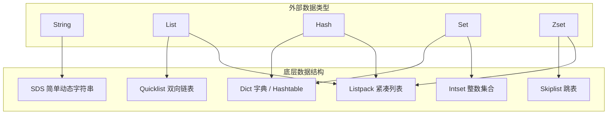
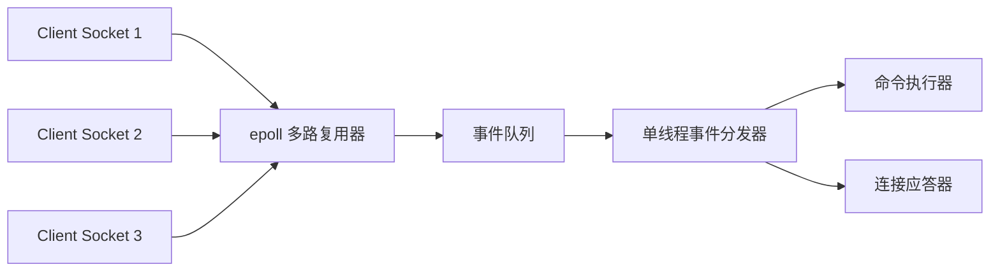

# Redis 核心数据结构与单线程模型

Redis 作为高性能的内存 NoSQL 数据库，在现代互联网架构中扮演着举足轻重的角色。深入理解 Redis 的底层数据结构（如 SDS、跳表）以及其单线程高性能的本质，是高级 Java 工程师面试的必考内容。

---

## 一、 Redis 核心数据结构底层原理

Redis 的外在表现有 5 种基础数据类型：`String`、`List`、`Hash`、`Set`、`Zset`。然而，它们的底层实现是由多种更为高效的数据结构支撑的。



### 1. SDS (Simple Dynamic String) 简单动态字符串

Redis 没有直接使用 C 语言的传统字符串（以 `\0` 结尾的字符数组），而是自己构建了 **SDS**。

#### SDS 的结构定义（以 3.2 版本之后为例，有 `sdshdr5`、`sdshdr8`、`sdshdr16` 等以节省空间）：
```c
struct __attribute__ ((__packed__)) sdshdr8 {
    uint8_t len;         // 1. 已使用长度
    uint8_t alloc;       // 2. 已分配的总长度（不包括空字符）
    unsigned char flags; // 3. 标志位，表示sds的类型（3位表示类型，5位未使用）
    char buf[];          // 4. 字符数组，保存实际数据
};
```

#### 为什么使用 SDS？（与 C 语言字符串对比）
1. **$O(1)$ 获取字符串长度**：C 语言需要遍历整个数组，时间复杂度是 $O(N)$；SDS 内部维护了 `len` 字段，直接读取即可。
2. **杜绝缓冲区溢出**：C 语言在拼接字符串时，如果未分配足够空间，会发生溢出。SDS 在修改前会先检查空间是否足够，若不足则自动扩容。
3. **减少内存重分配次数**：
   - **空间预分配**：当 SDS 扩容时，除了分配所需的空间外，还会额外分配未使用的空间（通常是翻倍分配，最大 1MB），避免频繁扩容。
   - **惰性空间释放**：当字符串缩短时，并不立即释放多余空间，而是用 `alloc` 记录下来，等待后续使用。
4. **二进制安全**：C 语言以 `\0` 判定字符串结束，无法存储图片、音频等二进制数据。SDS 以 `len` 长度判定结束，可以存储任意二进制数据。

---

### 2. Skiplist (跳跃表)

跳表是 **Zset（有序集合）** 的核心底层实现之一（当元素较多或元素较长时使用）。

- **原理**：跳表是在链表的基础上，增加了**多级索引**。通过索引进行跨越式查找，从而将链表的查询时间复杂度从 $O(N)$ 降低到了 **$O(\log N)$**，性能堪比红黑树，但实现和维护比红黑树简单得多。

```mermaid
graph LR
    subgraph Level 2 (Index)
        L2_1[1] --> L2_2[15] --> L2_3[30]
    end
    subgraph Level 1 (Index)
        L1_1[1] --> L1_2[8] --> L1_3[15] --> L1_4[22] --> L1_5[30]
    end
    subgraph Level 0 (Data List)
        D1[1] --> D2[4] --> D3[8] --> D4[12] --> D5[15] --> D6[19] --> D7[22] --> D8[26] --> D9[30]
    end
```

#### 为什么 Redis 选择跳表而不是红黑树来实现 Zset？
1. **范围查询极其高效**：在跳表中进行范围查询（如 `ZRANGEBYSCORE`），只需先 $O(\log N)$ 定位到范围的起点，然后顺着底层的双向链表向后遍历即可。而红黑树进行范围查询需要进行中序遍历，实现复杂且效率较低。
2. **实现更简单、易维护**：红黑树在插入和删除时需要进行复杂的旋转和变色来维持平衡。而跳表只需通过**随机函数**决定新节点的层数，插入和删除只需修改相邻节点的指针，实现非常简单。
3. **内存占用更灵活**：跳表的索引节点平均指针数可以通过参数调节，比红黑树更省内存。

---

## 二、 Redis 单线程高性能模型

“**Redis 是单线程的，为什么还这么快？**” 这是面试中几乎必问的经典问题。

### 1. 核心原因

1. **纯内存操作**：Redis 的所有数据都存储在内存中，CPU 不是 Redis 的瓶颈，内存读写速度极快（通常在纳秒级别）。
2. **高效的数据结构**：如前文所述，SDS、跳表、Dict 等都是专门为高性能设计的。
3. **多路复用 I/O 模型**：这是 Redis 处理海量并发连接的核心。
4. **避免了多线程的开销**：单线程避免了频繁的**上下文切换**和**线程竞争**，也无需考虑各种锁的开销，代码实现极其简单且安全。

---

### 2. I/O 多路复用机制（Reactor 模式）

Redis 采用 **I/O 多路复用程序** 来同时监听多个 Socket 连接。

- **原理**：在 Linux 下，Redis 主要基于 **`epoll`** 实现。`epoll` 允许一个线程同时监听多个文件描述符（Socket）。当某个 Socket 有数据可读或可写时，内核会通知 Redis，Redis 再将事件分发给对应的事件处理器进行处理。
- 这使得 Redis 能够用单线程高效地处理成千上万个并发连接，而不会因为某个连接的阻塞而导致整个服务卡死。



---

### 3. Redis 6.0 引入的多线程

> **面试高分追问**：既然单线程这么好，为什么 Redis 6.0 引入了多线程？

- **原因**：随着网络带宽的提升，Redis 的瓶颈逐渐转移到了**网络 I/O 的读写**上（即解析客户端请求和向客户端写回数据的过程，占用了大量的 CPU 时间）。
- **设计**：Redis 6.0 引入的多线程**仅仅用于处理网络 I/O 的读写**。而**核心的命令执行（数据的读写）依然是由单线程串行执行的**。
- 这样既解决了网络 I/O 的瓶颈，又完美保留了单线程无需加锁、线程安全的优势。
