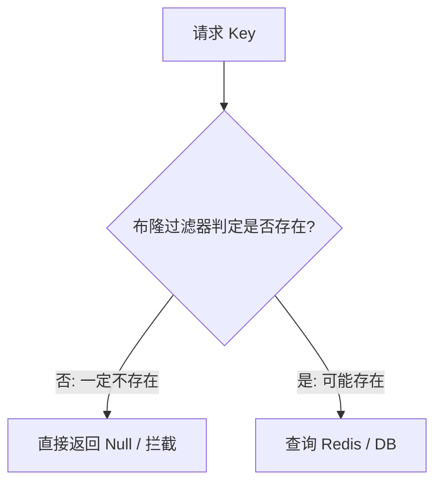

# Redis 缓存实战：三剑客与分布式锁

在实际业务中，Redis 最常用于缓存和分布式锁。如何应对缓存异常场景（穿透、击穿、雪崩），以及如何设计一个安全、高可用的分布式锁，是高级 Java 工程师必须掌握的实战技能。

---

## 一、 缓存三剑客：穿透、击穿、雪崩

| 异常场景 | 现象描述 | 核心解决方案 |
| :--

 **缓存穿透*

 **缓存击穿*

 **缓存雪崩** | **大量缓存 key 同时过期**，或者 **Redis 宕机**。导致海量请求瞬间全部打到数据库，造成数据库雪崩。 | 1. **过期时间加随机盐（Random Salt）**<br/>2. **构建 Redis 高可用集群**<br/>3. **多级缓存（本地缓存 + Redis）** |

### 1. 布隆过滤器（Bloom Filter）原理

布隆过滤器是一种空间效率极高的概率型数据结构，用于判断一个元素**是否一定不存在**或**可能存在**。

- **结构**：一个超长的二进制向量（Bit Array）和多个随机映射函数（Hash Functions）

**工作流程**：


   - 如果对应位置**全部为 `1`**，则该 key **可能存在**（允许穿透去查数据库/缓存）

**缺点**：存在误判率（False Positives），且不支持删除操作（因为删除一个位置的 `1` 可能会影响其他 key 的判定）。



---

## 二、 Redis 分布式锁深度设计

在分布式微服务架构下，Java 的 `synchronized` 和 `ReentrantLock` 只能锁住单个 JVM 进程。跨进程的并发控制需要使用分布式锁。

### 1. 简易分布式锁的缺陷（`SETNX`）

最简单的分布式锁实现是使用 `SETNX`（Set if Not Exists）：
```sql
SETNX lock_key unique_value
EXPIRE lock_key 30
```

**非原子性**：`SETNX` 和 `EXPIRE` 是两条命令。如果执行完 `SETNX` 后 Redis 突然宕机，导致过期时间未设置，该锁将变成**死锁**。


    ```bash
     SET lock_key unique_value NX PX 30000
     ``

**锁被他人误释放**：


    ```lua
     if redis.call("get", KEYS[1]) == ARGV[1] then
         return redis.call("del", KEYS[1])
     else
         return 0
     end
     ```

---

### 2. 工业级解决方案：Redisson 与看门狗（Watch Dog）机制

上述方案依然无法解决**“业务执行时间超过锁过期时间”**的问题。如果业务没执行完，锁就过期了，依然会出现并发安全问题。

**Redisson** 完美地解决了这一痛点，其核心就是**看门狗（Watch Dog）机制**。

```mermaid
sequenceDiagram
    participant Client as 客户端线程
    participant Redisson as Redisson 锁对象
    participant Redis as Redis Server
    participant WatchDog as 看门狗 (后台线程)

    Client->>Redisson:

   Redisson->>Redis:

   Redis-->>Redisson:

   Redisson->>WatchDog:

   loop 每隔 10s (leaseTime / 3)
        WatchDog->>Redis:

   end
    Client->>Redisson:

   Redisson->>Redis:

   Redisson->>WatchDog:

``

1. 客户端 A 加锁成功，默认锁的有效期是 30 秒（可以通过 `lockWatchdogTimeout` 配置）

一旦加锁成功，Redisson 内部会启动一个后台线程（看门狗）

看门狗是一个定时任务，**每隔 10 秒**（即 `lockWatchdogTimeout / 3`）就会向 Redis 发送续期命令，将锁的过期时间重新设置为 30 秒

只要客户端 A 的业务没有执行完（即没有显式调用 `unlock()`），看门狗就会一直续期

如果客户端 A 突然宕机，看门狗线程随之消失，锁在 30 秒后会自动过期释放，防止死锁。

---

### 3. 极端场景：主从切换下的锁丢失问题（Redlock 算法）

- **问题**：在 Redis 主从或哨兵架构下，客户端 A 在 Master 节点上加锁成功。在数据同步到 Slave 节点之前，Master 宕机了。Slave 升级为新的 Master。此时客户端 B 尝试加锁，由于新 Master 上没有锁数据，B 加锁成功。导致 A 和 B 同时持有了锁

**解决方案：Redlock（红锁）算法**：


- **争议**：Redlock 算法在分布式领域存在较大争议（如 Martin Kleppmann 与 Antirez 的论战），且维护成本极高。在实际生产中，如果对一致性要求极高，通常推荐使用 **ZooKeeper** 实现分布式锁（基于临时顺序节点和 Watcher 机制，保证强一致性）。
