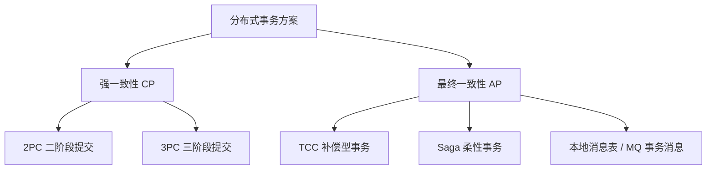
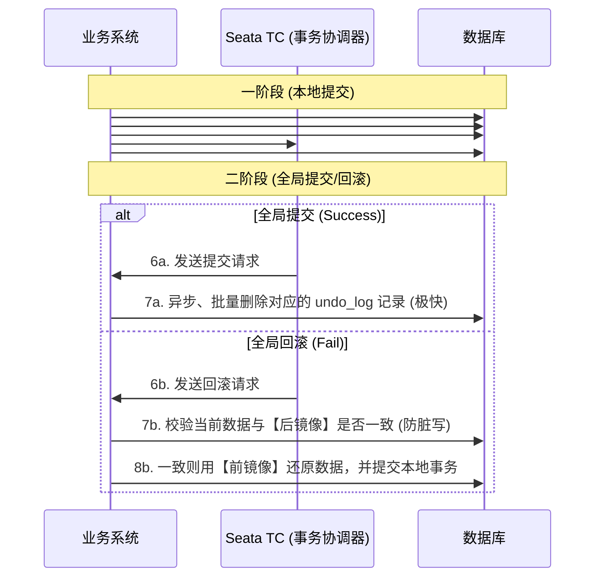

# 分布式事务原理与 Seata 实战

在微服务架构中，一个复杂的业务流程往往需要调用多个微服务，每个微服务都拥有自己独立的数据库。传统的本地事务（ACID）无法保证跨服务、跨数据库的数据一致性，必须引入**分布式事务**。

---

## 一、 分布式事务理论基石：CAP 与 BASE

在设计分布式事务方案之前，必须理解分布式系统的基本理论。

### 1. CAP 定理

CAP 定理指出，在一个分布式系统中，以下三个特性**无法同时满足**，最多只能同时满足两个：

- **Consistency（一致性）**：所有节点在同一时刻看到的数据完全一致

**Availability（可用性）**：系统提供的服务必须一直处于可用状态，每个请求都能收到非错响应（但不保证数据最新）

**Partition Tolerance（分区容错性）**：分布式系统在遇到任何网络分区故障时，仍然能够对外提供服务。

> **核心结论**：在分布式系统中，网络分区（P）是客观存在的，无法避免。因此，架构师只能在 **CP（强一致性）*

- **AP 架构**：为了保证高可用，允许不同节点的数据在短时间内不一致，牺牲强一致性，追求**最终一致性**（如 Eureka、Nacos AP 模式、Seata AT 模式）。

### 2. BASE 理论

BASE 理论是对 CAP 中 AP 方案的延伸，是现代分布式系统设计的核心指导思想

**Basically Available（基本可用）**：分布式系统在出现故障时，允许损失部分可用性（如响应时间延长、非核心功能降级），但保证核心功能可用

**Soft State（软状态）**：允许系统中的数据存在中间状态（如“支付中”、“处理中”），并认为该中间状态不影响系统的整体可用性

**Eventually Consistent（最终一致性）**：系统中的所有数据副本，在经过一段时间的同步后，最终能够达到一致的状态，而不需要实时强一致。

---

## 二、 常见分布式事务解决方案

### 1. 2PC (Two-Phase Commit) 二阶段提交

- **角色**：协调者（Coordinator）和参与者（Participants）

**流程**：

 1. **提交阶段（Commit Phase）**：如果所有参与者都反馈就绪，协调者发送 `commit` 指令，参与者提交事务并释放锁；如果有任意一个参与者反馈失败或超时，协调者发送 `rollback` 指令，参与者回滚本地事务

**致命缺点**：

- **数据不一致**：如果在第二阶段，协调者发送的 `commit` 指令因为网络原因只被部分参与者收到，会导致部分提交、部分未提交的数据不一致问题。

---

### 2. TCC (Try-Confirm-Cancel) 补偿型事务

TCC 是一种应用层面的柔性事务方案，将业务逻辑拆分为三个方法：

- **Try（尝试）**：完成所有业务检查，**预留/冻结**业务资源

**Confirm（确认）**：真正执行业务，只使用 Try 阶段预留的资源。Confirm 阶段默认不会出错，如果出错需要重试

**Cancel（取消）**：释放 Try 阶段预留的资源。

- **解决办法**：在分支事务记录表中增加状态字段。Cancel 执行时，先判断 Try 是否执行过，若未执行，则进行空回滚

**幂等性（Idempotence）**：

- **解决办法**：通过全局唯一的事务 ID（XID）和分支 ID 进行幂等校验，确保多次执行结果一致

**悬挂（Hanging）**：

- **解决办法**：在执行 Try 时，先检查当前分支的 Cancel 是否已经执行过。如果 Cancel 已经执行过，则直接拒绝 Try 的执行。

---

## 三、 Seata 分布式事务框架

Seata（Simple Extensible Autonomous Transaction Architecture）是阿里开源的工业级分布式事务解决方案。它提供了 **AT**、**TCC**、**SAGA** 和 **XA** 四种事务模式。

### 1. Seata AT 模式（无侵入、最常用）

AT 模式是 Seata 的王牌模式，对业务代码**零侵入**。其底层基于**拦截 JDBC 驱动**，自动生成回滚日志（Undo Log）来实现。

- 在一阶段本地事务提交前，Seata 会向 TC（Transaction Coordinator）申请**全局锁**

如果另一个非 Seata 管理的事务尝试修改同一行数据，由于无法获取全局锁，该修改会被阻塞或拒绝，从而在全局层面避免了脏写。
