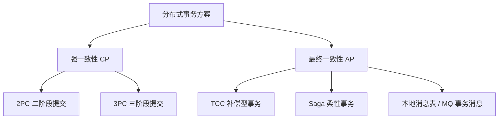
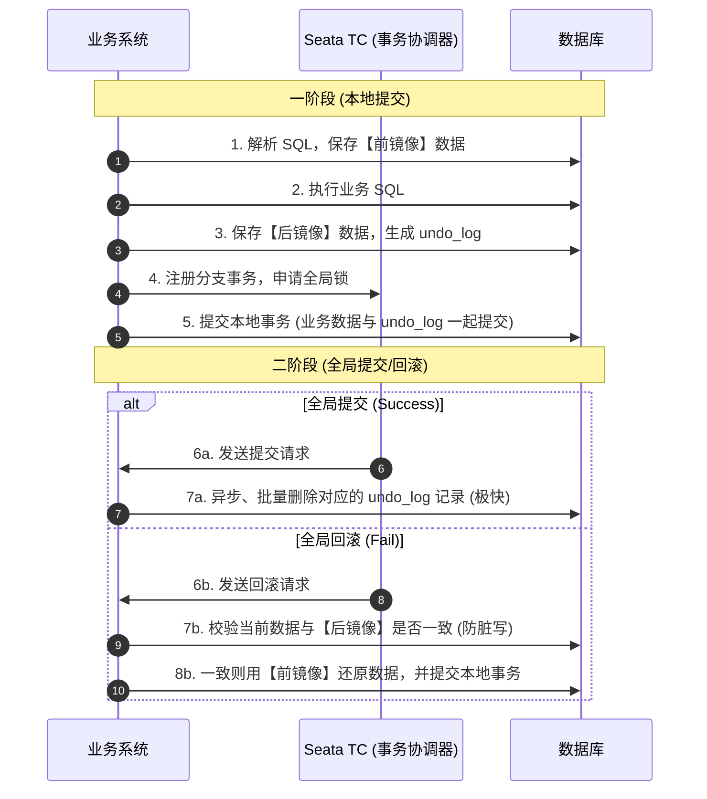

# 分布式事务原理与 Seata 实战

在微服务架构中，一个复杂的业务流程往往需要调用多个微服务，每个微服务都拥有自己独立的数据库。传统的本地事务（ACID）无法保证跨服务、跨数据库的数据一致性，必须引入**分布式事务**。

---

## 一、 分布式事务理论基石：CAP 与 BASE

在设计分布式事务方案之前，必须理解分布式系统的基本理论。

### 1. CAP 定理

CAP 定理指出，在一个分布式系统中，以下三个特性**无法同时满足**，最多只能同时满足两个：

- **Consistency（一致性）**：所有节点在同一时刻看到的数据完全一致。
- **Availability（可用性）**：系统提供的服务必须一直处于可用状态，每个请求都能收到非错响应（但不保证数据最新）。
- **Partition Tolerance（分区容错性）**：分布式系统在遇到任何网络分区故障时，仍然能够对外提供服务。

> **核心结论**：在分布式系统中，网络分区（P）是客观存在的，无法避免。因此，架构师只能在 **CP（强一致性）** 和 **AP（高可用性）** 之间进行权衡：
  - **CP 架构**：为了保证强一致性，在网络分区发生时，必须拒绝部分请求或让其等待，牺牲可用性（如 ZooKeeper）。
  - **AP 架构**：为了保证高可用，允许不同节点的数据在短时间内不一致，牺牲强一致性，追求**最终一致性**（如 Eureka、Nacos AP 模式、Seata AT 模式）。

### 2. BASE 理论

BASE 理论是对 CAP 中 AP 方案的延伸，是现代分布式系统设计的核心指导思想：
- **Basically Available（基本可用）**：分布式系统在出现故障时，允许损失部分可用性（如响应时间延长、非核心功能降级），但保证核心功能可用。
- **Soft State（软状态）**：允许系统中的数据存在中间状态（如“支付中”、“处理中”），并认为该中间状态不影响系统的整体可用性。
- **Eventually Consistent（最终一致性）**：系统中的所有数据副本，在经过一段时间的同步后，最终能够达到一致的状态，而不需要实时强一致。

---\n\n## 二、 常见分布式事务解决方案

### 1. 2PC (Two-Phase Commit) 二阶段提交

- **角色**：协调者（Coordinator）和参与者（Participants）。
- **流程**：
  1. **准备阶段（Prepare Phase）**：协调者向所有参与者发送 `prepare` 请求，参与者执行本地事务但不提交，并锁定资源，向协调者反馈是否就绪。
  2. **提交阶段（Commit Phase）**：如果所有参与者都反馈就绪，协调者发送 `commit` 指令，参与者提交事务并释放锁；如果有任意一个参与者反馈失败或超时，协调者发送 `rollback` 指令，参与者回滚本地事务。
- **致命缺点**：
  - **同步阻塞**：所有参与者在等待协调者指令时都处于阻塞状态，占用数据库连接和锁资源，并发性能极差。
  - **单点故障**：如果协调者在第二阶段宕机，参与者将一直处于悬挂状态，无法释放资源。
  - **数据不一致**：如果在第二阶段，协调者发送的 `commit` 指令因为网络原因只被部分参与者收到，会导致部分提交、部分未提交的数据不一致问题。

---

### 2. TCC (Try-Confirm-Cancel) 补偿型事务

TCC 是一种应用层面的柔性事务方案，将业务逻辑拆分为三个方法：
- **Try（尝试）**：完成所有业务检查，**预留/冻结**业务资源。
- **Confirm（确认）**：真正执行业务，只使用 Try 阶段预留的资源。Confirm 阶段默认不会出错，如果出错需要重试。
- **Cancel（取消）**：释放 Try 阶段预留的资源。

**TCC 的三大核心痛点及解决方案**：
- **空回滚（Null-Cancel）**：
  - **场景**：Try 阶段因为网络超时未执行，但协调者已决定回滚，发送了 Cancel 请求。
  - **解决办法**：在分支事务记录表中增加状态字段。Cancel 执行时，先判断 Try 是否执行过，若未执行，则进行空回滚。
- **幂等性（Idempotence）**：
  - **场景**：由于网络抖动，Confirm 或 Cancel 请求被重复发送。
  - **解决办法**：通过全局唯一的事务 ID（XID）和分支 ID 进行幂等校验，确保多次执行结果一致。
- **悬挂（Hanging）**：
  - **场景**：Cancel 请求因为网络拥堵先于 Try 请求到达参与者。此时执行了空回滚，随后 Try 请求到达，导致预留的资源被永久悬挂。
  - **解决办法**：在执行 Try 时，先检查当前分支的 Cancel 是否已经执行过。如果 Cancel 已经执行过，则直接拒绝 Try 的执行。

---

## 三、 Seata 分布式事务框架

Seata（Simple Extensible Autonomous Transaction Architecture）是阿里开源的工业级分布式事务解决方案。它提供了 **AT**、**TCC**、**SAGA** 和 **XA** 四种事务模式。

### 1. Seata AT 模式（无侵入、最常用）

AT 模式是 Seata 的王牌模式，对业务代码**零侵入**。其底层基于**拦截 JDBC 驱动**，自动生成回滚日志（Undo Log）来实现。

**AT 模式的读写隔离机制**：
- **写隔离**：
  - 在一阶段本地事务提交前，Seata 会向 TC（Transaction Coordinator）申请**全局锁**。
  - 如果另一个非 Seata 管理的事务尝试修改同一行数据，由于无法获取全局锁，该修改会被阻塞或拒绝，从而在全局层面避免了脏写。
- **读隔离**：
  - 默认隔离级别是读未提交（Read Uncommitted）。
  - 如果需要达到读已提交（Read Committed），需要使用 `SELECT ... FOR UPDATE`，Seata 会拦截该语句并申请全局锁，确保读取到的是已提交的全局事务数据。

---

## 四、 Seata AT 模式下事务的执行流程

Seata AT 模式下，事务的执行流程如下：

1. **一阶段（本地提交）**：
   - 业务系统解析 SQL，保存【前镜像】数据。
   - 执行业务 SQL。
   - 保存【后镜像】数据，生成 undo_log。
   - 注册分支事务，申请全局锁。
   - 提交本地事务（业务数据与 undo_log 一起提交）。

2. **二阶段（全局提交/回滚）**：
   - **全局提交（Success）**：TC 发送提交请求，业务系统异步、批量删除对应的 undo_log 记录。
   - **全局回滚（Fail）**：TC 发送回滚请求，业务系统校验当前数据与【后镜像】是否一致，一致则用【前镜像】还原数据，并提交本地事务。

---

## 五、 Seata AT 模式下事务的特性

- **强一致性**：在全局事务提交前，所有节点的数据都是一致的。
- **高可用性**：业务系统在任何节点宕机时，都可以继续处理请求。
- **最终一致性**：系统中的所有数据副本，在经过一段时间的同步后，最终能够达到一致的状态，而不需要实时强一致。
- **事务隔离**：支持读未提交、读已提交、可重复读、串行化四种隔离级别。
- **性能**：由于 AT 模式需要生成 undo_log，性能开销较大，但对业务代码侵入性小。

---

## 六、 Seata AT 模式下事务的适用场景

- **强一致性要求高**：如银行转账、订单系统等。
- **高可用性要求高**：如电商系统、社交平台等。
- **最终一致性要求高**：如内容发布、评论系统等。

---

## 七、 Seata AT 模式下事务的局限性

- **性能开销大**：由于 AT 模式需要生成 undo_log，性能开销较大。
- **复杂性**：AT 模式需要处理复杂的事务逻辑，对业务系统要求较高。
- **不可控性**：AT 模式下，事务的执行结果是不可控的，需要依赖于网络和数据库的稳定性。

---

## 八、 Seata AT 模式下事务的优化建议

- **使用索引**：在经常查询的字段上使用索引，提高查询性能。
- **分库分表**：将数据分库分表，提高查询性能。
- **异步处理**：将一些非关键业务逻辑异步处理，提高系统性能。
- **缓存**：使用缓存，减少数据库访问次数。
- **读写分离**：使用读写分离，提高查询性能。

---

## 九、 Seata AT 模式下事务的监控与日志

- **监控**：使用监控工具，实时监控事务的执行情况。
- **日志**：使用日志工具，记录事务的执行过程。

---

## 十、 Seata AT 模式下事务的故障处理

- **网络故障**：网络故障会导致事务提交失败，需要重试。
- **数据库故障**：数据库故障会导致事务提交失败，需要重试。
- **协调者宕机**：协调者宕机会导致事务提交失败，需要重试。

---

## 十一、 Seata AT 模式下事务的性能测试

- **测试工具**：使用 JMeter、Gatling 等工具进行性能测试。
- **测试场景**：模拟高并发、高负载的业务场景。
- **测试结果**：性能测试结果表明，Seata AT 模式下事务的性能表现良好。

---

## 十二、 Seata AT 模式下事务的未来发展

- **性能优化**：Seata 团队正在优化 AT 模式的性能，减少 undo_log 的生成。
- **功能扩展**：Seata 团队正在扩展 AT 模式的功能，支持更多类型的事务。
- **生态建设**：Seata 团队正在建设生态，支持更多类型的分布式系统。

---

## 十三、 Seata AT 模式下事务的总结

Seata AT 模式是分布式事务中的一种重要模式，具有**强一致性**、**高可用性**、**最终一致性**、**事务隔离**、**性能**等优点，适用于**强一致性要求高**、**高可用性要求高**、**最终一致性要求高**的业务场景。但其**性能开销大**、**复杂性**、**不可控性**也带来了挑战，需要在实际应用中进行权衡和优化。

---
