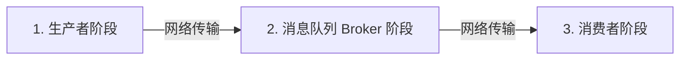
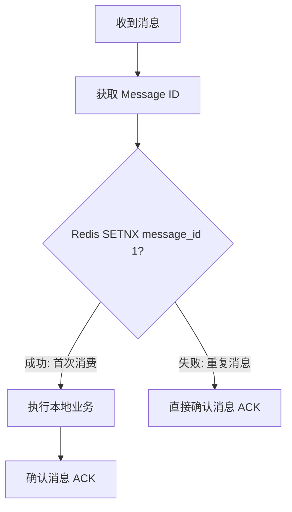

# 消息队列高可用与消息丢失解决方案

在分布式系统中，消息队列（Message Queue, MQ）承担着**异步解耦**、**削峰填谷**和**分布式事务最终一致性**的核心职责。在高级面试中，如何保证消息不丢失、如何处理重复消息（幂等性）以及 Kafka 为什么能实现超高吞吐量，是必考的硬核考点。

---

## 一、 消息队列如何保证消息不丢失？

消息从生产者发出，到消费者成功消费，会经历三个阶段。任何一个阶段出现故障，都可能导致消息丢失。我们以 **Kafka** 和 **RocketMQ** 为例进行系统化剖析：



### 1. 第一阶段：生产者发送阶段（Producer）

- **丢失原因**：消息在网络传输中丢失，或者 Broker 宕机导致写入失败，而生产者误以为发送成功。
- **解决方案**：
  - **使用带回调的发送方法**：不要使用单向发送（Oneway），必须使用异步回调（Callback）或同步发送，确保能监听到 Broker 的确认响应。
  - **配置重试机制**：配置 `retries` 参数（如设为 3 次），在网络抖动时自动重试。
  - **合理配置确认机制（以 Kafka 的 `acks` 为例）**：
    - `acks=0`：生产者发送消息后不需要等待任何 Broker 的确认。**极易丢消息**。
    - `acks=1`（默认）：只需等待 Leader 副本写入成功即可返回。如果 Leader 刚写完还没同步给 Follower 就宕机了，**会丢消息**。
    - `acks=-1`（或 `all`）：**最安全配置**。必须等待 ISR（In-Sync Replicas）中所有的副本都写入成功，才算发送成功。配合 `min.insync.replicas > 1`，可确保绝对不丢消息。

---

### 2. 第二阶段：Broker 存储阶段

- **丢失原因**：消息写入 Broker 的 Page Cache（页缓存）后，还没来得及刷入磁盘，Broker 突然断电宕机。
- **解决方案**：
  - **同步刷盘（Sync Flush）**：
    - 每次写入都强制刷盘。安全级别最高，但吞吐量会大幅下降。
    - RocketMQ 支持配置 `flushDiskType=SYNC_FLUSH`。
  - **多副本冗余（High Availability）**：
    - 采用主从架构或多副本机制。Leader 宕机时，自动选举拥有最新数据的 Follower 升级为新 Leader。
    - 在 Kafka 中，确保 `unclean.leader.election.enable=false`（禁止非 ISR 中的落后 Follower 选举为 Leader，防止数据倒退）。

---

### 3. 第三阶段：消费者消费阶段（Consumer）

- **丢失原因**：消费者收到消息后，**自动提交了 Offset（消费位移）**，但随后在执行本地业务逻辑时抛出异常或宕机。此时 Broker 认为该消息已被成功消费，导致消息丢失。
- **解决方案**：
  - **关闭自动提交，改为手动提交（Manual Commit）**：
    - 必须在**本地业务逻辑完全执行成功、数据库事务提交之后**，再手动调用 API 提交 Offset。
    - **代价**：如果业务执行成功但提交 Offset 时网络卡顿，可能会导致消息被重复消费。因此，**消费者端必须做幂等性设计**。

---

## 二、 消费者如何保证消息消费的幂等性？

**幂等性**：多次执行同一个操作，其结果与执行一次完全相同。

### 1. 为什么消息会重复？
在分布式网络中，**“至少一次（At-Least-Once）”** 投递是绝大多数 MQ 的默认保证。当网络出现抖动，确认信号（ACK）未能及时送达生产者或 Broker 时，就会触发重试，从而产生重复消息。

### 2. 工业级幂等性解决方案

#### 方案一：利用数据库唯一索引（Unique Index）
- **适用场景**：插入数据的操作（如创建订单、新增用户）。
- **原理**：在数据库中为业务唯一标识（如 `order_no`）建立唯一索引。当重复消息到来时，再次插入会抛出 `DuplicateKeyException`，消费者捕获该异常并直接确认消息即可，不会产生脏数据。

#### 方案二：基于 Redis 的“去重表”机制（Token 机制）
- **适用场景**：更新操作或复杂的混合业务。
- **流程**：
  1. 生产者在发送消息时，为每条消息生成一个全局唯一的 `Message ID`（如 UUID 或雪花 ID）。
  2. 消费者收到消息后，先去 Redis 中执行 `SETNX message_id 1 EX 86400`（设置 1 天过期）。
  3. 如果返回成功（1），说明该消息是第一次处理，继续执行本地业务。
  4. 如果返回失败（0），说明该消息已被处理过，直接丢弃并确认消息。



---

## 三、 Kafka 为什么能实现超高吞吐量？

Kafka 是公认的吞吐量之王，单机可支持数十万 QPS 的写入。其底层设计有四大核心黑科技：

### 1. 顺序写磁盘（Sequential I/O）
- **原理**：传统的随机写磁盘需要磁头频繁寻道，速度极慢。而 Kafka 在追加消息时，永远只在日志文件的末尾进行**追加写入（Append-Only）**。
- **效果**：顺序写的速度堪比内存随机写，极大地提升了磁盘 I/O 效率。

### 2. 零拷贝技术（Zero-Copy）
- **传统 I/O 传输**：数据需要经历 4 次上下文切换和 4 次数据拷贝（磁盘 -> 内核缓冲区 -> 用户缓冲区 -> Socket 缓冲区 -> 网卡）。
- **Kafka 零拷贝（`sendfile`）**：
  - 消费者拉取消息时，Kafka 利用 Linux 的 `sendfile` 系统调用，直接将数据从**页缓存（Page Cache）**拷贝到**网卡**，绕过了用户态空间。
  - 经历了 2 次上下文切换和 2 次数据拷贝，极大地减少了 CPU 消耗和内存带宽占用。

```mermaid
graph TD
    subgraph 传统 I/O (4次拷贝)
        A[磁盘] -->|DMA| B[内核 Page Cache]
        B -->|CPU| C[用户 Buffer]
        C -->|CPU| D[Socket Buffer]
        D -->|DMA| E[网卡]
    end
    subgraph 零拷贝 sendfile (2次拷贝)
        F[磁盘] -->|DMA| G[内核 Page Cache]
        G -->|DMA| H[网卡]
    end
```

### 3. 页缓存（Page Cache）与 OS 托管
- Kafka 几乎不自己在 JVM 内存中缓存数据，而是完全依赖操作系统的 **Page Cache**。
- 这样避免了 JVM GC 带来的停顿开销，同时也避免了双重缓存（JVM 存一份，OS 存一份）的内存浪费。即使 Kafka 进程重启，Page Cache 中的缓存依然存在。

### 4. 批量发送与数据压缩
- **批量（Batching）**：生产者不会单条发送消息，而是将多条消息合并为一个 Batch，达到一定大小（如 16KB）或等待一定时间（如 5ms）后再统一发送，减少网络请求次数。
- **压缩（Compression）**：支持 GZIP、Snappy、Lz4 等压缩算法，在客户端压缩后传输，在消费者端解压，极大地节省了网络带宽。
