# 人工智能学习路线与知识体系

欢迎来到 **AI / 人工智能** 知识库！本板块专为开发者与 AI 爱好者打造，无论你是零基础小白还是想进阶大模型工程化的开发者，都能在这里找到清晰、直观、可落地且包含完整算例与图解的教程。

从数学基础、神经网络原理，到大语言模型（LLM）、RAG（检索增强生成）、AI Agent 智能体以及 MLOps 部署，全链路拆解 AI 核心技术。

---

## 🗺️ 全栈 AI 知识图谱

```mermaid
graph TD
    A[人工智能学习路线] --> B[01. 基础准备]
    A --> C[02. 机器学习与深度学习]
    A --> D[03. 大语言模型 LLM]
    A --> E[04. RAG 与向量数据库]
    A --> F[05. AI Agent 智能体开发]
    A --> G[06. MLOps & LLMOps]

    B --> B1["线性代数/概率论/微积分"]
    B --> B2["Python 科学计算 NumPy/Pandas"]
    B --> B3["PyTorch / TensorFlow 深度学习框架"]

    C --> C1["经典 ML: 线性回归/决策树/SVM"]
    C --> C2["深度学习: CNN / RNN / Attention"]
    C --> C3[Transformer 架构原理]

    D --> D1[Prompt 工程与提示词设计]
    D --> D2["微调技术: LoRA / QLoRA / P-Tuning"]
    D --> D3["模型评估与对齐 RLHF / DPO"]

    E --> E1["RAG 架构: Chunking / Embedding"]
    E --> E2["向量数据库: Milvus / Chroma / Qdrant"]
    E --> E3[重排序 Rerank 与混合检索]

    F --> F1[Agent 单体架构与 ReAct 模式]
    F --> F2["框架选型: LangChain / LlamaIndex / LangGraph"]
    F --> F3["多智能体协同: AutoGen / CrewAI"]

    G --> G1["推理加速: vLLM / Ollama / TensorRT-LLM"]
    G --> G2[LLM 监控、Guardrails 与量化]
```



---

## 🚀 零基础小白四步走学习路线

```
[阶段 1: 玩转应用]  --->  [阶段 2: 理解核心]  --->  [阶段 3: 架构进阶]  --->  [阶段 4: 工程落地]
使用 API/Ollama              搞懂 Transformer            搭 RAG & ReAct Agent       模型微调与推理加速
(1-2 周快速建立信心)         (3-4 周打牢理论底座)        (4-6 周搭建业务系统)       (持续进阶与高可用)
```

1. **第一阶段：应用上手（1-2周）**：先别陷入数学公式！用 Ollama 在本地跑起第一个大模型，调用 API 或 LangChain 搭建极简对话 Demo，直观感受“输入 Prompt，输出 Response”。
2. **第二阶段：打牢底座（3-4周）**：学习向量（Vector）、矩阵乘法、PyTorch 自动求导与 Transformer 架构，搞懂注意力机制（Self-Attention）为什么能“理解上下文”。
3. **第三阶段：业务赋能（4-6周）**：学习 RAG（让 LLM 联网和读取私有文档）和 ReAct Agent（让 LLM 具备自主思考与调用 Tool 的能力），用向量数据库管理千百份文档。
4. **第四阶段：工程与微调（持续进阶）**：学习 LoRA / QLoRA 参数高效微调，使用 vLLM 提升模型推理吞吐量率，打造高可用生产级 AI 服务。

---

## 💻 硬件环境与前置依赖指南

为了让你顺畅运行本专栏中的完整代码，建议准备以下环境：

| 学习模块 | 推荐硬件配置 | 推荐 Python 版本 | 核心依赖库 | 小白避坑提示 |
| :--- | :--- | :--- | :--- | :--- |
| **01 基础与 02 Transformer** | 普通 CPU 电脑（8G 内存即可） | Python 3.10+ | `torch`, `numpy`, `matplotlib` | 刚开始无需买显卡，PyTorch 支持 CPU 模式调试 |
| **03 模型微调 (LoRA)** | N 卡（显存 $\ge$ 12GB/16GB，如 RTX 3060/4060Ti 或 Google Colab 免费 T4） | Python 3.10+ | `peft`, `transformers`, `datasets`, `bitsandbytes` | Windows 运行 QLoRA 量化建议用 WSL2 环境 |
| **04 RAG & 05 Agent** | 普通 CPU / Mac M 系列 / 任意独立显卡 | Python 3.10+ | `qdrant-client`, `sentence-transformers`, `langgraph` | 向量数据库优先使用本地内存模式，零配置启动 |
| **06 推理加速 (vLLM/Ollama)** | 带有 NVIDIA GPU 的 Linux / WSL2 系统或 Mac (Ollama) | Python 3.10+ | `vllm`, `requests` | Ollama 支持 CPU/Mac 开箱即用；vLLM 仅限 Linux/WSL2 |

---

## 📖 高频硬核术语“小白通俗字典”

初学者看 AI 文档最头疼的就是满屏英文缩写，先记住这几张“通俗卡片”：

- 💡 **Embedding（向量化）**：把文字/图片变成一串有语义含义的数字（坐标）。比如“苹果”和“香蕉”的向量距离很近，“苹果”和“飞机”的向量距离很远。
- 💡 **KV Cache（键值缓存）**：大模型生成文字时“记住前面看过的词”的加速缓存区，避免每说一个新词都要把前面的文本重新算一遍。
- 💡 **LoRA（低秩微调）**：在原本冻结的大模型旁边贴两个“小号外挂矩阵”，只训练外挂矩阵就能让大模型学会新知识，显存开销降低 70%+。
- 💡 **RAG（检索增强生成）**：大模型的“开卷考试”策略。用户提问时先去私有文档库查出相关资料，拼接给 LLM，彻底解决“幻觉瞎编”问题。
- 💡 **ReAct Agent（思考-行动智能体）**：大模型的“小助手”模式。LLM 不仅能说话，还会“思考（Thought）$\rightarrow$ 决定调用计算器/搜索工具（Action）$\rightarrow$ 观察结果（Observation）$\rightarrow$ 给出终极答案”。
- 💡 **vLLM / PagedAttention**：大模型高并发服务器的“虚拟内存管理器”，把 GPU 显存像操作系统的内存页一样高效分配，吞吐量提升 2-4 倍。

---

## 📚 目录结构

| 模块 | 核心内容 | 目标 |
| :--- | :--- | :--- |
| **[01. 基础准备](./01-fundamentals/0-readme.md)** | NumPy/Pandas 科学计算、直观线代与 Softmax 算例、PyTorch 张量与自动求导 | 打牢数学与编程底座 |
| **[02. ML & DL 核心](./02-ml-and-dl/0-readme.md)** | 经典机器学习 Regression/Classification、手写 MLP 神经网络、Transformer & Self-Attention | 理解 AI 模型计算本质 |
| **[03. LLM 大模型](./03-llm-core/0-readme.md)** | Prompt 工程与 JSON 提取、Tokenizer 机制与主流架构、LoRA/QLoRA 4-bit 量化微调 | 掌握 LLM 定制与优化 |
| **[04. RAG & 向量库](./04-rag-and-vector/0-readme.md)** | RAG 基础与 Overlap 文档切分、Chroma 向量数据库实战、混合检索与 Cross-Encoder 重排序 | 解决大模型幻觉与私有库结合 |
| **[05. AI Agent 开发](./05-agent-development/0-readme.md)** | Agent 四要素与 Tool Calling 机制、ReAct 范式与 LangChain 快速搭建、LangGraph 状态图智能体 | 打造可自主规划与调用 Tools 的 AI |
| **[06. MLOps & LLMOps](./06-mlops-llmops/0-readme.md)** | Ollama 本地私有化部署、vLLM PagedAttention 推理加速、GGUF/AWQ 量化与服务监控 | 实现 AI 应用的生产级高可用部署 |

---

## 💡 学习建议

1. **应用驱动，边学边做**：大模型时代无需从零手写所有算法，优先通过 API / LangChain / Ollama 搭建完整应用，再深入微调与底层原理。
2. **注重工程化实践**：重点关注 RAG 检索质量评估、Agent 工具调用稳定性以及 LLM 推理延迟优化。
