# 人工智能学习路线与知识体系

欢迎来到 **AI / 人工智能** 知识库！本板块旨在为开发者提供全面、系统且面向工程实战的 AI 学习指南。从数学基础、传统机器学习与深度学习，到大语言模型（LLM）、RAG（检索增强生成）、AI Agent 智能体架构以及 MLOps/LLMOps 工程化落地。

---

## 🗺️ 全栈 AI 知识图谱

```mermaid
graph TD
    A[人工智能学习路线] --> B[01. 基础准备]
    A --> C[02. 机器学习与深度学习]
    A --> D[03. 大语言模型 LLM]
    A --> E[04. RAG 与向量数据库]
    A --> F[05. AI Agent 智能体开发]
    A --> G[06. MLOps & LLMOps]

    B --> B1[线性代数/概率论/微积分]
    B --> B2[Python 科学计算 NumPy/Pandas]
    B --> B3[PyTorch / TensorFlow 深度学习框架]

    C --> C1[经典 ML: 线性回归/决策树/SVM]
    C --> C2[深度学习: CNN / RNN / Attention]
    C --> C3[Transformer 架构原理]

    D --> D1[Prompt 工程与提示词设计]
    D --> D2[微技术: LoRA / QLoRA / P-Tuning]
    D --> D3[模型评估与对齐 RLHF / DPO]

    E --> E1[RAG 架构: Chunking / Embedding]
    E --> E2[向量数据库: Milvus / Chroma / Qdrant]
    E --> E3[重排序 Rerank 与混合检索]

    F --> F1[Agent 单体架构与 ReAct 模式]
    F --> F2[框架选型: LangChain / LlamaIndex]
    F --> F3[多智能体协同: AutoGen / CrewAI]

    G --> G1[推理加速: vLLM / Ollama / TensorRT-LLM]
    G --> G2[LLM 监控、Guardrails 与量化]
```

---

## 📚 目录结构

| 模块 | 核心内容 | 目标 |
| :--- | :--- | :--- |
| **[01. 基础准备](./01-fundamentals/0-readme.md)** | 数学基础（线代/概率/微积分）、Python AI 生态、PyTorch 入门 | 打牢数学与编程底座 |
| **[02. ML & DL 核心](./02-ml-and-dl/0-readme.md)** | 经典机器学习、神经网络、Transformer 原理 | 理解 AI 模型计算本质 |
| **[03. LLM 大模型](./03-llm-core/0-readme.md)** | Prompt 工程、LoRA 微调、模型评估与对齐 | 掌握 LLM 定制与优化 |
| **[04. RAG & 向量库](./04-rag-and-vector/0-readme.md)** | Chunk 分块策略、Embedding 向量化、向量数据库、混合检索 | 解决大模型幻觉与私有库结合 |
| **[05. AI Agent 开发](./05-agent-development/0-readme.md)** | ReAct 模式、LangChain/LlamaIndex、Multi-Agent 多智能体 | 打造可自主规划与调用 Tools 的 AI |
| **[06. MLOps & LLMOps](./06-mlops-llmops/0-readme.md)** | vLLM 推理加速、Ollama 本地部署、模型量化与安全防线 | 实现 AI 应用的生产级高可用部署 |

---

## 💡 学习建议

1. **应用驱动，边学边做**：大模型时代无需从零手写算法，优先通过 API / LangChain / Ollama 搭建完整应用，再深入微调与底层原理。
2. **注重工程化实践**：重点关注 RAG 检索质量评估、Agent 工具调用稳定性以及 LLM 推理延迟优化。
