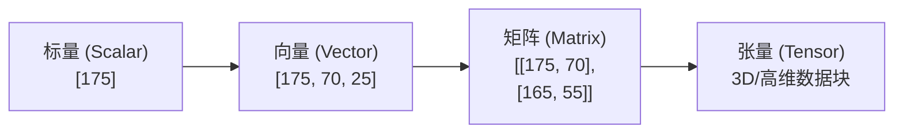
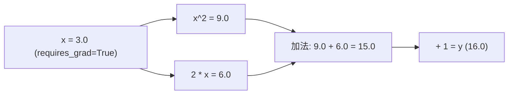

# 零基础入门：线性代数、概率论与 Python 科学计算栈

如果你刚接触人工智能，看到一堆公式（如 $\sum$、$\mathbf{u} \cdot \mathbf{v}$、$\text{Softmax}$）感到头大，**完全不用担心**！

AI 的本质其实就像**制作一道美食**：
- **数据**（如一句话、一张图片）就是**食材**。
- **数学**（向量、矩阵）是把食材打碎成计算机看得懂的**数字表格**。
- **模型**（神经网络）就是**烘焙烤箱**，通过调整温度（参数）烘焙出我们想要的答案。

本章将用**最通俗的生活比喻**、**直观维度推导**和**单步拆解的代码**，带你轻松跨过数学与编程门槛！

---

## 📚 1. 什么是向量与张量？（小白通俗篇）

### 1.1 标量、向量、矩阵与张量的直观对比

很多小白容易被名称搞晕，用生活中的例子一对比就懂了：

| 概念 | 英文 | 通俗理解 | 生活比喻 | 维度 (Rank) |
| :--- | :--- | :--- | :--- | :--- |
| **标量** | Scalar | 单个孤立的数字 | 一个人的**身高**：`175` | 0 维 |
| **向量** | Vector | 一排有序的数字 | 一个人的**名片卡**：`[身高: 175, 体重: 70, 年龄: 25]` | 1 维 |
| **矩阵** | Matrix | 很多排数字组成的表格 | 全班同学的**名片表格**（多行多列） | 2 维 |
| **张量** | Tensor | 多张表格叠在一起的**三维/高维数据块** | 包含了全校所有班级、所有同学名片数据的**立体数据册** | 3 维及以上 |



---

### 1.2 向量点积（Dot Product）：计算“相似度”的魔法

#### ❓ 什么是 Embedding（词向量/特征向量）？

在大模型眼里，不管是“苹果”、“香蕉”还是“手机”，计算机都不认识文字。我们需要把文字变成一串有意义的数字（即 **Embedding 向量**）。

例如，我们用 3 个维度（[甜度, 形状圆不圆, 是不是电子产品]）来打分：
- **苹果**：`[0.9, 0.8, 0.0]`
- **香蕉**：`[0.8, 0.2, 0.0]`
- **iPhone**：`[0.0, 0.9, 0.9]`

#### 💡 向量点积怎么算？（对应位置相乘再相加）

计算“苹果”和“香蕉”的关联度：

$$\text{苹果} \cdot \text{香蕉} = (0.9 \times 0.8) + (0.8 \times 0.2) + (0.0 \times 0.0) = 0.72 + 0.16 + 0 = 0.88$$

数值高达 **0.88**，说明它们俩很相似（都是水果）！

如果算“苹果”和“iPhone”：

$$\text{苹果} \cdot \text{iPhone} = (0.9 \times 0.0) + (0.8 \times 0.9) + (0.0 \times 0.9) = 0.72$$

#### 📐 余弦相似度（Cosine Similarity）：排除“干扰”只看角度

有时候一个向量数值特别大（比如文章很长，词频高），点积就会虚高。**余弦相似度**做了一步“标准化”，把最终得分约束在 **[-1, 1]** 之间：
- **1**：完全一样 / 方向相同
- **0**：毫无关系 / 互相垂直
- **-1**：完全相反

---

## 🧮 2. 神经网络的核心：矩阵乘法与 Softmax

### 2.1 矩阵乘法 $Y = XW + b$ 维度匹配与广播机制

在神经网络里，输入数据 $X$ 乘以权重 $W$，再加上偏置 $b$，就是在做**特征组合**。

#### 📐 矩阵乘法的维数匹配规则（前列等于后行）
想要让矩阵 $A$ 和矩阵 $B$ 相乘（$A \times B$），必须满足：**$A$ 的列数等于 $B$ 的行数**！乘完之后，结果矩阵的 Shape 为 $(A\text{的行数} \times B\text{的列数})$。

```
输入矩阵 X               权重矩阵 W             输出结果 Y
(Batch_Size, In_Features) × (In_Features, Out_Features) = (Batch_Size, Out_Features)
   [100, 2]         ×         [2, 1]            =    [100, 1]
```

#### 💡 算例拆解（平时成绩与期末成绩预测）
假设我们根据学生的 **[平时成绩, 期末成绩]** 预测 **[最终得分]**：
- 输入 $X = \begin{bmatrix} 80 & 90 \\ 60 & 70 \end{bmatrix}$ （2 个学生，每个人 2 门成绩，Shape: `[2, 2]`）
- 权重 $W = \begin{bmatrix} 0.4 \\ 0.6 \end{bmatrix}$ （平时占 40%，期末占 60%，Shape: `[2, 1]`）
- 偏置 $b = \begin{bmatrix} 5 \end{bmatrix}$ （加分 5 分，Shape: `[1]`）

**第一步：矩阵乘法 $X \times W$**
- 学生 1：$(80 \times 0.4) + (90 \times 0.6) = 32 + 54 = 86$
- 学生 2：$(60 \times 0.4) + (70 \times 0.6) = 24 + 42 = 66$

结果为矩阵 $\begin{bmatrix} 86 \\ 66 \end{bmatrix}$（Shape: `[2, 1]`）。

**第二步：广播机制（Broadcasting）加偏置 $b$**
偏置 $b$ 的 Shape 是 `[1]`，而 $X \times W$ 的 Shape 是 `[2, 1]`。PyTorch/NumPy 会自动将 $b$ “复制扩展”为 $\begin{bmatrix} 5 \\ 5 \end{bmatrix}$，从而完成按元素相加：

$$Y = \begin{bmatrix} 86 \\ 66 \end{bmatrix} + \begin{bmatrix} 5 \\ 5 \end{bmatrix} = \begin{bmatrix} 91 \\ 71 \end{bmatrix}$$

如果同时预测全班 1000 个学生，把 1000 个学生的数据堆成矩阵 $X_{1000 \times 2}$，一次矩阵乘法就全部算完了！这就是 GPU 并行计算极速的原因。

---

### 2.2 Softmax 函数：把得分变成“百分比概率”

当大模型思考“下一个人名可能是什么”时，模型输出原始打分（Logits），比如：
- 张三：`4.0`
- 李四：`1.0`
- 王五：`0.0`

这些原始打分不好直接比较。**Softmax** 做了两件事：
1. 通过指数 $e^x$ 把负数全变正数，把差距拉大。
2. 除以总和，归一化成**百分比概率**（总和恰好等于 100%）。

$$\text{Softmax}(z_i) = \frac{e^{z_i}}{e^{z_1} + e^{z_2} + \dots + e^{z_n}}$$

经过 Softmax 转换后：
- 张三：$\frac{e^{4.0}}{e^{4.0} + e^{1.0} + e^{0.0}} = \frac{54.60}{54.60 + 2.72 + 1.00} \approx 93.6\%$
- 李四：$\frac{2.72}{58.32} \approx 4.7\%$
- 王五：$\frac{1.00}{58.32} \approx 1.7\%$

---

## 🐍 3. Python 科学计算实战（手把手代码）

### 3.1 NumPy 入门：从零手写向量点积与余弦相似度

不需要复杂算法，用 NumPy 几行代码就能搞定：

```python
import numpy as np

# 1. 定义两个词的特征向量 (Embedding)
# 特征维度：[水果概率, 科技产品概率, 价格高低]
apple_fruit = np.array([0.9, 0.05, 0.2])  # 红富士苹果
apple_phone = np.array([0.1, 0.95, 0.9])  # 苹果手机
banana      = np.array([0.85, 0.01, 0.1]) # 香蕉

# 2. 手写点积函数 (Dot Product)
def dot_product(v1, v2):
    return np.sum(v1 * v2) # 对应元素相乘再相加

print("红富士苹果 vs 香蕉 点积:", dot_product(apple_fruit, banana))
# 输出: 0.785 (高相关度)

# 3. 手写余弦相似度函数 (Cosine Similarity)
def cosine_similarity(v1, v2):
    # np.linalg.norm 计算向量的模长 (长度)
    length1 = np.linalg.norm(v1)
    length2 = np.linalg.norm(v2)
    return dot_product(v1, v2) / (length1 * length2)

print("红富士苹果 vs 香蕉 相似度:", cosine_similarity(apple_fruit, banana))
# 输出: 0.998 (方向极度接近)

print("红富士苹果 vs 苹果手机 相似度:", cosine_similarity(apple_fruit, apple_phone))
# 输出: 0.320 (区分出是不同概念)
```

---

### 3.2 PyTorch 入门：计算图（Computational Graph）与自动求导

PyTorch 是目前全球最流行的深度学习框架，它的核心优势有两点：
1. **可以放进 GPU 显卡**里并行加速。
2. **会自动求导数**（梯度），让模型学会自动纠错。

#### 🎨 什么是 PyTorch 计算图？
在 PyTorch 中，当你对张量做加减乘除时，后台会自动画一张“计算流转图”。例如计算 $y = x^2 + 2x + 1$：



当你调用 `y.backward()` 时，PyTorch 会顺着这张图**反向追溯**，自动运用链式法则算出 $\frac{dy}{dx}$！

```python
import torch

# 1. 创建标量张量
# requires_grad=True 告诉 PyTorch：请记录对这个变量的运算，一会儿要对它求导！
x = torch.tensor(3.0, requires_grad=True)

# 2. 前向传播：构建计算图 y = x^2 + 2x + 1
y = x**2 + 2*x + 1
print("前向计算结果 y = ", y.item()) # 输出: 16.0

# 3. 反向传播 (Backward) - 自动链式求导
y.backward()

# 4. 查看 x 处的导数 dy/dx (当 x=3 时，导数 d(x^2+2x+1)/dx = 2x + 2 = 8.0)
print("x 处的梯度 (dy/dx):", x.grad.item()) # 输出: 8.0
```

> 💡 **为什么要求导/梯度？**  
> 导数代表了“变化趋势”。如果导数是正数，说明 $x$ 增大 $y$ 就会增大；如果想让误差 $y$ 变小，$x$ 就必须减小！这就是深度学习模型**自我调整、不断学习**的核心原理（梯度下降法）。

---

## 🎯 总结复盘

1. **向量** 就是包含多个特征数字的数组，**Embedding** 则是把现实世界的文字/图片映射为向量。
2. **点积与余弦相似度** 是大模型与 RAG 搜索的核心，用来快速判断两个事物是否相似。
3. **矩阵乘法 $Y = XW + b$** 是神经网络最核心的算子，要求前列等于后行，GPU 可以并行极速处理。
4. **Softmax** 把模型的原始打分变成了直观的百分比概率。
5. **PyTorch 计算图** 帮助我们自动完成高维张量运算与梯度求导，是后续学习大模型微调的基础！

