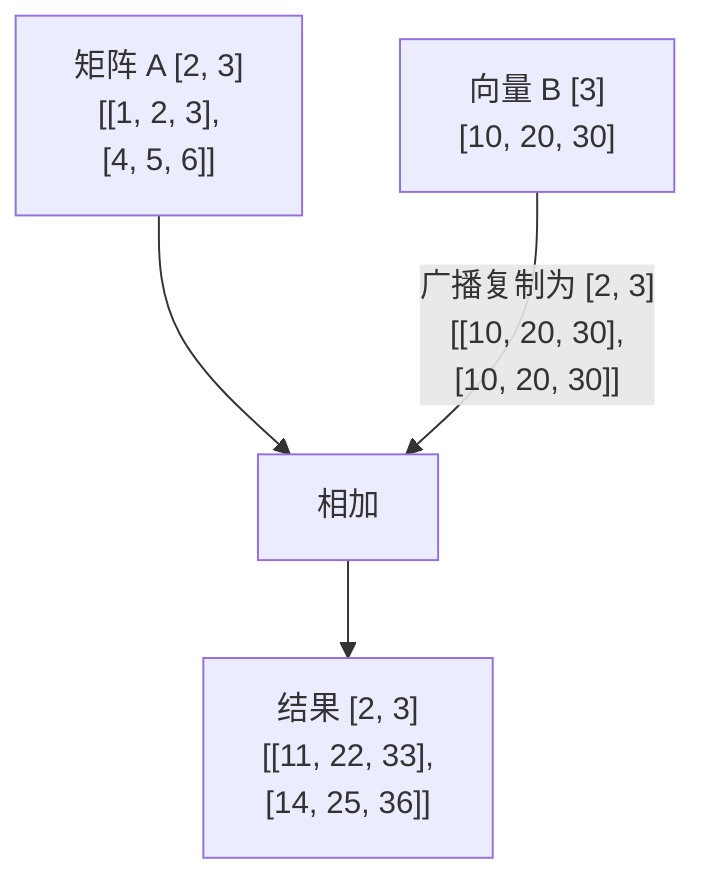

# 1. Python 科学计算基础 (NumPy & Pandas)

在人工智能与大模型开发中，无论是图片像素、音频波形，还是 LLM 处理的 Token 和 Embedding 词向量，**底层全都是数字与数组**。掌握 Python 科学计算库 **NumPy** 和 **Pandas**，是踏入 AI 领域的第一步。

---

## 💡 1. 为什么 AI 编程不直接用 Python 原生列表？

Python 原生列表（`list`）虽然灵活，但它是基于指针数组实现的，元素在内存中分散存储。

做大规模向量相加时：
- Python 列表需要遍历每个元素、动态判断类型，效率极低。
- **NumPy 数组（`ndarray`）** 在内存中连续存放相同类型的数据，并调用底层的 C/Fortran 和 SIMD 指令集进行向量化并行计算，运行速度可比 Python 列表快 **几十倍甚至上百倍**！

```python
import numpy as np
import time

# 比较 Python 列表与 NumPy 数组的加法性能
size = 1_000_000

# 1. Python 原生列表
py_list1 = list(range(size))
py_list2 = list(range(size))

start = time.time()
py_result = [x + y for x, y in zip(py_list1, py_list2)]
print(f"Python 原生列表耗时: {(time.time() - start) * 1000:.2f} ms")

# 2. NumPy 数组 (向量化并行)
np_arr1 = np.arange(size)
np_arr2 = np.arange(size)

start = time.time()
np_result = np_arr1 + np_arr2  # 简洁的向量化语法
print(f"NumPy 向量化运算耗时: {(time.time() - start) * 1000:.2f} ms")
```

---

## 🔢 2. NumPy 核心概念与广播机制 (Broadcasting)

### 2.1 基础数组创建与 Shape 形状

在 AI 中，我们需要随时清楚数据的维度（Shape）：

```python
import numpy as np

# 一维向量 (Vector): 比如句子的 5 个 Token 编码
vector = np.array([101, 2054, 2003, 1037, 102])
print("向量 Shape:", vector.shape)  # 输出: (5,)

# 二维矩阵 (Matrix): 比如 Batch_Size=2, Seq_Len=3 的输入
matrix = np.array([
    [0.1, 0.2, 0.5],
    [0.9, 0.3, 0.1]
])
print("矩阵 Shape:", matrix.shape)  # 输出: (2, 3) -> 2 行 3 列
```

---

### 2.2 广播机制：形状不同也能相加

当对两个形状不同的数组进行加减乘除时，NumPy 会自动将较小维度的数组沿着缺少维度的方向**扩展复制**，使其 Shape 匹配：



```python
# 矩阵 Shape: [2, 3]
A = np.array([[1, 2, 3],
              [4, 5, 6]])

# 向量 Shape: [3] (自动广播为 [2, 3])
B = np.array([10, 20, 30])

result = A + B
print("广播相加结果:\n", result)
# [[11, 22, 33],
#  [14, 25, 36]]
```

---

## 🐼 3. Pandas：大模型数据集处理工具

在微调大模型（SFT）或构建 RAG 知识库时，清洗 JSONL / CSV 格式的文本数据集主要靠 **Pandas**。

```python
import pandas as pd

# 模拟大模型微调 SFT 训练集数据
data = [
    {"instruction": "翻译成英文", "input": "你好，世界！", "output": "Hello, World!"},
    {"instruction": "写一首诗", "input": "关于秋天", "output": "落叶聚还散，寒鸦栖复惊。"},
    {"instruction": "提取关键词", "input": "", "output": "未指定输入"}
]

df = pd.DataFrame(data)

# 1. 过滤空输入数据
valid_df = df[df["input"] != ""].copy()

# 2. 新增一列：计算提示词文本长度
valid_df["prompt_length"] = valid_df["instruction"].apply(len) + valid_df["input"].apply(len)

print("清洗后的微调数据集:\n", valid_df[["instruction", "prompt_length"]])
```

---

## ⚠️ 小白常见踩坑指南

1. **混淆 `*`（逐元素相乘）与 `np.dot`（矩阵乘法）**：
   - `a * b` 表示对应位置上的元素各自相乘。
   - `np.dot(a, b)` 或 `a @ b` 才表示线性代数中的矩阵乘法。
2. **忽视 `shape` 导致维度不匹配报错**：
   - 写复杂代码前，用 `print(arr.shape)` 随时检查张量维度。
