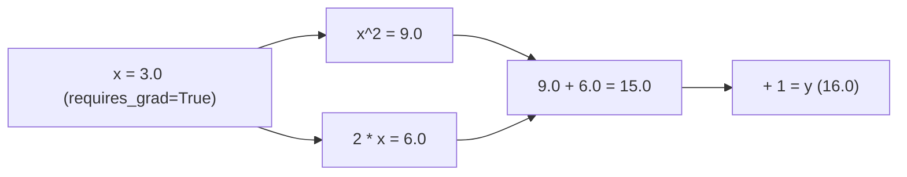

# 3. PyTorch 张量与自动求导 (Autograd)

**PyTorch** 是当前 AI 界最主导的深度学习框架。它的核心使命只有两个：
1. 提供类似 NumPy 但可以放在 **GPU 显卡**上极速运行的张量（Tensor）。
2. 提供**自动求导（Autograd）**功能，自动计算梯度（Gradient）并更新神经网络参数。

---

## ⚡ 1. PyTorch Tensor 基础与 GPU 加速

Tensor 与 NumPy `ndarray` 极其相似，并且可以零成本无缝转换。

```python
import torch

# 1. 创建张量
x = torch.tensor([[1.0, 2.0], [3.0, 4.0]])
print("张量 Shape:", x.shape)
print("数据类型 Device:", x.device) # 默认在 CPU 上

# 2. 如果有 NVIDIA GPU，转放到 GPU 上运行
if torch.cuda.is_available():
    x_gpu = x.to("cuda")
    print("已成功移动到 GPU:", x_gpu.device)
```

---

## 🎨 2. 动态计算图与自动求导 (`requires_grad`)

模型“学习”的过程就是寻找能让损失（Loss）最小的参数。PyTorch 会在后台自动为你绘制**计算图（Computational Graph）**。

假设目标函数为 $y = x^2 + 2x + 1$：



当调用 `y.backward()` 时，PyTorch 顺着路线图反向调用**链式法则**算出 $\frac{dy}{dx} = 2x + 2$：

```python
import torch

# 1. 声明需要求导的叶子节点变量
x = torch.tensor(3.0, requires_grad=True)

# 2. 前向传播 (Forward) 构建计算图
y = x**2 + 2*x + 1
print("前向计算结果 y =", y.item()) # 输出: 16.0

# 3. 反向传播 (Backward) 自动计算梯度 dy/dx
y.backward()

# 4. 查看 x 的梯度结果: 2 * 3.0 + 2 = 8.0
print("x 在 3.0 处的梯度 (导数):", x.grad.item()) # 输出: 8.0
```

---

## 🏋️ 3. 从零手写迷你神经网络训练循环 (SGD)

下面用 20 行代码展示神经网络如何通过梯度下降学习线性规律 $y = 2x + 1$：

```python
import torch

# 训练数据: y = 2x + 1
X = torch.tensor([[1.0], [2.0], [3.0], [4.0]])
Y = torch.tensor([[3.0], [5.0], [7.0], [9.0]])

# 初始化拟合权重 w 和偏置 b (随机值)
w = torch.randn(1, 1, requires_grad=True)
b = torch.randn(1, 1, requires_grad=True)

learning_rate = 0.05

for epoch in range(100):
    # 1. 前向预测 Y_pred = X*w + b
    Y_pred = X @ w + b
    
    # 2. 计算均方误差损失 MSE Loss
    loss = torch.mean((Y_pred - Y) ** 2)
    
    # 3. 反向传播计算梯度
    loss.backward()
    
    # 4. 梯度下降更新参数 (不记录计算图)
    with torch.no_grad():
        w -= learning_rate * w.grad
        b -= learning_rate * b.grad
        # 梯度清零，防止下一次循环累加
        w.grad.zero_()
        b.grad.zero_()

print(f"拟合出的 w: {w.item():.2f} (目标 2.0)")
print(f"拟合出的 b: {b.item():.2f} (目标 1.0)")
```

---

## 💡 总结与路线引导

至此，你已经搞懂了 AI 核心三大基础：
1. **NumPy & Pandas**：清洗与处理数字向量与表格。
2. **矩阵乘法 & Softmax**：神经网络底层数学变换与概率计算。
3. **PyTorch & Autograd**：利用 GPU 加速计算与自动反向传播纠错。

下一章我们将真正进入**经典机器学习与深度学习神经网络**的世界！
