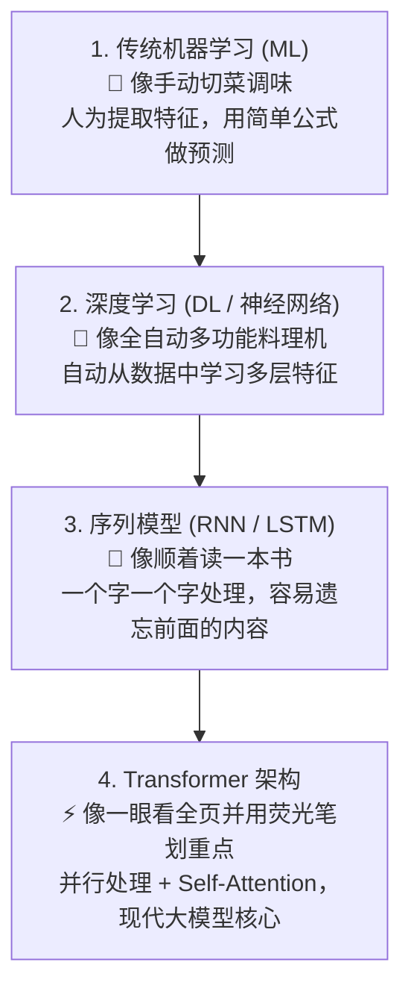

# 机器学习与深度学习原理（小白入门版）

> 💡 **导读**：大语言模型（LLM）并不是凭空诞生的魔法，它的基石是**机器学习**与**深度学习神经网络**。如果你零基础看公式感到吃力，本章将用**生活比喻 + 渐进拆解**，带你轻松读懂大模型底层的灵魂！

---

## 🧭 学习路线图：从“做菜”理解 AI 演进

如果把 AI 预测比作**烹饪做菜**：

---

## 📚 本章核心知识地图

### 1. 经典机器学习算法（AI 的基石）

- **监督学习（带标准答案的学习）**：
  - **线性回归（Linear Regression）**：画一条直线预测房价/销量。
  - **逻辑回归（Logistic Regression）**：给事件分类（如判断邮件是否为垃圾邮件）。
  - **决策树与随机森林（Decision Tree & Random Forest）**：像玩“二十个问题”提问猜答案，多棵树投票得出结果。
  - **XGBoost / LightGBM**：梯度提升树，竞赛与工业界表格数据的“大杀器”。
- **无监督学习（没有答案，自己找规律）**：
  - **K-Means 聚类**：把相似的用户或商品自动分到同一组。
  - **PCA 降维**：把成百上千个特征压缩成几个核心指标，防止数据过复杂。
- **评估指标（怎么打分）**：精确率（Precision）、召回率（Recall）、F1-Score、ROC-AUC、均方误差（MSE）。

---

### 2. 深度学习神经网络（ANN / CNN / RNN）

- **多层感知机 (MLP)**：
  - **前向传播与反向传播**：预测结果 -> 算误差 -> 倒推更新参数（像做错题后改进）。
  - **激活函数（ReLU, GELU, Sigmoid, Softmax）**：为神经网络引入“非线性”，让它能学习复杂的曲面规律。
  - **损失函数（Cross-Entropy, MSE）**：量化预测结果与真实值差距的“标尺”。
- **卷积神经网络 (CNN)**：像用放大镜逐区域扫描图片，专门提取图像的线条、纹理和边缘特征。
- **循环神经网络 (RNN / LSTM / GRU)**：专门处理有时序关系的数据（文本、语音），带记忆机制但长文本容易遗忘。

---

### 3. Transformer 架构（现代大模型的共同骨架）

- **Self-Attention（自注意力机制）**：让模型在处理每一个词时，自动关注上下文中关联系数最高的其他词（解决 RNN 容易遗忘的问题）。
- **Multi-Head Attention（多头注意力）**：同时从多个不同视角（如语法关系、语义相似度、角色关系）去观察一个句子。
- **Positional Encoding（位置编码）**：给输入的每一个词打上位置标签（如绝对位置编码、RoPE 旋转位置编码），解决并行计算失去顺序的问题。
- **Encoder 与 Decoder 变体**：
  - **BERT（Pure Encoder）**：双向理解上下文，擅长分类、抽取与搜索。
  - **GPT（Causal Decoder）**：因果单向生成，根据上文猜下一个字，大模型（ChatGPT、Claude）的主流架构。
  - **T5 / BART（Encoder-Decoder）**：先理解全文再生成新内容，擅长翻译与摘要。

---

## 🎯 推荐学习路径

1. 先阅读 [1. Transformer 架构详解与 Self-Attention 原理](1-transformer-architecture.md)（含小白通俗比喻、逐步推导与 PyTorch 代码）。
2. 在大模型实际应用中，逐步对照加深对 Embedding、Softmax 与 Attention 的理解。
