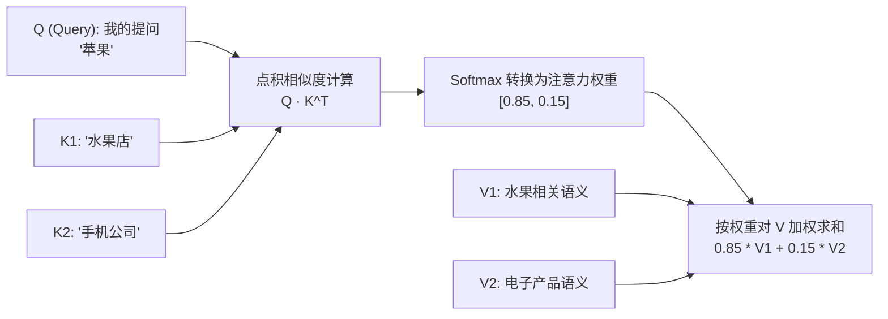
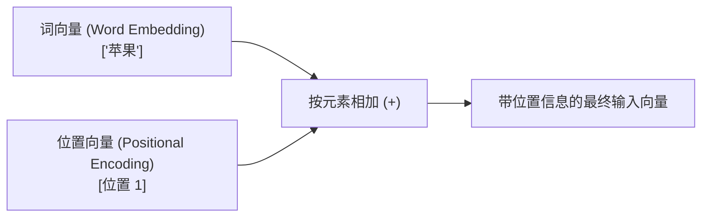
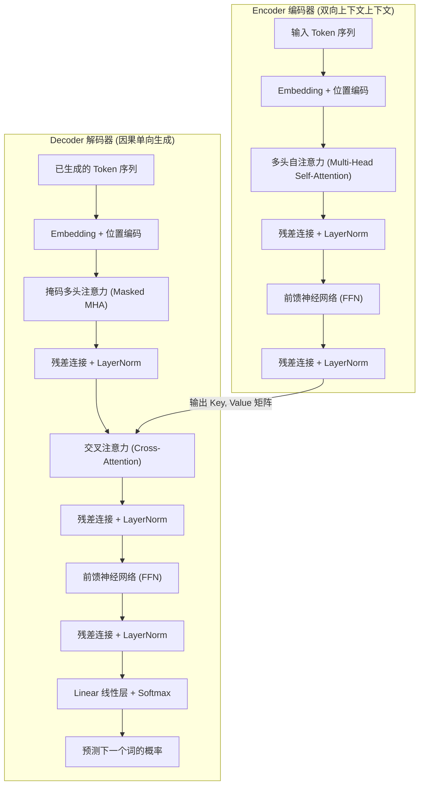

# Transformer 架构详解与 Self-Attention 原理

> 💡 **导读**：Transformer 架构来自于 Google 在 2017 年发表的经典论文 *《Attention Is All You Need》*。它是 ChatGPT、Claude、Llama 等现代大语言模型（LLM）共同的底层骨架。
> 
> 如果公式让你头大，**别担心**！本篇将用“图书馆找书”、“结婚匹配”等通俗生活比喻，带你彻底搞懂 Q、K、V、Self-Attention 和 Transformer 的每一个细节！

---

## 🌟 1. 为什么需要 Transformer？（小白进化史）

在 Transformer 出现之前，AI 处理语言主要依靠 **RNN（循环神经网络）**。

### ❌ 传统 RNN 的三大致命痛点

1. **像单向列车，串行计算极慢**：RNN 必须处理完第 1 个字，才能处理第 2 个字，无法发挥 GPU 强大的并行计算优势。
2. **“近视眼”与长文本遗忘**：当句子很长（如 1000 个字）时，RNN 读到句尾已经把开头的关键词忘光了（梯度消失问题）。
3. **代词无法指代**：比如句子 *“苹果公司发布了新手机，**它**非常好看”*，RNN 很难确定“它”到底指代“苹果公司”还是“新手机”。

### ⚡ Transformer 的降维打击

- **全景并行（Self-Attention）**：一口气把整段话全部输入 GPU，同时计算每个词与其它所有词的关联程度。
- **长距离关联秒级识别**：无论两个词相隔多远，它们之间的计算距离都是常数级 $O(1)$！

---

## 🔍 2. 核心原理：Self-Attention（自注意力机制）

### 2.1 大白话比喻：Q, K, V 到底是什么？

假设你在逛**图书馆（或者相亲平台）**：

| 变量 | 英文 | 通俗比喻 | 在模型里的真实作用 |
| :--- | :--- | :--- | :--- |
| **$Q$** | **Query**（查询向量） | 你手里的**检索需求 / 提问**<br/>（“我想找一本关于 Python 编程的书”） | 当前词希望向周围其他词询问的信息特征 |
| **$K$** | **Key**（键向量） | 书架上每本书的**标签 / 索引**<br/>（“本书主题：Python/数据分析/入门”） | 当前词用来供其他词匹配的身份标签 |
| **$V$** | **Value**（值向量） | 书本里包含的**实际知识内容** | 当前词实际蕴含的语义信息 |



---

### 2.2 详细计算 4 步走（以“苹果”为例）

假设我们要处理句子：**“苹果 很好吃”**。

#### 步 1：线性映射得到 Q, K, V
将输入的 Embedding 向量 $X$ 分别乘以三个可学习矩阵 $W_Q, W_K, W_V$：
$$Q = X \cdot W_Q \quad | \quad K = X \cdot W_K \quad | \quad V = X \cdot W_V$$

#### 步 2：计算相关性得分（点积）
用“苹果”的 $Q$ 去和句子里所有词的 $K$ 计算点积（Dot Product）：
- “苹果” $Q$ $\cdot$ “苹果” $K$ = $8.0$
- “苹果” $Q$ $\cdot$ “很” $K$ = $1.5$
- “苹果” $Q$ $\cdot$ “好吃” $K$ = $6.5$

#### 步 3：除以 $\sqrt{d_k}$ 缩放并做 Softmax（归一化）
- **为什么要除以 $\sqrt{d_k}$？**：如果向量维度很高（比如 $d_k=64$），点积数值会非常大（如 $80$）。很大数值传入 Softmax 会导致梯度极小（梯度饱和），模型学不动。缩放后能让梯度更稳定。
- **Softmax**：将得分转化为总和为 1 的百分比（注意力权重）：
  $$\text{Softmax}([8.0/\sqrt{d_k}, 1.5/\sqrt{d_k}, 6.5/\sqrt{d_k}]) \rightarrow [\mathbf{0.68}, 0.02, \mathbf{0.30}]$$

#### 步 4：按权重对 $V$ 加权求和
最终“苹果”更新后的向量 = $0.68 \times V_{\text{苹果}} + 0.02 \times V_{\text{很}} + 0.30 \times V_{\text{好吃}}$。  
这样，“苹果”这个词的表征里就融合了“好吃”的语义，模型自然就知道这里的“苹果”是水果，而不是手机！

---

### 2.3 经典公式汇总

$$\text{Attention}(Q, K, V) = \text{Softmax}\left(\frac{Q K^T}{\sqrt{d_k}}\right) V$$

---

## 🧠 3. Multi-Head Attention（多头注意力机制）

### 💡 为什么要“多头”？

如果只用一组 $Q, K, V$（单头），模型只能关注一种关系（例如“苹果”和“好吃”的修饰关系）。

**多头注意力（Multi-Head Attention）** 就像组建了一个**专家会诊小组**：
- **专家 1（Head 1）**：关注**语法修饰关系**（主谓宾、定状补）。
- **专家 2（Head 2）**：关注**代词指代关系**（“它”指代谁）。
- **专家 3（Head 3）**：关注**长距离语义关联**。

最终把所有专家的意见（各个 Head 的输出）拼接（Concat）在一起，经过线性变换还原维度：

$$\text{MultiHead}(Q, K, V) = \text{Concat}(\text{head}_1, \dots, \text{head}_h) W^O$$

---

## 📍 4. Positional Encoding（位置编码）

Transformer 内部全是矩阵乘法，**天然失去了词语的顺序信息**。在模型看来，“我打你”和“你打我”如果没有位置信息，算出来的 Attention 完全一样！

为了解决这个问题，论文引入了**位置编码（Positional Encoding）**：在输入 Embedding 的同时，叠加（相加）一个代表位置信息的向量。



常见的位置编码类型：
1. **绝对位置编码（正弦/余弦函数）**：原始 Transformer 使用，利用不同频率的 $\sin$ 和 $\cos$ 函数生成独一无二的位置标记。
2. **RoPE（旋转位置编码）**：现代主流大模型（Llama、Qwen、DeepSeek）使用的技术，将向量旋转特定角度，完美结合了绝对位置与相对位置优势。

---

## 🏗️ 5. Transformer 整体架构拆解

完整 Transformer 由 **Encoder（编码器）** 和 **Decoder（解码器）** 组成：



### 关键辅助结构：
- **Masked Self-Attention（掩码自注意力）**：在 Decoder 中，模型生成下一个词时，不能“穿越”偷看后面的词，因此使用上三角掩码（把未来的词得分设为 $-\infty$）。
- **Residual Connection（残差连接 `Add`）**：$X_{\text{out}} = F(X) + X$，防止层数变深时梯度消失，让深层网络更容易训练。
- **Layer Normalization（层归一化 `Norm`）**：将每一层神经元的激活值归一化为均值为 0、方差为 1，加速收敛并保持稳定。

---

## 🧱 6. 三大主流架构衍生：BERT vs GPT vs T5

| 模式 | 代表模型 | 注意力机制类型 | 适用场景 |
| :--- | :--- | :--- | :--- |
| **Pure Encoder** | **BERT** | 双向注意力（能看到前后的词） | 文本分类、命名实体识别（NER）、向量搜索（Embedding） |
| **Causal Decoder** | **GPT-4 / Llama / DeepSeek** | 单向因果掩码注意力（只能看左边的词） | **生成式大模型**、对话、代码生成、续写 |
| **Encoder-Decoder** | **T5 / BART / Whisper** | 编码器双向 + 解码器单向 | 机器翻译、文本摘要、语音转文字 |

---

## 💻 7. PyTorch 逐行手把手实现 Self-Attention

下面是用 PyTorch 写的标准带因果掩码的 Self-Attention 模块，带详尽中文注释：

```python
import torch
import torch.nn as nn
import torch.nn.functional as F

class SelfAttention(nn.Module):
    def __init__(self, embed_dim: int):
        super().__init__()
        self.embed_dim = embed_dim
        
        # 定义获取 Q, K, V 的线性变换矩阵 (W_q, W_k, W_v)
        self.W_q = nn.Linear(embed_dim, embed_dim, bias=False)
        self.W_k = nn.Linear(embed_dim, embed_dim, bias=False)
        self.W_v = nn.Linear(embed_dim, embed_dim, bias=False)

    def forward(self, x: torch.Tensor, causal_mask: bool = False):
        # x 维度: (batch_size, seq_len, embed_dim)
        batch_size, seq_len, _ = x.shape

        # 1. 计算 Q, K, V 矩阵
        Q = self.W_q(x) # (batch_size, seq_len, embed_dim)
        K = self.W_k(x) # (batch_size, seq_len, embed_dim)
        V = self.W_v(x) # (batch_size, seq_len, embed_dim)

        # 2. 计算 Attention Scores (点积并除以 sqrt(d_k) 缩放)
        # K.transpose(-2, -1) 将 K 转置为 (batch_size, embed_dim, seq_len)
        scores = torch.matmul(Q, K.transpose(-2, -1)) / (self.embed_dim ** 0.5)
        # scores 维度: (batch_size, seq_len, seq_len)

        # 3. 如果是 Decoder 自回归生成，施加因果掩码 (Causal Mask)
        if causal_mask:
            # 创建下三角矩阵 (上三角部分设为 True，即需要被掩盖遮挡的部分)
            mask = torch.triu(torch.ones(seq_len, seq_len), diagonal=1).bool()
            mask = mask.to(x.device)
            # 将需要遮挡的位置填充为一个极小的数 (-1e9)，Softmax 后变为 0
            scores = scores.masked_fill(mask, -1e9)

        # 4. 通过 Softmax 得到概率权重 (sum(attn_weights, dim=-1) == 1)
        attn_weights = F.softmax(scores, dim=-1)

        # 5. 加权求和得到最终输出
        output = torch.matmul(attn_weights, V) # (batch_size, seq_len, embed_dim)

        return output, attn_weights


# --- 测试代码 ---
if __name__ == "__main__":
    # 模拟输入数据: Batch大小为2，序列长度为5（5个词），每个词的向量维度为64
    batch_size = 2
    seq_len = 5
    embed_dim = 64

    inputs = torch.randn(batch_size, seq_len, embed_dim)
    
    # 实例化自注意力层
    attention_layer = SelfAttention(embed_dim=embed_dim)
    
    # 前向传播（开启因果掩码）
    output, weights = attention_layer(inputs, causal_mask=True)

    print("输入 Tensor 形状:", inputs.shape)   # torch.Size([2, 5, 64])
    print("输出 Tensor 形状:", output.shape)   # torch.Size([2, 5, 64])
    print("注意力权重矩阵形状:", weights.shape) # torch.Size([2, 5, 5])
    print("\n第一个样本的注意力权重矩阵（下三角，右上角为 0）:\n", weights[0].detach().round(decimals=2))
```

---

## 🔬 8. 总结与常见面试题

1. **为什么 Transformer 比 RNN 更适合训练大模型？**
   - RNN 是串行处理，无法并行计算；Transformer 基于 Self-Attention 可以一次性并行处理全序列数据，充分发挥 GPU 算力。
2. **为什么 Self-Attention 中需要除以 $\sqrt{d_k}$？**
   - 维度较高时点积数值会很大，导致 Softmax 函数输出趋近于 0 或 1（进入饱和区），梯度几乎为 0，引发梯度消失。
3. **Q 和 K 的点积代表什么意义？**
   - 代表 Query 与 Key 之间的相关性/匹配度得分，得分越高表示这两个 Token 之间的联系越紧密。
