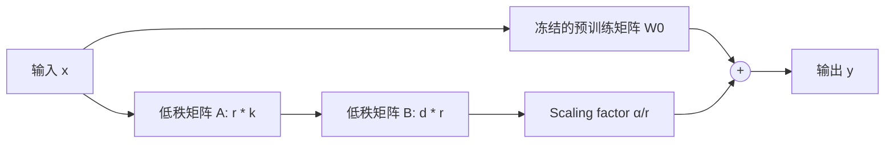

# Prompt 工程与 LoRA/QLoRA 高效微调

在 LLM 应用开发中，优先通过提示词工程（Prompt Engineering）发挥基础模型能力；当需要特定领域能力或特定输出风格时，使用轻量微调（PEFT）技术进行定制。

---

## 1. 高级 Prompt 设计范式

### 1.1 CoT (Chain-of-Thought 思维链)

引导模型输出思考过程，显著提升逻辑推理与复杂计算能力：

```text
Q: 某商店有 15 个苹果，卖出 6 个，又进货 10 个，现在有多少个？
A: 让我们一步步思考：
1. 初始数量为 15 个。
2. 卖出 6 个后剩余：15 - 6 = 9 个。
3. 进货 10 个后数量为：9 + 10 = 19 个。
答案是 19。
```

### 1.2 Structured Output (结构化输出约束)

结合 JSON Schema 或 System Prompt 强制模型返回可被程序解析的数据：

```text
你是一个专业的 JSON 提取助手。请从用户文本中提取实体并按以下格式返回 JSON：
{
  "name": "姓名",
  "age": 整数或 null,
  "skills": ["技能1", "技能2"]
}
只输出 JSON，不要附加任何 Markdown 标记或解释。
```

---

## 2. LoRA (Low-Rank Adaptation) 低秩微调原理

全参数微调需更新大模型全部百亿/千亿参数，显存开销极大。LoRA 冻结预训练模型权重 $W_0 \in \mathbb{R}^{d \times k}$，通过引入两个低秩矩阵 $A \in \mathbb{R}^{r \times k}$ 和 $B \in \mathbb{R}^{d \times r}$（其中 $r \ll \min(d, k)$）来近似权重更新 $\Delta W$：

$$W = W_0 + \Delta W = W_0 + \frac{\alpha}{r} (B \cdot A)$$



---

## 3. QLoRA 与 Unsloth 极速微调实战

QLoRA 引入 4-bit NormalFloat (NF4) 量化与双重量化技术，使 7B / 14B 模型可以在 16GB 显存的消费级显卡（如 RTX 4090）上完成高质量 SFT（指令微调）。

```python
# 使用 Hugging Face PEFT 库加载 LoRA 配置
from peft import LoraConfig, get_peft_model
from transformers import AutoModelForCausalLM, BitsAndBytesConfig
import torch

# 1. 4-bit 量化配置 (QLoRA)
bnb_config = BitsAndBytesConfig(
    load_in_4bit=True,
    bnb_4bit_quant_type="nf4",
    bnb_4bit_compute_dtype=torch.bfloat16,
    bnb_4bit_use_double_quant=True,
)

# 2. 加载基础模型
model = AutoModelForCausalLM.from_pretrained(
    "Qwen/Qwen2.5-7B-Instruct",
    quantization_config=bnb_config,
    device_map="auto"
)

# 3. 配置 LoRA 目标模块
peft_config = LoraConfig(
    r=16,                         # 秩
    lora_alpha=32,                # 缩放系数
    target_modules=["q_proj", "v_proj", "k_proj", "o_proj"],
    lora_dropout=0.05,
    bias="none",
    task_type="CAUSAL_LM"
)

model = get_peft_model(model, peft_config)
model.print_trainable_parameters()
# 输出: trainable params: 20,000,000 || all params: 7,000,000,000 || trainable%: 0.28%
```
