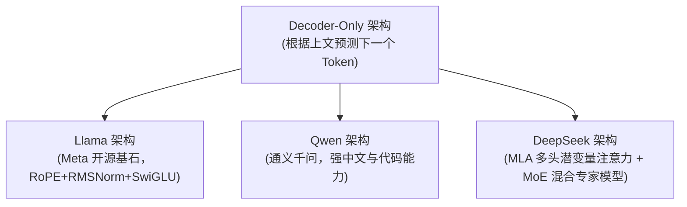

# 2. Tokenizer 机制与大模型主流架构

为什么大模型有时候算不准中文字数？为什么英文按词切分，而中文按字或偏旁切分？这背后的关键在于 **Tokenizer（分词器）**。

---

## 🔤 1. 什么是 Tokenizer？BPE 分词算法原理

大模型无法直接处理文本，必须通过分词器将文本转换为数字 ID 数组（Token IDs）。

常见的 **BPE（Byte-Pair Encoding，字节对编码）** 算法逻辑：
1. 初始阶段：将文本拆分为最小字节/字符。
2. 迭代统计：统计相邻字符对出现的频次，将高频组合合并为一个新 Token。
3. 最终词表：形成一个包含 32,000 ~ 150,000 个高频词元的大词表。

```python
from transformers import AutoTokenizer

# 加载开源模型分词器 (以 Qwen 或 Llama 为例)
tokenizer = AutoTokenizer.from_pretrained("Qwen/Qwen2.5-0.5B")

text = "Hello AI! 欢迎学习大模型开发。"

# 1. 将文本编码为 Token IDs
tokens = tokenizer.encode(text)
print("Token IDs 数组:", tokens)

# 2. 将 Token IDs 解码还原为单个 Token 词元
decoded_tokens = [tokenizer.decode([t]) for t in tokens]
print("切分后的 Token 词元:", decoded_tokens)
# 输出示例: ['Hello', ' AI', '!', ' 欢迎', '学习', '大', '模型', '开发', '。']
```

---

## 🏛️ 2. 大模型主流开源架构演进

当前大语言模型（LLM）绝大多数采用 **Decoder-Only** 架构（因果自回归生成），代表模型包括：



### 核心改进点：
- **RoPE（旋转位置编码）**：更好地支持长文本外推（比如 32k ~ 128k 上下文）。
- **MoE (Mixture of Experts)**：激活少量专家网络，极大降低推理成本。
