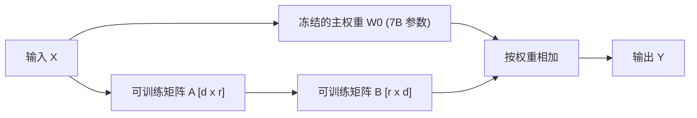

# 3. LoRA/QLoRA 高效微调实战

当通用大模型在领域专业数据（如医疗问答、法律条款、特定格式 JSON 提取）上表现不佳时，我们需要对模型进行**微调（Finetuning）**。

---

## 💡 1. 参数高效微调 (PEFT) 与 LoRA 原理

全量参数微调（Full Finetuning）需要更新模型全部百亿级参数，对 GPU 显存要求极高（如 7B 模型需要 80GB+ 显存）。

**LoRA (Low-Rank Adaptation，低秩适应)** 的解决思路：
- **冻结原模型预训练权重 $W_0$**。
- 在旁边新增两个极小维度的低秩矩阵 $A$ 和 $B$（维度 $r \ll d$）。
- 训练时**只更新 $A$ 和 $B$ 的参数**，参数量可锐减 **99%**！

$$\Delta W = A_{d \times r} \times B_{r \times d}$$



**QLoRA**：进一步将底层的 $W_0$ 量化压缩为 **4-bit**，使得在消费级显卡（如 12GB/16GB 显存的 RTX 4060/4070）上微调 7B 大模型成为可能！

---

## 🛠️ 2. 端到端 QLoRA 微调脚本 (HuggingFace `peft` + `trl`)

在 Linux / WSL2 环境下，使用 `peft` 与 `SFTTrainer` 进行高效微调的核心代码结构：

```python
import torch
from transformers import AutoModelForCausalLM, AutoTokenizer, BitsAndBytesConfig
from peft import LoraConfig, get_peft_model
from trl import SFTTrainer, SFTConfig

# 1. 配置 4-bit NF4 量化参数
bnb_config = BitsAndBytesConfig(
    load_in_4bit=True,
    bnb_4bit_quant_type="nf4",
    bnb_4bit_compute_dtype=torch.float16
)

model_id = "Qwen/Qwen2.5-0.5B-Instruct"

# 2. 加载量化模型与分词器
model = AutoModelForCausalLM.from_pretrained(
    model_id,
    quantization_config=bnb_config,
    device_map="auto"
)
tokenizer = AutoTokenizer.from_pretrained(model_id)

# 3. 配置 LoRA 挂载目标模块
peft_config = LoraConfig(
    r=8,                   # 低秩矩阵维度
    lora_alpha=16,         # 缩放系数
    target_modules=["q_proj", "v_proj"], # 挂载到 Self-Attention 的 Q, V 矩阵
    lora_dropout=0.05,
    bias="none",
    task_type="CAUSAL_LM"
)

# 4. 包装为 PEFT 模型
model = get_peft_model(model, peft_config)
model.print_trainable_parameters()
# 输出: trainable params: ~0.5% (极度节省显存)
```
