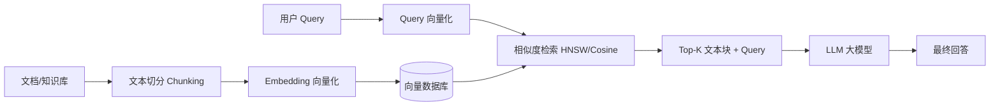

# RAG 检索增强生成与向量数据库

RAG（Retrieval-Augmented Generation）是解决大语言模型“知识过期”和“幻觉（Hallucination）”问题的最核心企业级工程方案。

## 核心知识点

### 1. RAG 基础架构与流程

### 2. 核心组件与优化策略

- **文本切分（Chunking）**：Fixed-size, Recursive, Semantic Chunking。切分 Overlap（重叠）设置。
- **向量嵌入（Embedding）**：BGE, OpenAI text-embedding-3, Cohere Embedding 模型选型。
- **检索优化（Advanced RAG）**：
  - **Query 重写/扩展**：HyDE (Hypothetical Document Embeddings)、Multi-Query。
  - **混合检索（Hybrid Search）**：关键词检索（BM25） + 向量密集检索（Dense Vector）。
  - **重排序（Rerank）**：Cross-Encoder 重排序模型（如 BGE-Reranker）过滤不相关 Chunk。

### 3. 主流向量数据库选型

- **Milvus / Zilliz**：高并发、分布式的云原生向量数据库。
- **Qdrant**：Rust 编写、高性能、支持丰富 Payload 过滤。
- **Chroma / FAISS**：轻量级嵌人式向量检索库，适合单机/实验阶段。
- **Pgvector**：PostgreSQL 向量扩展，适合已有 PG 体系的技术栈。
