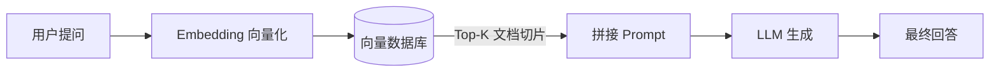
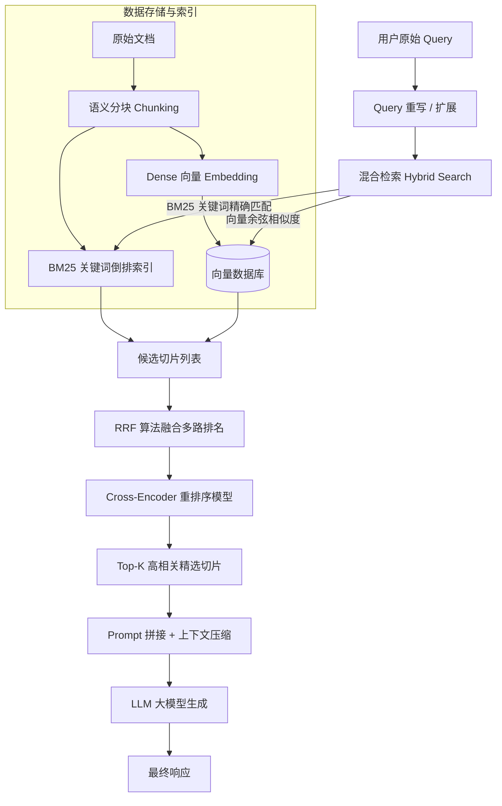

# 进阶 RAG 架构与向量数据库实战

在真实业务场景中，朴素 RAG（Naive RAG）常面临**检索噪音大、召回不精准、专有名词漏检索**等缺陷。进阶 RAG（Advanced RAG）通过前置查询优化、混合检索与后置重排序极大提升了回答准确率。

---

## 1. 基础 RAG vs 进阶 RAG 对照

### 基础 RAG (Naive RAG) 架构

最简单的 RAG 流程遵循：**读取文档 $\rightarrow$ 切分 Chunk $\rightarrow$ 转 Embedding $\rightarrow$ 向量相似度检索 $\rightarrow$ 拼接 Prompt 送给 LLM**。



❌ **基础 RAG 的三大痛点**：
1. **关键词丢失**：如搜索专有名词“RTX 4090Ti”，向量 Embedding 可能会把它和普通显卡混淆，找不准精准型号。
2. **检索噪音**：向量检索出来的 Top 5 切片里，可能只有 1 切片真正有用，其余 4 切片都是干扰信息（导致大模型胡言乱语）。
3. **Query 表达不清**：用户提问“那个怎么配？”，缺乏上下文，直接检索很难查到任何有用资料。

---

## 2. 进阶 RAG 全链路工作流

进阶 RAG 引入了 **Query 重写 (Rewrite)**、**混合检索 (Hybrid Search)**、**RRF 排序融合** 和 **Cross-Encoder 重排序 (Rerank)**：



---

## 3. 关键优化技术拆解与算例

### 3.1 混合检索 (Hybrid Search) 与 RRF 融合算法

- **Dense Retrieval (密集向量检索)**：基于 Embedding，擅长理解“意图与语义”（如“天气好”与“阳光明媚”）。
- **Sparse Retrieval (稀疏关键词检索)**：基于 BM25，擅长精确匹配**人名、专有名词、错误码、产品型号**。
- **RRF (Reciprocal Rank Fusion, 倒数排名融合)** 公式：

$$RRF\_Score(d) = \sum_{m \in M} \frac{1}{k + r_m(d)}$$

#### 💡 RRF 算例演示（平局机制如何打破）
假设平常检索常数 $k=60$。对同一文档 $A$：
- 在 BM25 检索中排名 **第 1**（$r_{\text{BM25}}(A) = 1$）
- 在向量检索中排名 **第 3**（$r_{\text{Vector}}(A) = 3$）

则文档 $A$ 的综合得分：
$$RRF\_Score(A) = \frac{1}{60 + 1} + \frac{1}{60 + 3} = \frac{1}{61} + \frac{1}{63} \approx 0.01639 + 0.01587 = 0.03226$$

综合得分最高的文档将被优先推送到后续阶段。

---

### 3.2 双塔 Bi-Encoder vs 交叉塔 Cross-Encoder 重排序

| 维度 | Bi-Encoder (向量检索模型) | Cross-Encoder (Reranker 重排序模型) |
| :--- | :--- | :--- |
| **计算方式** | Query 和 Document 独立算 Embedding，算点积/余弦 | Query 与 Document 拼接成字符串，一起送入模型算交叉 Attention |
| **计算速度** | ⚡ **极快**（文档向量可预先离线算好存库） | 🐢 **较慢**（每次都需要实时计算注意力矩阵） |
| **精准度** | 80%（缺少交互细节） | 🎯 **95%+**（完全捕获两者微观词级匹配度） |
| **在 RAG 中的定位** | 用于第一阶段**海量文档召回（如 10,000 切片 $\rightarrow$ 提取 20 切片）** | 用于第二阶段**精细重排序（如 20 切片 $\rightarrow$ 精选 Top 3）** |

---

## 4. 真实 Embedding + Qdrant 向量数据库端到端实战

拒绝假数据向量！下面演示使用免费轻量级 Embedding 模型（`sentence-transformers`）生成真实向量，并写入内存版 Qdrant 向量数据库进行搜索：

```python
from qdrant_client import QdrantClient
from qdrant_client.models import Distance, VectorParams, PointStruct, Filter, FieldCondition, MatchValue
from sentence_transformers import SentenceTransformer

# 1. 加载轻量级开源 Embedding 模型 (生成真实 384 维向量)
print("正在加载 Embedding 模型...")
model = SentenceTransformer("all-MiniLM-L6-v2")

# 2. 初始化内存版 Qdrant 向量数据库
client = QdrantClient(":memory:")
collection_name = "ai_knowledge_base"

# 创建集合 Collection
client.create_collection(
    collection_name=collection_name,
    vectors_config=VectorParams(size=384, distance=Distance.COSINE),
)

# 3. 准备私有知识库文本
documents = [
    {"id": 1, "text": "PostgreSQL 能够通过 Pgvector 扩展快速支持高性能向量检索。", "category": "database"},
    {"id": 2, "text": "Qdrant 是一个使用 Rust 编写的高度可扩展的开源向量数据库。", "category": "vector_db"},
    {"id": 3, "text": "Transformer 架构是现代大语言模型 (LLM) 的基础骨架。", "category": "ai_framework"}
]

# 4. 生成真实 Embedding 并写入 Qdrant
points = []
for doc in documents:
    # 真实计算文本的向量表示
    vector = model.encode(doc["text"]).tolist()
    points.append(
        PointStruct(
            id=doc["id"],
            vector=vector,
            payload={"category": doc["category"], "text": doc["text"]}
        )
    )

client.upsert(collection_name=collection_name, points=points)
print(f"成功将 {len(points)} 条知识库数据写入 Qdrant 向量数据库！")

# 5. 执行基于真实语义的向量检索
user_query = "我想寻找能够存储向量数据的数据库"
query_vector = model.encode(user_query).tolist()

print(f"\n用户提问: '{user_query}'")
search_results = client.search(
    collection_name=collection_name,
    query_vector=query_vector,
    limit=2 # 召回最相似的 2 条记录
)

print("\n--- 向量检索结果 ---")
for idx, hit in enumerate(search_results, 1):
    print(f"Top {idx} [相似度得分: {hit.score:.4f}]")
    print(f"文本: {hit.payload['text']}")
    print(f"分类: {hit.payload['category']}\n")
```
