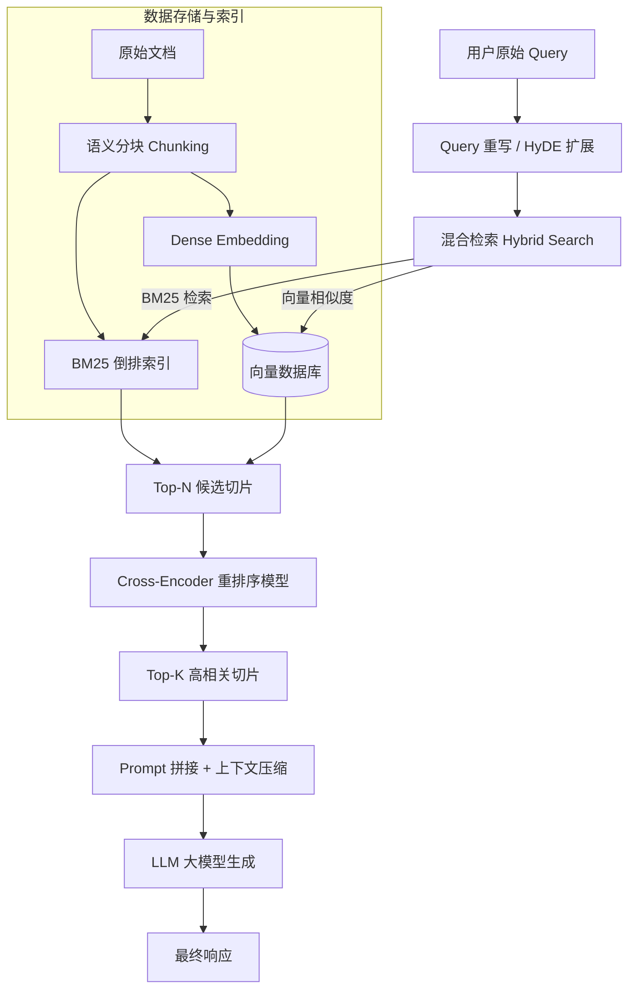

# 进阶 RAG 架构与向量数据库实战

朴素 RAG（Naive RAG）常面临**检索噪音大、召回不精准、知识断层**等缺陷。进阶 RAG（Advanced RAG）通过前置查询处理与后置重排序极大提升了回答准确率。

---

## 1. 进阶 RAG 全链路工作流



---

## 2. 关键优化技术

### 2.1 混合检索 (Hybrid Search)

- **Dense Retrieval (密集检索)**：基于 Vector/Embedding，擅长理解语义泛化与同义词表达。
- **Sparse Retrieval (稀疏检索)**：基于 BM25 / TF-IDF，擅长精确匹配人名、专有名词、产品型号、专有代码。
- **RRF (Reciprocal Rank Fusion)**：融合两种检索得分：

$$RRF\_Score(d) = \sum_{m \in M} \frac{1}{k + r_m(d)}$$

### 2.2 重排序 (Reranking)

向量相似度（如 Cosine）使用双塔（Bi-Encoder）独立计算，忽略了 Query 与 Document 间的交叉注意力。Reranker 模型采用 Cross-Encoder，将 Query 与 Document 一起输入，能够精准评估文档相关度。

---

## 3. Qdrant 向量数据库实战代码

```python
from qdrant_client import QdrantClient
from qdrant_client.models import Distance, VectorParams, PointStruct, Filter, FieldCondition, MatchValue

# 1. 初始化内存版 Qdrant 客户端
client = QdrantClient(":memory:")

# 2. 创建 Collection
collection_name = "knowledge_base"
client.create_collection(
    collection_name=collection_name,
    vectors_config=VectorParams(size=384, distance=Distance.COSINE),
)

# 3. 插入向量与 Payload 元数据
points = [
    PointStruct(
        id=1,
        vector=[0.05, 0.61, 0.76, ...], # 384 维 Embedding
        payload={"category": "database", "text": "PostgreSQL 能够通过 Pgvector 支持向量检索。"}
    ),
    PointStruct(
        id=2,
        vector=[0.12, 0.81, 0.33, ...],
        payload={"category": "ai", "text": "Milvus 是一个高度可扩展的开源向量数据库。"}
    )
]
client.upsert(collection_name=collection_name, points=points)

# 4. 带 Payload 过滤条件的向量检索
search_result = client.search(
    collection_name=collection_name,
    query_vector=[0.10, 0.80, 0.30, ...],
    query_filter=Filter(
        must=[FieldCondition(key="category", match=MatchValue(value="ai"))]
    ),
    limit=1
)

for hit in search_result:
    print(f"Score: {hit.score:.4f}, Text: {hit.payload['text']}")
```
