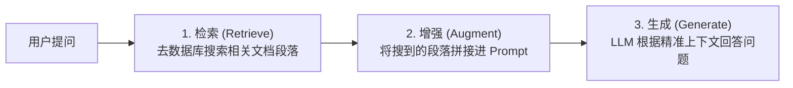

# 1. RAG 基础与文档切分 (Chunking) 策略

大语言模型（LLM）虽然强大，但存在两大致命缺陷：**知识幻觉（Hallucination）** 与 **实时/私有数据缺失**。**RAG（Retrieval-Augmented Generation，检索增强生成）** 是解决这两个痛点的最佳企业级方案。

---

## 🏗️ 1. Naive RAG 的三大核心步骤

RAG 的核心逻辑非常通俗：**“开卷考试”**。模型回答问题前，先去私有知识库里翻书搜资料，把搜到的准确认内容连同问题一起喂给 LLM。



---

## ✂️ 2. 文档切分 (Chunking) 策略详解

为了把大段 PDF / Markdown 导入数据库，必须先将文档切分成小块（Chunk）。切分质量直接决定了检索精度！

| 切分策略 | 说明 | 适用场景 |
| :--- | :--- | :--- |
| **固定大小切分 (Fixed-size)** | 按固定字符数（如 500 字）切分，带重叠 (Overlap) | 简单文本、快速原型搭建 |
| **按 Markdown 标题切分** | 识别 `#`, `##` 标题标签按章节完整切分 | 结构化文档、技术 Wiki |
| **语义切分 (Semantic Chunking)** | 计算相邻句子的 Embedding 相似度，断层处切分 | 逻辑交错的长文章 |

### 带 Overlap（重叠区）的滑动窗口切分
为防止切分断句破坏上下文语义，通常会在前后 Chunk 之间保留 10%~20% 的重叠：

```python
def chunk_text(text, chunk_size=100, overlap=20):
    chunks = []
    start = 0
    while start < len(text):
        end = start + chunk_size
        chunk = text[start:end]
        chunks.append(chunk)
        start += (chunk_size - overlap) # 步长 = 大小 - 重叠
    return chunks

doc = "人工智能是研究、开发用于模拟、延伸和扩展人的智能的理论、方法、技术及应用系统的一门新的技术科学。" * 5
chunks = chunk_text(doc, chunk_size=50, overlap=10)
print(f"共切分为 {len(chunks)} 个 Chunk，第1块内容:\n'{chunks[0]}'")
```
