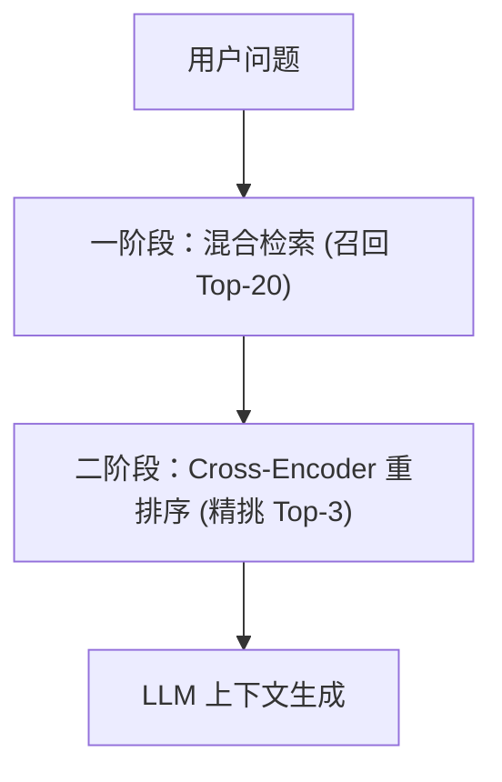

# 3. 高级 RAG 检索与 Cross-Encoder 重排序 (Rerank)

在生产环境中，简单的基础 RAG（Naive RAG）常常面临检索召回不准、长文本噪音干扰等问题。**Advanced RAG（高级 RAG）** 通过混合检索与重排序架构解决这些挑战。

---

## 🔀 1. 混合检索 (Hybrid Search)：向量 + BM25 关键词

单一向量检索擅长理解**通用语义**，但在遇到专用专有名词、产品型号、专有名词缩写（如“RTX 4090”、“ERR_502”等）时容易失效。

**混合检索**将两者结合：
1. **向量检索（Dense Retrieval）**：召回语义相近的段落。
2. **BM25 关键词检索（Sparse Retrieval）**：召回精确匹配字符的段落。
3. **RRF (Reciprocal Rank Fusion) 算法**：融合两者的排名得分。

---

## 🎯 2. 二阶段重排序 (Cross-Encoder Rerank) 原理

为了降低延迟，一阶段检索用的是 Bi-Encoder（向量独立计算），准确度稍低。  
二阶段引入 **Cross-Encoder 重排序模型（如 `bge-reranker-large`）**，将 `Query` 与 `Document` 拼接后一起送入模型计算全局注意力：



```python
from sentence_transformers import CrossEncoder

# 加载重排序模型
reranker = CrossEncoder('BAAI/bge-reranker-base')

query = "苹果手机提示电池健康度低怎么办？"
documents = [
    "苹果公司的 iPhone 15 搭载了 A17 芯片。",
    "如果 iPhone 电池健康度低于 80%，建议前往官方售后更换电池。",
    "吃苹果对身体健康有诸多好处，富含维生素 C。"
]

# 构造 (Query, Doc) 对并计算精准相关性得分
pairs = [[query, doc] for doc in documents]
scores = reranker.predict(pairs)

# 按得分高低排序
ranked_docs = sorted(zip(scores, documents), key=lambda x: x[0], reverse=True)

print("精准重排序后的结果:")
for score, doc in ranked_docs:
    print(f"[得分: {score:.4f}] {doc}")
```
