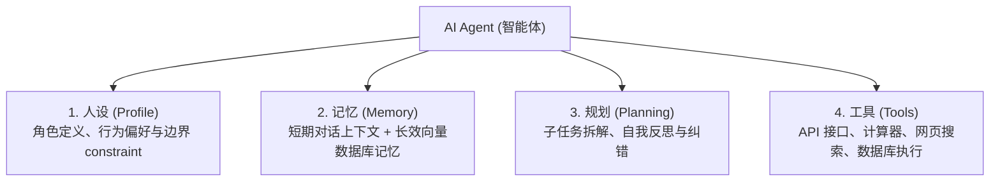

# 1. Agent 架构与 Tool Calling 机制

大语言模型不仅能“聊天”，更能自主使用工具、制定计划、解决复杂问题，这就演化成了 **AI Agent（智能体）**。

---

## 🤖 1. AI Agent 的四大核心要素



---

## 🛠️ 2. Tool Calling（工具调用）底层原理

大模型本身无法直接运行 Python 代码或查询天气，它通过 **Function Calling（函数调用）** 机制输出结构化的 JSON 来指挥外部程序：

1. **定义工具**：将可用工具的函数名、描述、入参 Schema 提交给大模型。
2. **模型抉择**：大模型根据用户请求，决定调用哪个工具，并生成参数 JSON（如 `{"location": "北京"}`）。
3. **本地执行**：代码程序拦截该 JSON，在本地运行真实 API 获取结果（如 `25℃，晴`）。
4. **回传生成**：将运行结果追加回对话历史，大模型根据结果组织最终自然语言回复！

---

## 💻 3. Python 手写极简 Tool Calling 循环

```python
import json

# 1. 模拟本地真实工具函数
def get_weather(location: str):
    if "北京" in location:
        return json.dumps({"temperature": "22℃", "condition": "晴"})
    return json.dumps({"temperature": "18℃", "condition": "多云"})

# 2. 模拟 LLM 返回的 Function Calling 指令
llm_tool_call_response = {
    "tool_name": "get_weather",
    "arguments": {"location": "北京"}
}

# 3. 应用程序调度执行工具
if llm_tool_call_response["tool_name"] == "get_weather":
    args = llm_tool_call_response["arguments"]
    tool_result = get_weather(args["location"])
    print("工具实际执行返回:", tool_result)

# 4. 将 tool_result 喂回 LLM 得到最终回答
final_answer = f"北京目前天气{json.loads(tool_result)['condition']}，温度为 {json.loads(tool_result)['temperature']}。"
print("Agent 最终回答:", final_answer)
```
