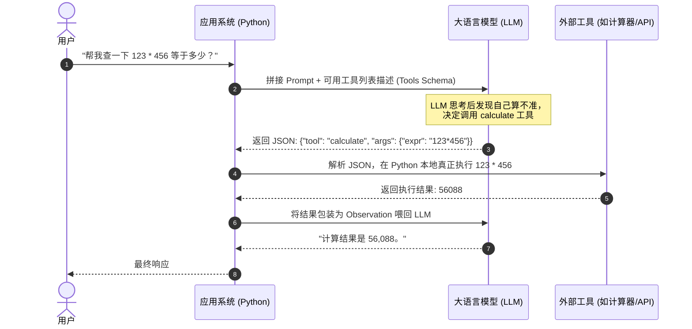
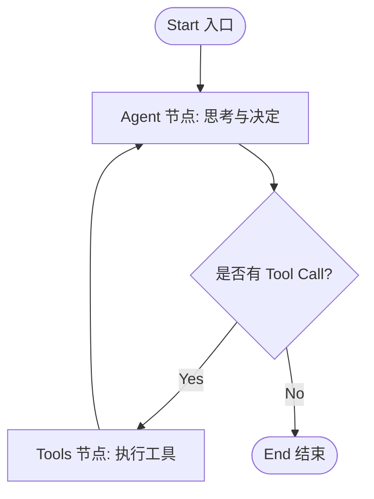

# ReAct 范式与 LangGraph 智能体工作流

AI Agent（智能体）打破了单一 Prompt 对话的局限，通过赋予大模型 **记忆（Memory）**、**规划（Planning）** 和 **工具调用（Tool Calling）** 能力，使其能够像人类助手一样自主思考与解决复杂任务。

---

## 1. 大模型 Tool Calling（工具调用）底层原理

初学者常问：*“大模型不是只能输出文字吗，它是怎么真正执行代码或查数据库的？”*

答案是：**LLM 不会自己运行代码，它只是输出特定格式的结构化 JSON（Tool Call），由上层 Python 系统解析并代替它执行！**



---

## 2. ReAct (Reasoning + Acting) 运行机制

ReAct 范式通过交替执行 **Thought（思考）**、**Action（行动）** 和 **Observation（观察）** 来达成目标：

```text
User Task: 查找并对比 Apple 和 Microsoft 最新季度的财报营收。

Thought 1: 我需要先获取 Apple 最新的季度财报营收数据。
Action 1: GoogleSearch("Apple latest quarter financial results revenue")
Observation 1: Apple 报告季度营收为 1195.8 亿美元。

Thought 2: 现在我需要获取 Microsoft 最新的季度财报营收数据。
Action 2: GoogleSearch("Microsoft latest quarter financial results revenue")
Observation 2: Microsoft 报告季度营收为 620.2 亿美元。

Thought 3: 我已获得两家公司的数据，现在可以进行对比并回复用户。
Final Answer: Apple 最新季度营收为 1195.8 亿美元，Microsoft 为 620.2 亿美元，Apple 高出约 575.6 亿美元。
```

---

## 3. LangGraph 状态图与语法通俗拆解

LangGraph 是目前主流的构建可控 Agent 的图状态机框架。



### 💡 高频 LangGraph 语法通俗卡片
- **State（状态）**：图中所有节点共享的“记忆剪贴簿”。
- **`Annotated[list, add_messages]`**：增量追加消息的语法。当节点返回新消息时，不会覆盖原聊天记录，而是自动 `append` 拼接到对话列表中。
- **`tools_condition`**：条件路由助手。自动检查 LLM 返回的上一条消息里是否有 `tool_calls`。如果有，路由去 `tools` 节点；如果没有，路由去 `END` 结束。

---

## 4. Python + LangGraph 完整可运行 Agent 代码

下面的代码包含**自定义工具、死循环防范（最大循环次数限制）与容错机制**：

```python
import os
from typing import Annotated, TypedDict
from langgraph.graph import StateGraph, START, END
from langgraph.graph.message import add_messages
from langchain_openai import ChatOpenAI
from langchain_core.tools import tool
from langgraph.prebuilt import ToolNode, tools_condition

# 1. 定义 Agent 共享状态 (State)
class AgentState(TypedDict):
    # add_messages 会将新产生的信息自动追加到列表中，保持对话上下文完整
    messages: Annotated[list, add_messages]

# 2. 定义可供 Agent 调用的工具 (Tool)
@tool
def calculate(expression: str) -> str:
    """计算数学表达式的结果。例如输入: '123 * 456'"""
    try:
        # 在真实生产环境建议使用 safe_eval 或 ast 解析
        result = eval(expression)
        return f"计算成功，结果为: {result}"
    except Exception as e:
        return f"工具计算出错: {str(e)}"

tools = [calculate]
tool_node = ToolNode(tools)

# 3. 初始化绑定工具的大模型 (以 OpenAI/Qwen 为例)
# 需要先设置环境变量: export OPENAI_API_KEY="your-key"
llm = ChatOpenAI(
    model="gpt-4o-mini",
    temperature=0
).bind_tools(tools)

# 4. 定义 Chatbot 决策节点
def chatbot_node(state: AgentState):
    # 让 LLM 根据当前对话记录作出思考
    response = llm.invoke(state["messages"])
    return {"messages": [response]}

# 5. 构建 LangGraph 状态图
workflow = StateGraph(AgentState)

# 添加节点
workflow.add_node("chatbot", chatbot_node)
workflow.add_node("tools", tool_node)

# 设置边 (Flow)
workflow.add_edge(START, "chatbot")

# 条件边: 判断 chatbot 节点的输出中是否包含工具调用请求
workflow.add_conditional_edges(
    "chatbot",
    tools_condition, # 自动识别: 有 tool_calls 转到 "tools", 没有则转到 END
    {"tools": "tools", END: END}
)

# 工具执行完毕后，重新回到 chatbot 节点继续思考
workflow.add_edge("tools", "chatbot")

# 编译生成可执行 Agent 应用 (设置 recursion_limit 防止死循环)
agent_app = workflow.compile()

# --- 测试运行 ---
if __name__ == "__main__":
    # 模拟用户提问
    query = "请帮我计算 (35 + 65) * 12 等于多少？"
    print(f"用户: {query}\n")

    # 执行 Agent 工作流 (设置最大步骤数为 10，防止无线死循环)
    config = {"recursion_limit": 10}
    inputs = {"messages": [("user", query)]}

    try:
        results = agent_app.invoke(inputs, config=config)
        print("--- 执行轨迹 ---")
        for msg in results["messages"]:
            role = msg.type
            content = msg.content
            if role == "ai" and msg.tool_calls:
                print(f"🤖 [Agent 思考并决定调用工具]: {msg.tool_calls}")
            elif role == "tool":
                print(f"🛠️ [Tool 执行结果]: {content}")
            elif role == "ai":
                print(f"💡 [Agent 最终回答]: {content}")
    except Exception as err:
        print(f"Agent 运行异常或超过最大迭代步数: {err}")
```
