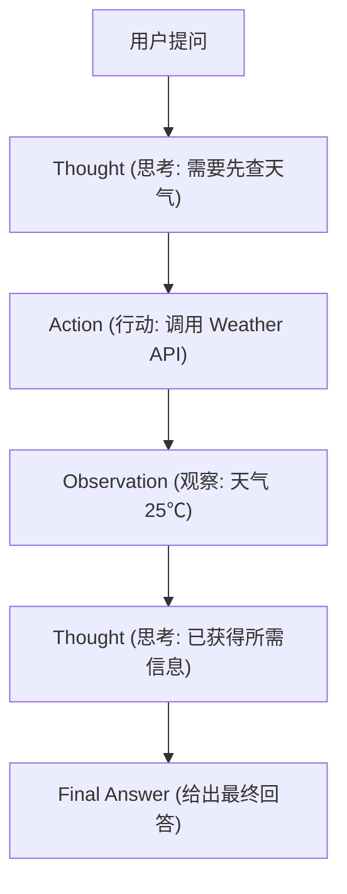

# 2. ReAct 范式与 LangChain 框架入门

让 AI Agent 顺畅运行的最典型思考范式是 **ReAct（Reasoning + Acting）**。

---

## 🔄 1. ReAct 范式：思考 - 行动 - 观察 循环

ReAct 要求模型在每一步都按照固定三部曲循环交替：
- **Thought (思考)**：我当前需要做什么？
- **Action (行动)**：调用指定工具（如 `Search["北京天气"]`）。
- **Observation (观察)**：拿到工具返回的结果，进行进一步推理。



---

## 🔗 2. 使用 LangChain 快速搭建 ReAct Agent

**LangChain** 是最受欢迎的 Agent 开发框架之一，它封装了 Prompt 模板、Tool 管理与 ReAct 执行链：

```python
from langchain_community.llms import Ollama
from langchain.agents import initialize_agent, AgentType
from langchain.tools import tool

# 1. 使用 @tool 装饰器定义自定义工具
@tool
def multiply_numbers(a: int, b: int) -> int:
    """计算两个整数相乘的积"""
    return a * b

tools = [multiply_numbers]

# 2. 初始化大模型 (以本地 Ollama / Qwen 为例)
llm = Ollama(model="qwen2.5")

# 3. 初始化 ReAct Agent
agent = initialize_agent(
    tools=tools,
    llm=llm,
    agent=AgentType.ZERO_SHOT_REACT_DESCRIPTION,
    verbose=True # 打印思考推导日志
)

# 4. 执行复杂推理任务
# agent.run("请帮我计算 34 乘以 56 等于多少？")
```
