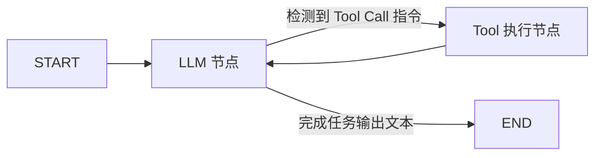

# 3. LangGraph 状态图智能体开发

传统的简单 Agent（如零散的 Chain）缺乏状态持久化与分支控制能力。**LangGraph** 将 Agent 建模为**状态图（State Graph）**，完美支持循环流程、人工干预（Human-in-the-loop）与多智能体协作。

---

## 🕸️ 1. LangGraph 三大核心概念

1. **State（状态）**：贯穿整个图结构的数据载体（如对话历史列表 `messages`）。
2. **Nodes（节点）**：处理逻辑单元（Python 函数），输入当前 State，返回更新后的 State（如 LLM 思考节点、Tool 执行节点）。
3. **Edges（边）**：控制下一步走向，支持条件分支边（Conditional Edges）。



---

## 💻 2. LangGraph 状态图 Agent 实战

```python
from typing import Annotated, TypedDict
from langgraph.graph import StateGraph, START, END
from langgraph.graph.message import add_messages

# 1. 定义图状态 State (自动累加消息)
class AgentState(TypedDict):
    messages: Annotated[list, add_messages]

# 2. 定义处理节点
def chatbot_node(state: AgentState):
    # 此处调用 LLM 生成最新回复
    last_msg = state["messages"][-1]
    response = f"AI 已收到您的消息: '{last_msg}'"
    return {"messages": [response]}

# 3. 构建状态图
builder = StateGraph(AgentState)
builder.add_node("chatbot", chatbot_node)

# 设置入口与出口
builder.add_edge(START, "chatbot")
builder.add_edge("chatbot", END)

# 4. 编译图应用
graph = builder.compile()

# 5. 运行图 workflow
output = graph.invoke({"messages": ["Hello LangGraph!"]})
print("图最终状态输出:\n", output["messages"][-1])
```
