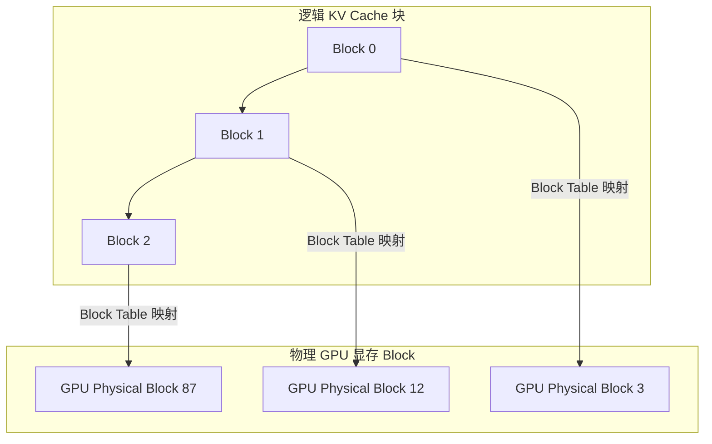

# vLLM 推理加速与 Ollama 本地部署实战

实现生产环境大模型服务的高吞吐量、低延迟响应，需要借助于专业的 LLM 推理引擎与轻量化部署体系。

---

## 1. vLLM 与 PagedAttention 技术解析

传统 Transformer 在生成 Token 时，KV Cache 需要连续显存空间，存在严重的显存碎片化与浪费。vLLM 引入了类似于操作系统虚拟内存管理机制的 **PagedAttention**。



- **显存零浪费**：按需分配固定大小的物理 Block，显存利用率接近 100%。
- **Prefix Caching（前缀缓存）**：系统 Prompt 相同的多请求可共享相同物理 KV Block。

---

## 2. vLLM 部署 OpenAI 兼容 API 服务

### 2.1 启动 vLLM 服务端

```bash
python -m vllm.entrypoints.openai.api_server \
    --model Qwen/Qwen2.5-7B-Instruct \
    --tensor-parallel-size 1 \
    --max-model-len 8192 \
    --port 8000
```

### 2.2 Python 客户端流式调用

```python
from openai import OpenAI

# 连接 vLLM 兼容的 API 接口
client = OpenAI(
    base_url="http://localhost:8000/v1",
    api_key="EMPTY"
)

response = client.chat.completions.create(
    model="Qwen/Qwen2.5-7B-Instruct",
    messages=[{"role": "user", "content": "请用 Python 写一个快速排序算法。"}],
    stream=True
)

for chunk in response:
    if chunk.choices[0].delta.content:
        print(chunk.choices[0].delta.content, end="", flush=True)
```

---

## 3. Ollama 本地轻量化部署实战

Ollama 提供了极致简单的一键本地部署体验，支持 GGUF 格式量化模型。

### 3.1 常用 CLI 命令

```bash
# 运行/拉取模型 (如 qwen2.5)
ollama run qwen2.5:7b

# 查看本地模型列表
ollama list

# 停止并释放显存
ollama stop qwen2.5:7b
```

### 3.2 自定义 Modelfile 创建专属模型

编写 `Modelfile` 定制 System Prompt 与采样参数：

```dockerfile
FROM qwen2.5:7b

# 设置采样温度
PARAMETER temperature 0.3

# 设置系统提示词
SYSTEM """
你是一个顶级的代码评审专家，请用简洁严谨的语言指出代码中的 Performance 和 Security 隐患。
"""
```

通过 Modelfile 构建镜像：

```bash
ollama create code-reviewer -f ./Modelfile
ollama run code-reviewer
```
