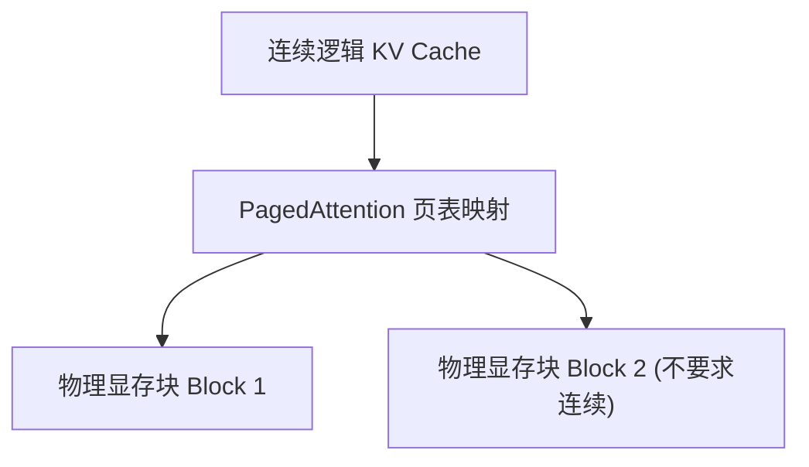

# 2. vLLM 推理加速与高并发服务

在企业生产上线大模型服务时，HuggingFace 默认推理速度太慢、高并发下 GPU 显存迅速爆满（OOM）。**vLLM** 是目前工业界最主流的高性能 LLM 推理引擎。

---

## ⚡ 1. vLLM 核心创新：PagedAttention 机制

在大模型自回归生成过程中，需要为之前的每一个 Token 缓存注意力矩阵（即 **KV Cache**）。随着并发请求数增加，KV Cache 会占用大量显存且产生严重碎片化。

vLLM 借鉴了操作系统虚拟内存分页（Paging）思想，发明了 **PagedAttention**：
- 将连续的 KV Cache 切分为固定大小的“物理块（Block）”。
- **按需动态分配，无需连续物理显存**，显存浪费率直接从 60% 降低到 **低于 4%**！
- 带来 **2x ~ 4x 的吞吐量（Throughput）提升**。



---

## 🚀 2. vLLM 一键启动 OpenAI 兼容 HTTP 服务

在拥有 NVIDIA GPU 的服务器上，一条命令即可拉起高性能生产级服务：

```bash
# 使用 vLLM 启动 Qwen 模型服务
python3 -m vllm.entrypoints.openai.api_server \
    --model Qwen/Qwen2.5-7B-Instruct \
    --port 8000 \
    --tensor-parallel-size 1  # GPU 数量
```

启动后直接使用标准 `openai` SDK 访问 `http://localhost:8000/v1`，吞吐量比原生 PyTorch 提高数倍！
