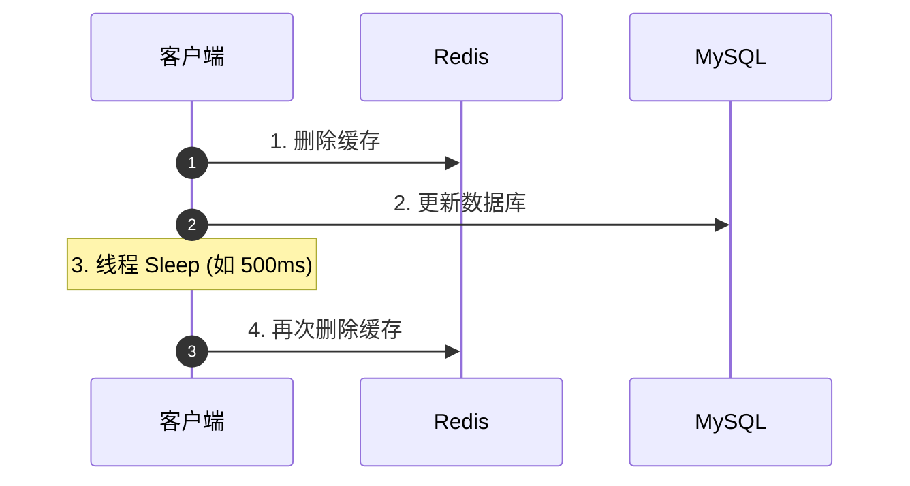
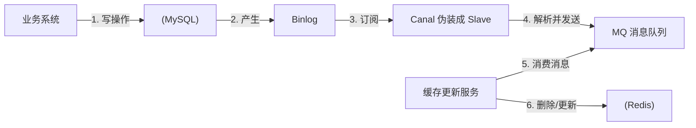

## Redis 双写一致性与内存淘汰策略

在现代高并发架构中，Redis 缓存与 MySQL 数据库的配合使用是标准配置。然而，如何保证缓存与数据库的数据一致性，以及如何管理 Redis 有限的内存空间，是高级 Java 工程师必须攻克的两大核心难题。

---

## 一、 Redis 与 MySQL 双写一致性方案

当数据发生变更时，我们需要同时更新数据库和缓存。由于这是两个独立的系统，无法保证原子性，因此极易产生数据不一致问题。

### 1. 经典方案对比

#### 方案一：先更新缓存，再更新数据库

- **致命缺陷**：如果缓存更新成功，但数据库更新失败，会导致缓存中是新值，数据库中是旧值。后续读请求会一直读取到缓存中的错误新值，产生严重的脏数据。**此方案严禁在生产环境使用**。

#### 方案二：先更新数据库，再更新缓存

- **缺陷（并发竞争）**：

  设有两个并发写请求 A 和 B：

  1. 请求 A 更新数据库（值为 1）。
  2. 请求 B 更新数据库（值为 2）。
  3. 由于网络抖动，请求 B 先更新了缓存（值为 2）。
  4. 请求 A 随后更新了缓存（值为 1）。

  最终：数据库的值是 2，缓存的值是 1，产生**数据不一致**。

#### 方案三：先删除缓存，再更新数据库

- **缺陷（并发读写）**：

  设有一个写请求 A 和一个读请求 B：

  1. 写请求 A 先删除缓存。
  2. 读请求 B 过来，发现缓存失效，去查询数据库（拿到旧值），并准备写入缓存。
  3. 写请求 A 更新数据库（写入新值）。
  4. 读请求 B 将刚刚拿到的旧值写入缓存。

  最终：数据库是新值，缓存是旧值，产生**数据不一致**。

---

### 2. 工业级高可用解决方案

#### 方案一：先更新数据库，再删除缓存（Cache Aside Pattern）

这是目前业界应用最广泛的经典模式。

- **为什么是删除缓存而不是更新缓存？**
  1. **懒加载思想**：如果该缓存是一个复杂的计算结果，频繁更新会浪费 CPU 性能。删除缓存，让其在下次被读取时再懒加载重建，效率更高。
  2. **避免并发竞争**：如前文所述，更新缓存极易因为并发写导致顺序错乱，而删除缓存是幂等的。
- **该方案的极端缺陷**：
  1. 缓存刚好失效。
  2. 读请求 B 查询数据库，拿到旧值。
  3. 写请求 A 更新数据库，并删除缓存。
  4. 读请求 B 将旧值写入缓存。

  最终导致不一致。但由于写数据库的速度（毫秒级）远慢于写缓存的速度（微秒级），步骤 3 几乎必然在步骤 4 之前完成，因此该场景发生的概率极低。

##### 补充：双写一致性下的强一致性方案 —— 读写锁

> 如果业务场景要求绝对的强一致性（不能容忍任何短暂的最终一致延迟），可以使用 Redisson 提供的分布式读写锁（`RReadWriteLock`）。
> - **读锁 (Shared Lock)**：允许多个读请求并发获取读锁，与写锁互斥，但读读不互斥。
> - **写锁 (Exclusive Lock)**：写请求获取写锁，会排斥其他的读锁和写锁。
>
> 读写锁底层依赖 Redis Hash 的状态标志和不同的客户端线程 ID 维护逻辑，保证了写操作进行时读请求被阻塞，或者读操作进行时写操作被阻塞，实现完美的强一致性。

**Java 代码实现示例**：

```java
// 读操作
public String readData(String key) {
    RReadWriteLock rwLock = redissonClient.getReadWriteLock("rwlock:" + key);
    RLock readLock = rwLock.readLock();
    // 获取读锁，若有写锁正在占用，读锁会阻塞等待
    readLock.lock();
    try {
        // 1. 尝试从缓存读取
        String value = redisTemplate.opsForValue().get(key);
        if (value != null) {
            return value;
        }
        // 2. 缓存失效，从数据库读取并回写
        value = mySqlMapper.queryData(key);
        redisTemplate.opsForValue().set(key, value, 30, TimeUnit.MINUTES);
        return value;
    } finally {
        readLock.unlock(); // 释放读锁
    }
}

// 写操作
public void writeData(String key, String newValue) {
    RReadWriteLock rwLock = redissonClient.getReadWriteLock("rwlock:" + key);
    RLock writeLock = rwLock.writeLock();
    // 获取写锁（排他锁，会阻塞其他所有的读锁和写锁请求）
    writeLock.lock();
    try {
        // 1. 更新数据库
        mySqlMapper.updateData(key, newValue);
        // 2. 删除缓存
        redisTemplate.delete(key);
    } finally {
        writeLock.unlock(); // 释放写锁
    }
}
```

#### 方案二：延迟双删（针对先删缓存，后写库方案的补救）

为了解决“先删缓存，后写库”方案中，读请求将旧值写回缓存的问题：



- **原理**：在写请求更新完数据库后，先 `Sleep` 一段时间（确保读请求已经完成了“查库并写回缓存”的操作），然后**再次删除缓存**。
- **痛点**：`Sleep` 的时间极难评估，且同步阻塞会降低接口的吞吐量（可以通过异步线程或消息队列进行第二次删除）。

#### 方案三：Canal 异步订阅 Binlog（终极解耦方案）

为了实现真正的业务解耦，并保证最终一致性：



1. 业务系统只管更新 MySQL，不直接操作 Redis。
2. 阿里开源的 **Canal** 伪装成 MySQL 的 Slave，订阅并解析 MySQL 的 Binlog。
3. Canal 将变更数据发送到消息队列（MQ）。
4. 缓存更新服务消费 MQ 消息，异步、幂等地去删除或更新 Redis 缓存。

- **优点**：业务代码零侵入，高吞吐，且 MQ 的重试机制保证了缓存删除的绝对成功，实现**最终一致性**。

---

## 二、 Redis 过期删除策略

Redis 内存是有限的，必须有机制清理过期的 key。Redis 采用 **定期删除 + 惰性删除** 配合的策略。

### 1. 惰性删除（Passive Eviction）

- **原理**：当客户端尝试访问某个 key 时，Redis 会先检查该 key 是否过期。如果过期，则删除并返回 `nil`；如果没过期，则正常返回。
- **优点**：对 CPU 极度友好，只有在访问时才占用 CPU 进行删除。
- **缺点**：对内存极度不友好。如果大量过期的 key 长期没有被访问，它们会一直驻留在内存中，造成内存浪费。

### 2. 定期删除（Active Eviction）

- **原理**：Redis 默认每隔 100ms（可以通过 `hz` 参数配置）运行一次后台任务，**随机**抽取一部分设置了过期时间的 key，检查并删除其中过期的 key。
- **具体流程**：
  1. 从过期字典中随机抽取 20 个 key。
  2. 删除这 20 个 key 中已经过期的 key。
  3. 如果过期的 key 比例超过 25%（即超过 5 个），则重复步骤 1 和 2。
  4. 为了防止定期删除任务占用太多 CPU 时间，该任务有严格的执行时间上限（默认 25ms）。

---

## 三、 Redis 8 种内存淘汰策略（Eviction Policies）

当 Redis 的内存使用量达到了最大限制（`maxmemory`），且过期删除策略清理后内存依然不足时，Redis 会触发**内存淘汰策略**。

Redis 提供了 8 种淘汰策略，主要分为四大类：

| 策略名称                 | 淘汰行为说明                                                                    |
| :----------------------- | :------------------------------------------------------------------------------ |
| **`noeviction`（默认）** | 不淘汰任何数据。当内存不足时，新写入/修改命令直接报错，只允许读和删除操作。     |
| **`volatile-lru`**       | 在设置了过期时间（TTL）的 key 中，使用 **LRU 算法** 淘汰最近最少使用的 key。    |
| **`allkeys-lru`**        | 在所有的 key 中，使用 **LRU 算法** 淘汰最近最少使用的 key。                     |
| **`volatile-lfu`**       | 在设置了过期时间（TTL）的 key 中，使用 **LFU 算法** 淘汰使用频率最低的 key。    |
| **`allkeys-lfu`**        | 在所有的 key 中，使用 **LFU 算法** 淘汰使用频率最低的 key。                     |
| **`volatile-random`**    | 在设置了过期时间（TTL）的 key 中，**随机**淘汰 key。                            |
| **`allkeys-random`**     | 在所有的 key 中，**随机**淘汰 key。                                             |
| **`volatile-ttl`**       | 在设置了过期时间（TTL）的 key 中，优先淘汰 **剩余存活时间（TTL）最短** 的 key。 |

### 核心算法解析：LRU 与 LFU 的区别

- **LRU (Least Recently Used) 最近最少使用**：
  - **核心思想**：如果数据最近被访问过，那么将来被访问的概率也更高。它看重的是**时间（Recency）**。
  - **Redis 的近似 LRU 实现**：标准的 LRU 需要维护一个双向链表，开销极大。Redis 采用近似 LRU：在每个 key 的对象头中记录一个 24 位的 `lru` 时间戳。当需要淘汰时，随机抽取 5 个（可配置）key，淘汰其中时间戳最旧的那个。
- **LFU (Least Frequently Used) 最不经常使用**：
  - **核心思想**：如果数据在过去被访问的次数最多，那么将来被访问的概率也更高。它看重的是**频次（Frequency）**。
  - **引入原因**：解决 LRU 的“缓存污染”问题。例如，一个 key 长期无人访问，但在淘汰前一秒突然被访问了一次，LRU 会认为它是热点数据而保留它。而 LFU 会记录访问频次，能更精准地识别真正的热点数据。
