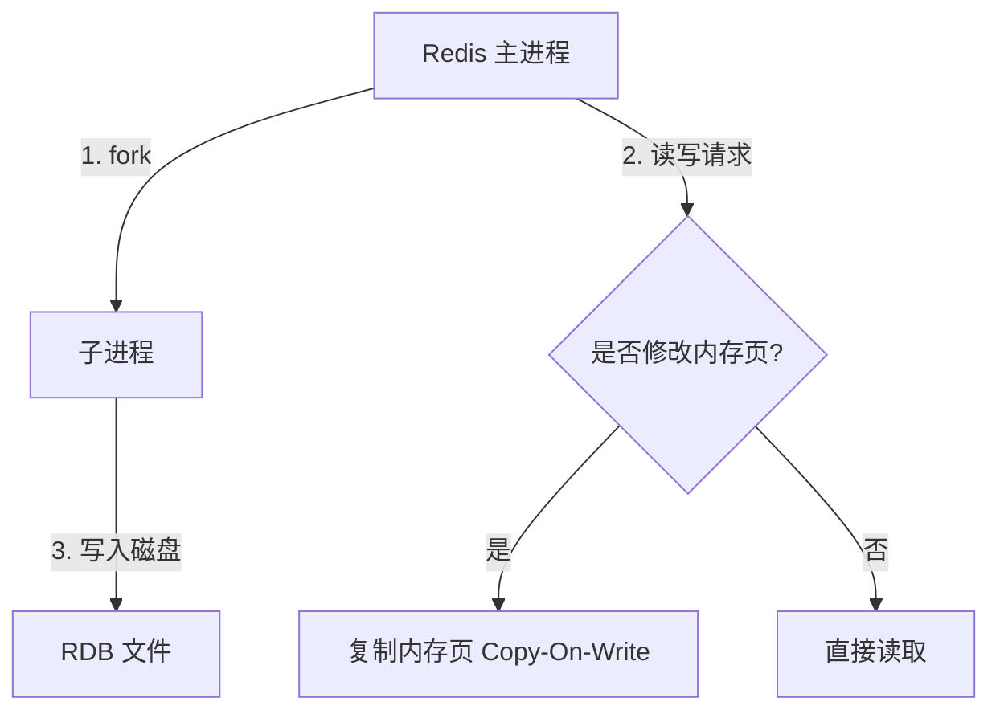
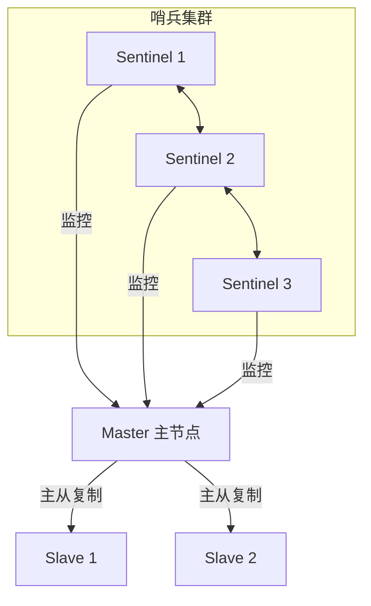

## Redis 高可用：持久化、哨兵与集群

在生产环境中，单机 Redis 无法保证高可用和高并发。为了防止数据丢失 and 单点故障，Redis 提供了 **RDB/AOF 持久化**、**Sentinel（哨兵）** 以及 **Redis Cluster（集群）** 方案。

---

## 一、 Redis 持久化机制：RDB 与 AOF

Redis 是内存数据库，一旦宕机数据就会丢失。为了解决这个问题，Redis 提供了两种持久化方式。

### 1. RDB (Redis Database) 快照持久化

- **原理**：在指定的时间间隔内，将内存中的数据集快照写入磁盘（保存为 `dump.rdb` 文件）。
- **触发方式**：
  - 手动触发：执行 `save`（阻塞主进程，不推荐）或 `bgsave`（后台异步执行，推荐）。
  - 自动触发：在配置文件中配置 `save 900 1`（900秒内有1次修改则触发）。
- **`bgsave` 的底层原理：Copy-On-Write（写时复制）**：
  - Redis 主进程通过 `fork` 创建子进程，子进程共享主进程的物理内存数据。
  - 子进程开始将内存数据写入临时的 RDB 文件。
  - 如果主进程在此时需要修改某个键值对，操作系统会将被修改的内存页复制一份（Copy-On-Write），主进程在复制出的内存页上进行修改，而子进程继续读取原来的物理内存页进行持久化。
  - **优点**：保存的是某个时间点的完整快照，恢复速度极快。
  - **缺点**：容易丢失最后一次快照之后的所有修改。

---

### 2. AOF (Append Only File) 日志持久化

- **原理**：以独立日志的方式记录每次写命令（类似于 MySQL 的 Binlog），重启时重新执行 AOF 文件中的命令来恢复数据。
- **写回策略（`appendfsync`）**：
  - `always`：每次写命令都立即同步到磁盘，最安全，性能最差。
  - `everysec`（默认）：每秒同步一次，折中方案，最多丢失 1 秒数据。
  - `no`：由操作系统决定何时落盘，性能最好，最不安全。
- **AOF 重写（Rewrite）机制**：
  - **原因**：随着运行时间增长，AOF 文件会越来越大。
  - **原理**：创建一个新的 AOF 文件，直接读取当前内存中的键值对，用一条命令代替历史的多条命令（例如，对同一个 key 执行了 100 次 `INCR`，重写时直接记录一条 `SET key 100`）。

### 3. 混合持久化（Redis 4.0+）

- **配置**：`aof-use-rdb-preamble yes`
- **原理**：在 AOF 重写时，先将当前内存数据以 RDB 的格式写入 AOF 文件的开头，然后再将重写期间产生的增量写命令以 AOF 的格式追加到文件末尾。
- **优点**：结合了 RDB 恢复速度快和 AOF 丢失数据少的优点。

### 4. Multi-Part AOF 机制（Redis 7.0+）

在 Redis 7.0 之前，AOF 重写会产生一个全新的 AOF 文件。在重写期间，所有的增量写命令不仅要写入旧的 AOF 文件，还要缓存在内存中的 **AOF 重写缓冲区** 中。当重写完成后，主线程会将缓冲区内的数据追加写入新的 AOF 文件中，这会产生两个严重痛点：

1. **内存占用暴增**：高并发写入时，重写缓冲区会消耗大量内存，甚至导致 OOM。
2. **磁盘 I/O 抖动**：最后追加大文件时会阻塞主线程，产生严重的磁盘吞吐尖峰。

为了彻底解决这一问题，Redis 7.0 引入了 **Multi-Part AOF** 机制。

- **原理**：将单一的 AOF 文件拆分为三种类型的文件：
  - **Base AOF 文件**：基础数据，通常是重写时刻的快照（可以是 RDB 格式或 AOF 格式）。
  - **Incremental AOF 文件**：增量命令日志。在重写开始后，新的写命令会直接追加到新的增量 AOF 文件中，而不需要使用内存重写缓冲区。
  - **Manifest 清单文件**：用于跟踪和管理上述 Base 和 Incremental 文件，记录它们的创建顺序和文件名元数据。
- **优势**：
  1. **免去内存缓冲区**：重写期间的写操作直接落盘，极大节省了内存消耗。
  2. **消除主线程阻塞**：重写完成后，只需更新 Manifest 清单文件即可，省去了庞大数据拷贝追加的过程。

---

## 二、 Redis 主从复制与 PSYNC 演进

在进入哨兵与集群之前，主从复制是所有高可用架构的基石。为了将主节点的数据同步给从节点，Redis 经历了同步机制的演进。

### 1. 全量复制 vs 部分复制

- **全量复制 (Full Synchronization)**：主节点通过 `bgsave` 生成 RDB 文件发送给从节点，从节点清空自身数据并加载该 RDB。之后，主节点将缓冲区中缓存的写命令发送给从节点执行。通常在从节点初次连接、或偏移量超出环形缓冲区时触发。
- **部分复制 (Partial Synchronization)**：当主从网络发生短暂断开并重连时，主节点只将断开期间产生的增量写命令发送给从节点，避免了全量复制的高昂代价。

### 2. PSYNC1 与 PSYNC2 机制演进

为了实现更高效的部分复制，Redis 进行了协议升级：

- **PSYNC1 缺陷 (Redis 2.8+)**：
  - **主备切换全量复制**：如果主节点发生故障，某个从节点被晋升为新主节点。其他从节点指向这个新主节点时，因为其运行 ID（`runid`）发生了改变，所有从节点都必须和新主节点进行一次全量复制。
  - **重启全量复制**：当从节点重启后，其内存中的 `runid` 和 `offset` 丢失，即使它本地有数据，重连主节点后也只能进行全量复制。
- **PSYNC2 优化 (Redis 4.0+)**：
  1. **双 ID 机制 (`replid` 与 `replid2`)**：主节点除了维护自身的 `replid` 之外，如果自己是从 Slave 晋升而来的，还会用 `replid2` 记录前一个主节点的 ID。这样当其他从节点发送前一个主节点的 ID 进行同步时，新主节点发现能匹配 `replid2`，且偏移量合理，就依然允许进行增量部分同步。
  2. **辅助信息持久化**：从节点在关机时，会将当前的 `replid` 和 `offset` 作为辅助元数据写入本地的 RDB/AOF 文件中。重启加载数据时，能还原上次同步的信息，从而向主节点发起增量 PSYNC，彻底避免了重启全量复制。

---

## 三、 Redis Sentinel (哨兵模式)

哨兵模式是为了解决主从复制（Master-Slave）模式下，主节点宕机后需要人工干预切换的问题。

**哨兵的核心职责**：

1. **监控（Monitoring）**：持续检查主节点和从节点是否正常运行。
2. **自动故障转移（Automatic Failover）**：当主节点出现故障时，自动将某个从节点升级为新的主节点，并通知其他从节点和客户端。
3. **配置提供者（Configuration Provider）**：客户端连接哨兵集群，由哨兵告知当前可用的主节点地址。

### 2. 故障判定与选举领头哨兵

- **主观下线（Subjective Down, SDOWN）**：单个哨兵节点在指定时间内未收到主节点的心跳响应，认为主节点已下线。
- **客观下线（Objective Down, ODOWN）**：当判定主观下线的哨兵数量达到配置的法定人数（Quorum，通常设为哨兵总数的一半以上）时，主节点被判定为客观下线。
- **选举领头哨兵（Raft 协议简化版）**：
  - 选举规则：先到先得，获得半数以上选票的哨兵成为 Leader。

---

## 四、 Redis Cluster (集群模式)

Redis Cluster 是 Redis 官方提供的分布式解决方案，实现了数据的**自动分片（Sharding）**和**横向扩展**。

### 1. 哈希槽（Hash Slot）机制

Redis Cluster 没有使用一致性 Hash，而是引入了 **哈希槽（Hash Slot）** 的概念。

- **槽位总数**：Redis Cluster 固定的槽位总数为 **16384** 个（`` `$2^{14}$` ``）。
- **路由规则**：当客户端向集群发送一个 key 时，集群会先对 key 进行 CRC16 校验，然后对 16384 取模，决定该 key 落在某一个槽位：

  `Slot = CRC16(key) % 16384`

  *补充：如果 key 包含 `` `{}` ``，则集群只会计算大括号内内容的 CRC16。这就是 **Hash Tag** 机制，可强制包含特定子串的 key 落入同一个槽中（例如 `{user:100}:info` 和 `{user:100}:orders` 会落到同槽），从而支持多 key 的 Lua 脚本和事务操作。*

- **节点分配**：集群中的每个物理 Master 节点负责管理一部分槽位。例如，有 3 个 Master 节点：
  - 节点 A 负责：0 ~ 5460 槽。
  - 节点 B 负责：5461 ~ 10922 槽。
  - 节点 C 负责：10923 ~ 16383 槽。

### 2. 为什么哈希槽的数量是 16384？

这是面试中非常经典的细节追问：

- **网络抖动与心跳包大小**：
  - Redis Cluster 节点之间需要频繁发送 Ping/Pong 心跳包，心跳包中会携带节点的槽位位图（Bitmap）。
  - 如果槽位是 16384，位图大小为 `16384 / 8 = 2KB`。
  - 如果槽位增加到 65536（64KB），心跳包中的位图大小将达到 8KB。在节点数量较多时，这会占用大量的网络带宽，造成网络拥堵。
- **集群规模限制**：
  - Redis 官方推荐的集群节点数量上限是 1000 个左右。
  - 对于 1000 个以内的节点，16384 个槽位已经足够让每个节点分配到适量的槽位，分片粒度足够细，没必要使用更大的 65536。

