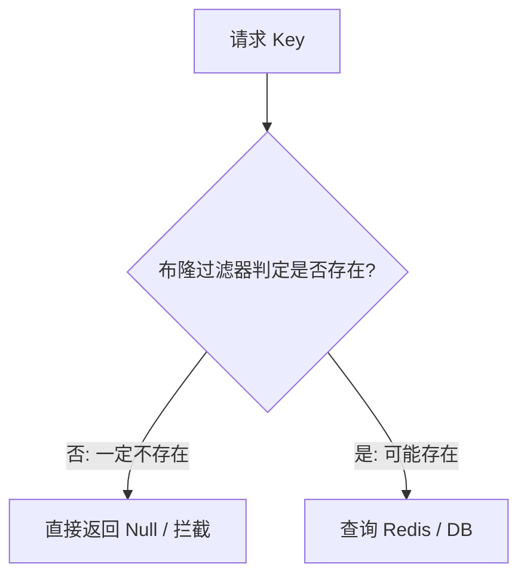
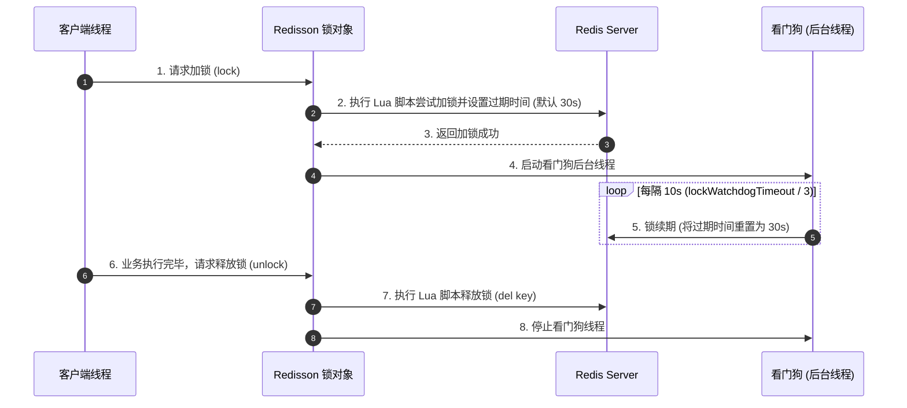

## Redis 缓存实战：三剑客与分布式锁

在实际业务中，Redis 最常用于缓存和分布式锁。如何应对缓存异常场景（穿透、击穿、雪崩），以及如何设计一个安全、高可用的分布式锁，是高级 Java 工程师必须掌握的实战技能。

---

## 一、 缓存三剑客：穿透、击穿、雪崩

| 异常场景     | 现象描述                                                                                                     | 核心解决方案                                                                                                                       |
| :----------- | :----------------------------------------------------------------------------------------------------------- | :--------------------------------------------------------------------------------------------------------------------------------- |
| **缓存穿透** | 查询一个**根本不存在的数据**，缓存和数据库中都没有。导致每次请求都直接打到数据库，可能导致数据库崩溃。       | 1. **缓存空对象/默认值**（设置较短过期时间） 2. **使用布隆过滤器（Bloom Filter）** 在查询前进行拦截                                |
| **缓存击穿** | 一个**热点 key**（如秒杀商品）在过期的瞬间，有海量并发请求同时过来。由于缓存失效，这些请求会同时打到数据库。 | 1. **热点数据设置永不过期** 2. **使用互斥锁（Mutex Lock）**，只允许一个线程去查库并重建缓存，其他线程等待                          |
| **缓存雪崩** | **大量缓存 key 同时过期**，或者 **Redis 宕机**。导致海量请求瞬间全部打到数据库，造成数据库雪崩。             | 1. **过期时间加随机盐（Random Salt）**，避免集中失效 2. **构建 Redis 高可用集群**（哨兵/集群） 3. **多级缓存（本地缓存 + Redis）** |

### 1. 布隆过滤器（Bloom Filter）原理

布隆过滤器是一种空间效率极高的概率型数据结构，用于判断一个元素**是否一定不存在**或**可能存在**。

- **结构**：一个超长的二进制向量（Bit Array）和多个随机映射函数（Hash Functions）。
- **工作流程**：
  1. **添加元素**：将一个 key 传入多个哈希函数，计算出多个哈希值，并将二进制向量中对应位置的值设为 `1`。
  2. **查询元素**：将要查询的 key 传入相同的哈希函数，计算出对应的位置：
     - 如果对应位置有**任意一个为 `0`**，则该 key **一定不存在**（直接拦截，不查库）。
     - 如果对应位置**全部为 `1`**，则该 key **可能存在**（允许穿透去查数据库/缓存）。
- **缺点**：存在误判率（False Positives），且不支持删除操作（因为删除一个位置的 `1` 可能会影响其他 key 的判定）。



---

## 二、 Redis 分布式锁深度设计

在分布式微服务架构下，Java 的 `synchronized` 和 `ReentrantLock` 只能锁住单个 JVM 进程。跨进程的并发控制需要使用分布式锁。

### 1. 简易分布式锁的缺陷（`SETNX`）

最简单的分布式锁实现是使用 `SETNX`（Set if Not Exists）：

```sql
SETNX lock_key unique_value
EXPIRE lock_key 30
```

**缺陷分析**：

- **非原子性**：`SETNX` 和 `EXPIRE` 是两条命令。如果执行完 `SETNX` 后 Redis 突然宕机，导致过期时间未设置，该锁将变成**死锁**。
  - **解决方案**：使用 Redis 2.6.12+ 提供的原子性 `SET` 命令：

    ```bash
    SET lock_key unique_value NX PX 30000
    ```

- **锁被他人误释放**：
  - **场景**：客户端 A 加锁成功，设置过期时间 30 秒。但 A 的业务执行了 40 秒。在第 30 秒时，锁自动过期释放。此时客户端 B 成功加锁。在第 40 秒时，客户端 A 业务执行完毕，执行 `DEL lock_key` 释放锁，结果把客户端 B 刚刚加的锁给释放了。
  - **解决方案**：加锁时存入一个唯一的 `unique_value`（如 UUID）。释放锁时，先判断锁的值是否等于自己的 `unique_value`，如果相等才释放。
  - **原子性释放**：由于“判断”和“删除”是两步操作，必须使用 **Lua 脚本** 保证原子性：

    ```lua
    if redis.call("get", KEYS[1]) == ARGV[1] then
        return redis.call("del", KEYS[1])
    else
        return 0
    end
    ```

---

### 2. 工业级解决方案：Redisson 与看门狗（Watch Dog）机制

上述方案依然无法解决**“业务执行时间超过锁过期时间”**的问题。如果业务没执行完，锁就过期了，依然会出现并发安全问题。

**Redisson** 完美地解决了这一痛点，其核心就是**看门狗（Watch Dog）机制**。

#### 补充：Redisson 分布式锁的底层数据结构和重入原理

> Redisson 的分布式锁在 Redis 中并非存储为简单的 String 类型，而是存储为 **Hash 类型**。
> - **Key**：锁的名称（如 `anyLock`）。
> - **Field**：客户端唯一标识（通常是 UUID + 线程 ID，如 `8f4b-3a21-4f11:1`）。
> - **Value**：锁的重入次数（正整数，默认是变为 1，每次重入累加 1）。
>
> 加锁和释放锁的逻辑完全由 **Lua 脚本** 保证原子性。例如加锁脚本会首先判断锁 key 是否存在，若不存在或是当前线程持有的，就使用 `hset` 或 `hincrby` 写入或递增，并设置 TTL。



**看门狗工作流程**：

1. 客户端 A 加锁成功，默认锁的有效期是 30 秒（可以通过 `lockWatchdogTimeout` 配置）。
2. 一旦加锁成功，Redisson 内部会启动一个后台线程（看门狗）。
3. 看门狗是一个定时任务，**每隔 10 秒**（即 `lockWatchdogTimeout / 3`）就会向 Redis 发送续期命令，将锁的过期时间重新设置为 30 秒。
4. 只要客户端 A 的业务没有执行完（即没有显式调用 `unlock()`），看门狗就会一直续期。
5. 如果客户端 A 突然宕机，看门狗线程随之消失，锁在 30 秒后会自动过期释放，防止死锁。

---

### 3. 极端场景：主从切换下的锁丢失问题与 Redlock 深度思辨

- **问题现象**：在 Redis 主从或哨兵架构下，客户端 A 在 Master 节点上加锁成功。在异步数据同步到 Slave 节点之前，Master 突发宕机了。Slave 升级为新的 Master。此时客户端 B 尝试加锁，由于新 Master 上完全没有锁数据，B 加锁成功。导致 A 和 B 同时持有了锁，分布式锁宣告失效。
- **解决方案：Redlock（红锁）算法**：
  - 客户端需要同时向多个（通常是 5 个）物理独立的外部 Redis Master 节点发起加锁请求。
  - 只有在半数以上（如 3 个）节点加锁成功，且加锁消耗的总时间小于锁的有效时间，才算最终加锁成功。

#### 💡 著名的学术 PK：Martin Kleppmann vs Antirez

分布式领域专家 **Martin Kleppmann**（*DDIA* 作者）曾发表文章指出 Redlock 并非想象中那么安全，与 Redis 作者 **Antirez** 展开了长达数轮的精彩论战。

##### Martin 提出的致命质疑

Martin 认为 Redlock 是建立在“异步时间模型（Asynchronous System Model）”上的，这在分布式系统中是不稳固的。

1. **NPC 现象的侵蚀**：
   - **N (Network Delay) 网络延迟**：客户端在获取前 2 个锁时极其顺畅，但在获取第 3 个锁时发生网络严重阻塞，导致锁过期时间已被严重消耗。
   - **P (Process Pauses) GC 停顿 / 进程暂停**：客户端 A 在所有节点加锁成功后，突然触发了 JVM 的 **Full GC**，线程陷入 **STW**（Stop The World）数分钟。此时锁全部过期，客户端 B 抢到锁开始执行，等 A 从 GC 中恢复过来，它依然认为自己持有锁，从而导致两端并发修改。
   - **C (Clock Drift) 时钟漂移**：多台物理服务器之间的系统时钟不可能绝对对齐。由于 NTP 步进、时钟硬件老化，可能导致某些节点的秒过得更快。如果一台服务器的时钟突然向前跳跃，直接导致本节点的锁提前过期。

##### Antirez 的强力回击

针对 Martin 的学术轰炸，Antirez 逐一做出了工程学层面的强力辩驳：

1. **时钟漂移的边界控制**：
   - 只要合理配置 NTP，设置时钟的最大误差限度。且在判定加锁成功时，**减去可能产生的时钟漂移最大预估值**，便可直接消除时钟突跳带来的失效风险。
2. **GC 停顿与 Lease（租约）机制**：
   - 如果发生 Full GC STW，不仅是 Redlock 无法自愈，任何基于租约/过期时间的锁机制（包括 ZooKeeper 的 Session Timeout）都会面临相同的问题。
   - **防范策略**：在获取到锁之后、执行具体业务代码之前，再次检查锁是否仍然有效（Check-then-Act，比如利用单调时间戳做二次判定）。

##### 工业界的真实抉择

论战虽然没有绝对的胜负，但给工业界指明了清晰的方向：

- **效率优先（99% 的互联网场景）**：使用 **Redisson + Watch Dog** 即可。即使发生极罕见的主从切换丢数，通过人工兜底、幂等控制或重试来低成本修复。
- **强一致性优先（金融、核心交易、库存扣减）**：生产上不推荐使用复杂的 Redlock。直接采用基于 CP 协议的 **ZooKeeper 方案**（利用 ZAB 协议与临时顺序节点，强一致性写入，Master 挂了 Session 直接在 ZooKeeper 全局清退，锁被及时感知）。

---
