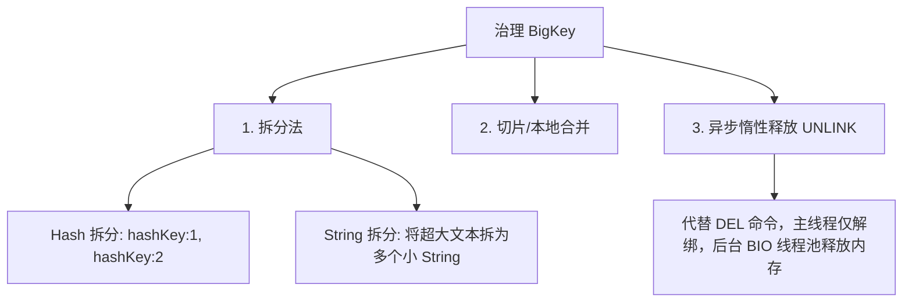
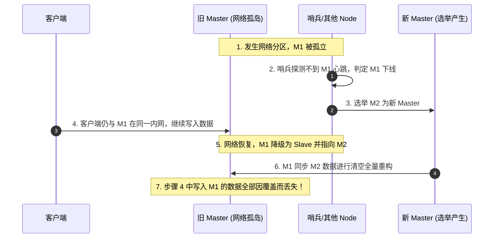

## Redis 性能调优与大Key/热Key解决方案

在生产环境的高并发体系下，Redis 的稳定性直接关系到整套微服务架构的生死。因此，掌握企业级的性能监测、BigKey / HotKey（大Key和热Key）治理、脑裂现象及其规避方案，至关重要。

---

## 一、 BigKey (大Key) 深度治理

### 1. 什么是 BigKey

BigKey 并不是指 Key 本身很大，而是指其对应的 **Value 占用了过大的物理内存或包含了极为庞大的数组成员**。

- **String 类型**：单个 Value 大于 $5\text{KB}$（或 $10\text{KB}$）。
- **集合类型（Hash/List/Set/Zset）**：成员数量大于 5000 个。

### 2. BigKey 的危害

- **网络阻塞**：每次获取 BigKey 都会产生巨大的网卡流量。假设一个大 Hash 占用了 $5\text{MB}$，万级 QPS 将直接把网卡打爆。
- **单线程阻塞**：因为 Redis 核心执行器是单线程的，释放或删除一个庞大 Key（如几百万个成员的 Zset）会长时间阻塞主线程，引发大面积请求超时（P99 飙升）。
- **客户端超时与 OOM**：客户端缓冲区溢出或 JVM 直接 OOM。

### 3. 如何发现 BigKey

- **命令扫描**：
  - `redis-cli --bigkeys`：对整个 Key 空间进行扫描，并给出各类数据类型的 Top 1 空间大小，但对集合只统计成员数，不统计实际字节数。
  - `SCAN` 结合 `DEBUG OBJECT` or `MEMORY USAGE`：利用非阻塞的 `SCAN` 命令分批读出 Key，然后使用 `MEMORY USAGE <key>` 测量准确的字节。
- **RDB 分析工具**：
  - 离线分析：将 RDB 备份文件下载，利用开源分析工具如 **`redis-rdb-tools`**，输出完整的 csv 数据报告，对生产物理环境零侵入。

### 4. 彻底治理 BigKey 的方案



- **数据拆分（Deconstruction）**：
  - **Hash 拆分**：如果成员过多，可将哈希根据 Key 的 MurmurHash 模以 $N$，分散到多个小哈希中（例如 `user:info:12345` 路由到 `user:info:12`）。
  - **String 拆分**：将超大 JSON 或大列表拆分成多个段。
- **异步清理（Lazy Freeing）**：
  - 严禁在生产中使用同步阻塞的 `DEL` 移除大 Key。
  - **使用 `UNLINK` 替代 `DEL`**：`UNLINK` 会直接在全局字典中移除该 Key（这一步是 $O(1)$ 的，主线程瞬时解绑），而其实际占用的物理内存将由 **BIO（Background I/O Thread）** 异步线程在后台缓慢释放。
  - **配置自动异步释放**：

    ```text
    lazyfree-lazy-eviction yes
    lazyfree-lazy-expire yes
    lazyfree-lazy-server-del yes
    replica-lazy-flush yes
    ```

---

## 二、 HotKey (热Key) 爆发与突围

### 1. 什么是 HotKey 及成因

在极短时间内，数万甚至数十万并发请求集中访问 Redis 中的同一个 Key（例如：突发热点新闻中的人物信息、大促秒杀的商品库存）。

- **多级缓存失效导致流量直达**：当热点缓存失效，流量全部打在单一 Redis 分片节点。

### 2. 如何探测 HotKey

- **客户端监控**：在 Redis 客户端连接池（如 `Lettuce` / `Jedis`）或连接池上层做 AOP 拦截，进行滑动窗口计数。
- **代理层拦截**：在 Redis Proxy（如 Codis、Twemproxy）层汇聚统计。
- **Redis 节点自带探测**：
  - `redis-cli --hotkeys`：基于 **LFU**（Least Frequently Used）内存淘汰算法追踪记录的热门 Key。需将内存淘汰策略设为 `allkeys-lfu` 或 `volatile-lfu`。
- **网络抓包**：使用 `tcpdump` 加上专业解析工具嗅探分发包。

### 3. HotKey 的黄金解决方案：本地缓存 + 隔离


- **JVM 进程本地缓存（Caffeine / Guava Cache）**：
  - 核心思想：**直接在应用服务器内存缓存热点数据，压根儿不让流量出网卡**。
  - 借助开源的 HotKey 探测框架（如京东的 **`JD-hotkey`**），一旦某台应用节点发现某个 Key 极热，会自动将该 Key 推送给所有应用服务的本地 JVM 内存（Caffeine）缓存，过期后再穿透回 Redis。
- **备份 Key 分散路由（Key Backup）**：
  - 将热点 Key 复制成多份，加上随机后缀，均匀分配在不同的分片节点。
  - 例如 `hot_item_100` 备份为 `hot_item_100_1`、`hot_item_100_2`、`hot_item_100_3`。
  - 客户端读取时，在后缀范围 $[1, N]$ 内随机取一个进行访问，将千万级的读取高负载分摊到多台 Redis 实例。

---

## 三、 Redis 脑裂（Split-Brain）与防御措施

在 Sentinel（哨兵）模式或 Cluster（集群）模式下，由于网络分区，可能会产生**脑裂现象**，导致严重的数据丢失。

### 1. 脑裂的诞生场景与危害



- **成因**：由于物理网络故障，Master 节点所在的内网与哨兵集群/副本节点所在的网络断开，但该 Master 本身依然处于运行状态（未宕机）。
  - 哨兵集群因为探测不到 Master 的心跳，认为其“客观下线”，并开始选举，将其中一个 Slave 升级为**新 Master**。
  - 此时，在整个拓扑网络中，存在**两个 Master** 同时工作。这就叫**脑裂**。
  - 部分未感知到网络分区的客户端依然能访问旧 Master，并向其写入新数据。
  - 当网络分区恢复后，旧 Master 被降级为 Slave，并强制向新 Master 发起全量复制（`replicaof` / `slaveof`）。在复制开始前，**旧 Master 会清空自己的数据**，从而导致那些在网络分区期间由客户端写入旧 Master 的最新数据，**彻底、永久丢失**。

### 2. 完美的防御之道

通过修改 Redis 的主配置文件 `redis.conf`，设置两个硬性容错参数：

```text
min-replicas-to-write 1
min-replicas-max-lag 10
```

- **参数详解**：
  - `min-replicas-to-write 1`：Master 要求至少有 $1$ 个从节点保持连接，才允许接收客户端的写入请求（否则拒绝写入，直接返回错误）。
  - `min-replicas-max-lag 10`：Master 要求从节点与自己的心跳延迟延迟（lag）必须小于 $\le 10$ 秒。
- **规避逻辑**：
  - 当网络分区建立，旧 Master 被孤立时，它由于无法与周围任何 Slave 进行心跳通讯，导致活跃 Slave 数降为 0。
  - 此时，只要客户端向旧 Master 写入，旧 Master 直接报错拒绝（返回只读等），**从而阻止了不一致数据的产生**，网络恢复后也就不会再发生丢数现象。

---

## 四、 缓冲区溢出与主从调优秘籍

### 1. 增量复制断流后的环形缓冲区（Replication Buffer）溢出

- 当主从网络瞬时断开重连时，如果连接断开期间主节点写入的数据量**超出了环形缓冲区（`repl-backlog-size`）**的大小，主节点将无法通过 `PSYNC` 增量同步数据，必须退化为 **全量同步（Full Synchronization）**。
- **全量同步的连环雪崩**：主节点 fork 子进程生成 RDB 会阻塞网络，并向从节点发送 RDB。在此期间，主节点又要将写请求写入 `client-output-buffer-limit replica`。由于 RDB 发送漫长，如果缓冲区再次溢出，主从连接会直接重置，从而形成**“全量同步断流 $\to$ 缓冲区溢出 $\to$ 重连全量同步 $\to$ 再次溢出”的死循环**，直接锁死 Redis 性能。

### 2. 调优推荐

- 适当调大后台增量同步环形缓冲区大小：

  ```text
  repl-backlog-size 512mb
  ```

- 调大客户端输出缓冲区物理限制，防止全量恢复时直接断线：

  ```text
  client-output-buffer-limit replica 1024mb 512mb 60
  ```

---

## 五、 内存碎片率 (mem_fragmentation_ratio) 治理

在长期运行的 Redis 实例中，物理内存的使用量可能会远超实际存储数据所需的内存，这就涉及**内存碎片**。

### 1. 内存碎片产生原因

1. **内存分配器策略**：Redis 默认使用 **jemalloc** 作为内存分配器。jemalloc 会按照一系列固定大小的内存页（如 8B、16B、64B、2KB 等）来分配空间，而不是按需精确分配。当 Redis 存储一个 10 字节的数据时，可能会被分配 16 字节的空间，多余的 6 字节即成为碎片。
2. **键值对频繁删改**：当大量的 Key 被频繁删除或修改，占用的空间大小发生变化时，之前释放的空间无法直接被其他大小不同的对象使用，从而产生大量细碎且不连续的空闲内存空间。

### 2. 碎片率指标 mem_fragmentation_ratio

在 `redis-cli` 中运行 `INFO memory`，可以查看到：

`mem_fragmentation_ratio = used_memory_rss / used_memory`

- `used_memory_rss`：操作系统分配给 Redis 进程的物理内存（常驻内存集）。
- `used_memory`：Redis 使用内存分配器分配的用于存储数据的内存总量。

**指标分析**：

- **正常范围**：`1.0 ~ 1.5`。稍微有些碎片是正常现象。
- **碎片严重 (> 1.5)**：表示内存碎片率过高，大量的物理内存被浪费，需要进行碎片整理。
- **异常变慢 (< 1.0)**：表示物理内存不足，操作系统已经开始使用 **Swap 交换分区**。由于磁盘读写速度远慢于内存，Redis 的性能会发生断崖式下跌，必须立刻增加物理内存或扩容集群。

### 3. 彻底治理内存碎片方案

#### 方案一：自动渐进式整理（推荐）

Redis 4.0+ 提供了活跃内存碎片整理（Active Defragmentation）功能，支持在不重启的情况下，在后台渐进式地重新分配和合并物理内存。

在 `redis.conf` 中开启配置：

```text
activedefrag yes
```

*辅助调优参数*：

```text
# 触发整理的最小碎片大小（默认 100MB）
active-defrag-ignore-bytes 100mb

# 触发整理的最小碎片率百分比（默认 10%）
active-defrag-threshold-lower 10

# 后台整理任务占用的最小 CPU 时间百分比（默认 1%）
active-defrag-cycle-min 1

# 后台整理任务占用的最大 CPU 时间百分比（默认 25%）
active-defrag-cycle-max 25
```

Redis 会在主线程空闲时段运行碎片整理，通过将存活对象拷贝到连续的新内存地址来释放旧的碎片，从而在不影响主线程读写性能的前提下完成内存回收。

#### 方案二：滚动重启

对于老旧版本的 Redis，或者碎片率极高（例如大于 2.0）且开启自动整理后 CPU 消耗过大的节点，可以在夜间低峰期，通过 Sentinel 或 Cluster 架构对节点进行**滚动重启**（先重启 Slave，待数据同步完毕后进行主从切换，再重启旧 Master）以彻底释放内存碎片。

