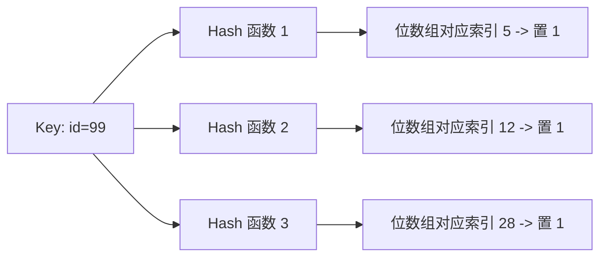

## Redis 缓存高并发与击穿/穿透/雪崩面试真题

本专栏致力于为中高级后端开发人员提供最硬核、直击底层原理、结合生产实战的 Redis 缓存高并发面试真题剖析。每个知识点都配有详尽的答案、核心源码流程、以及辅助理解的布隆过滤器算法与分布式锁双重检查机制图。

---

## 📂 模块五：数据持久化与缓存高并发（Redis 部分）

### Q2：高并发下缓存击穿、缓存穿透、缓存雪崩的场景成因以及最牛的工业级规避方案？

这是互联网大厂高并发架构下出镜率 100% 的实操题。

#### 1. 缓存穿透 (Cache Penetration)

- **概念成因**：

  请求查一条**既不在 Redis、也绝不在 MySQL 数据库中**的无端畸形数据（比如恶意黑客发起的 ID = -1 或各种伪造 UUID 的高频查询）。缓存由于没有该 Key 无法拦截，直接全部强行打到 MySQL 建立连接，引发数据库直接宕机。

- **终极大招：布隆过滤器 (Bloom Filter) 原理与应用**：

  布隆过滤器由一个超长**高效的二进制位数组**和 **若干个弱哈希散列函数** 组成。
  当一条数据（如 ID = 99）入库时，用 $k$ 个 hash 函数映射到数组上并将其值置为 $1$。



- **算法断言机制**：
  1. **布隆过滤器判定“该对象不存在”，则该对象一定 100% 数据库中真实的没有。**
  2. **布隆过滤器判定“该对象可能存在”，仅由于极低哈希碰撞有轻微假阳性概率。**

- **规避流程**：

  请求发起后，先经过布隆过滤器，如果过滤器断定不存在，甚至不查缓存，直接打回拦截。如果是合法存在，才放行给 Redis/MySQL。
  也可以在 Redis 内部将这些空 Key 临时写成 `""` 字符串占位、并给予极短过期时间（如 5 秒），从机制上堵塞。

---

#### 2. 缓存击穿 (Cache Breakdown)

- **概念成因**：

  **某个超热点 Key（比如微博热搜、秒杀核心单品）在突发高并发流量的节骨眼，它的过期时间突然到期了。**
  由于该 Key 当前属于千万并发点，此时海量读线程在缓存内“扑空”，全部在同一瞬间向 MySQL 发起查询并回写缓存。瞬间的超高峰连接让数据库直接被堵死，全线瘫痪。

- **工业最强方案：Redisson 分布式锁 + 双重检查锁（DCL） / 逻辑过期异步线段**：

  若发生空缺，不直接并发读，只允许通过抢拿**基于 Redisson 机制的分布式锁**来确保只有一个线程有权去读库回写：

```java
public String getProductInfo(String key) {
    // 1. 尝试从缓存直接拿
    String value = redisTemplate.opsForValue().get(key);
    if (value != null) {
        return value; 
    }
    // 2. 缓存没有，由于是高并发，必须严防击穿，加锁
    RLock lock = redissonClient.getLock("lock:" + key);
    try {
        if (lock.tryLock(3, 10, TimeUnit.SECONDS)) { // 抢锁
            try {
                // 3. Double Check !! 再次从缓存查，可能刚才前一个拿到锁的线程已经把数据回写了
                value = redisTemplate.opsForValue().get(key);
                if (value != null) {
                    return value;
                }
                // 4. 读取数据库
                value = mySqlMapper.queryProduct(key);
                // 5. 写入缓存，加上过期时间
                redisTemplate.opsForValue().set(key, value, 30, TimeUnit.MINUTES);
            } finally {
                lock.unlock(); // 优雅释放锁
            }
        }
    } catch (InterruptedException e) {
        Thread.currentThread().interrupt();
    }
    return value;
}
```

---

#### 3. 缓存雪崩 (Cache Avalanche)

- **概念成因**：

  **在极短时间内，有大量的不同 Key 在同一时间集体大面积到期；或者是代表 Redis 极高集群整体发生了物理宕机断网。**
  在瞬时没有了缓存兜底，整体流量一泄百里直接把底座 MySQL 冲垮，酿成系统级整体雪崩。

- **企业高阶规避方案**：

  - **随机失效抖动阈值**：

    在分配 Redis 过期时间的时候，严禁所有 Key 写固定时间。必须在预置的基础时间后，动态添加一个**随机值**（如 30 分钟 + [1..5 分钟极限随机]），使大量热点到期分布平滑：
    `T_expire = T_base + random(1, 300) seconds`

  - **多级缓存隔离**：

    构建 JVM 本地高敏缓存（如 **Caffeine** 或 **Guava Cache**）作为二级缓存。第一层被冲刷，仍有极高速的本地缓存护航限制穿透。

  - **降低或熔断机制**：

    一旦 Redis 宕机检测发生，配合微服务框架的 **Sentinel** 或 **Resilience4j**，直接限制 QPS 降级或者启用空数据熔断快速返回机制，兜住核心不倒台。

---

### Q3：Redis 的事务与 Pipeline 管道机制有什么区别？在实战中如何选择？

这也常作为高频大厂面试题，用来考察对并发操作和网络优化的深刻理解。

#### 1. Redis 事务 (Transactions)

Redis 通过 `MULTI`、`EXEC`、`DISCARD` 和 `WATCH` 五个命令来实现事务机制。
- **核心特点**：
  1. **隔离性**：事务中的所有命令都会串行化、排他化地执行。在事务执行期间，其他客户端发送的命令不会被插入到事务执行序列中。
  2. **没有回滚机制 (无原子性保证)**：Redis 事务不保证传统数据库的 ACID 中的 Atomicity。如果事务中的某一命令在执行时出错，其他命令依然会继续执行，Redis **不会进行回滚 (Rollback)**。
- **`WATCH` 命令与乐观锁**：
  `WATCH` 命令用于监视一个或多个 key。如果在事务执行 (`EXEC`) 之前，被监视的 key 被其他客户端修改了，那么整个事务将会被丢弃并返回空 (Null Multi-bulk)。这实现了分布式系统的**乐观锁 (CAS) 机制**。

#### 2. Pipeline 管道机制

Pipeline 并不是 Redis 服务器直接提供的命令，而是客户端的一种优化技术。
- **核心特点**：
  - **打包发送**：客户端将多个命令打包在一起，一次性发送给服务端，服务端处理完所有命令后，再将所有响应打包一次性返回给客户端。
  - **节省 RTT (往返时间)**：由于极大地减少了网络往返次数和上下文切换，Pipeline 在需要执行批量操作时（如批量写入 10 万条数据），其吞吐量会有几十倍到上百倍的提升。

#### 3. 二者对比与选择

| 维度 | Redis 事务 | Pipeline 管道 |
| :--- | :--- | :--- |
| **原子性/排他性** | 保证排他执行（命令串行不被打断） | 不保证（多个客户端的命令可以交织执行） |
| **网络耗时 (RTT)** | 每次命令发送依然需要往返 (如果是普通单条命令发送) | 仅需一次网络往返 |
| **实现原理** | 服务端队列暂存并统一串行执行 | 客户端网络缓冲区打包发送 |
| **支持的命令操作** | 可以在事务中使用 `WATCH` 进行乐观锁 | 常用来做批量初始化或不相关数据的批处理 |

- **实战选择**：
  - 如果需要**保证多条指令不被其他客户端插队**地串行执行，选择 **Redis 事务** 或直接编写 **Lua 脚本** (更推荐 Lua 脚本，支持复杂的条件分支判断且同样具备原子排他性)。
  - 如果纯粹是为了**批量传输、导入、更新大量无关联的数据，追求最大化网络吞吐物理限制**，选择 **Pipeline 管道**。
