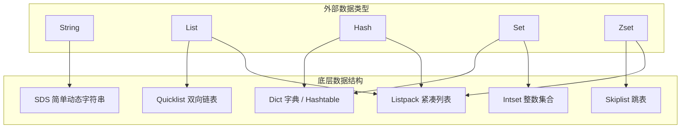
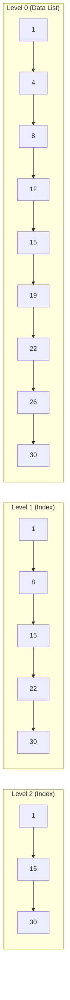
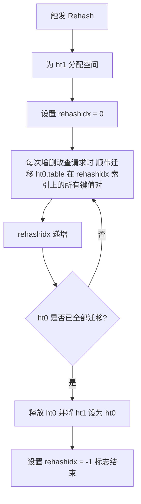
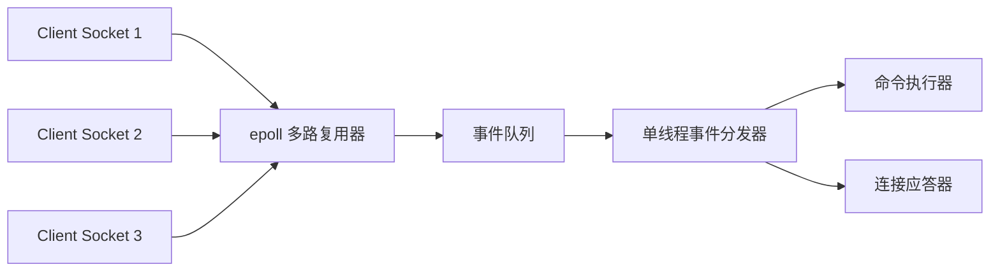

## Redis 核心数据结构与单线程模型

Redis 作为高性能的内存 NoSQL 数据库，在现代互联网架构中扮演着举足轻重的角色。深入理解 Redis 的底层数据结构（如 SDS、跳表）以及其单线程高性能的本质，是高级 Java 工程师面试的必考内容。

---

## 一、 Redis 核心数据结构底层原理

Redis 的外在表现有 5 种基础数据类型：`String`、`List`、`Hash`、`Set`、`Zset`。然而，它们的底层实现是由多种更为高效的数据结构支撑的。



### 1. SDS (Simple Dynamic String) 简单动态字符串

Redis 没有直接使用 C 语言的传统字符串（以 `\0` 结尾的字符数组），而是自己构建了 **SDS**。

```c
struct __attribute__ ((__packed__)) sdshdr8 {
    uint8_t len;         // 已使用长度
    uint8_t alloc;       // 已分配总长度 (不包括空字符)
    unsigned char flags; // 标志位，表示 SDS 的类型 (sdshdr5/8/16/32/64)
    char buf[];          // 字符数组，存储实际数据
};
```

**SDS 的优势**：

1. **$O(1)$ 获取字符串长度**：C 语言需要遍历整个数组，时间复杂度是 $O(N)$；SDS 内部维护了 `len` 字段，直接读取即可。
2. **杜绝缓冲区溢出**：C 语言在拼接字符串时，如果未分配足够空间，会发生溢出。SDS 在修改前会先检查空间是否足够，若不足则自动扩容。
3. **减少内存重分配次数**：
   - **空间预分配**：当 SDS 需要扩容时，Redis 不仅会分配所需的空间，还会分配额外的未使用空间（通常是翻倍分配，最大 1MB），减少连续修改时的内存分配次数。
   - **惰性空间释放**：当字符串缩短时，并不立即释放多余空间，而是用 `alloc` 记录下来，等待后续使用。
4. **二进制安全**：C 语言以 `\0` 判定字符串结束，无法存储图片、音频等二进制数据。SDS 以 `len` 长度判定结束，可以存储任意二进制数据。

---

### 2. Skiplist (跳跃表)

跳表是 **Zset（有序集合）** 的核心底层实现之一（当元素较多或元素较长时使用）。

- **原理**：跳表是在链表的基础上，增加了**多级索引**。通过索引进行跨越式查找，从而将链表的查询时间复杂度从 $O(N)$ 降低到了 **$O(\log N)$**，性能堪比红黑树，但实现和维护比红黑树简单得多。



**为什么 Zset 选择跳表而不是红黑树？**

1. **范围查询极其高效**：在跳表中进行范围查询（如 `ZRANGEBYSCORE`），只需先 $O(\log N)$ 定位到范围的起点，然后顺着底层的双向链表向后遍历即可。而红黑树进行范围查询需要进行中序遍历，实现复杂且效率较低。
2. **实现更简单、易维护**：红黑树在插入和删除时需要进行复杂的旋转 and 变色来维持平衡。而跳表只需通过**随机函数**决定新节点的层数，插入 and 删除只需修改相邻节点的指针，实现非常简单。
3. **内存占用更灵活**：跳表的索引节点平均指针数可以通过参数调节，比红黑树更省内存。

---

### 3. Dict 字典与渐进式 Rehash

Redis 的 Hash 和内部的 Key-Value 空间都是通过 **Dict**（字典）实现的。其底层是一个 Hash 表，但在扩容或收缩时采用 **渐进式 Rehash**（Incremental Rehash）机制，避免了由于一次性迁移海量数据而导致的线程卡顿。

#### Rehash 触发条件与容量计算

- **扩容（Expand）**：
  - 未执行后台持久化（BGSAVE/BGREWRITEAOF）且装载因子 $\ge 1$。
  - 正在执行后台持久化且装载因子 $\ge 5$（防止写时复制机制拷贝过多内存）。
  - 新容量为 $\ge \text{used} \times 2$ 的第一个 $2^n$ 数值。
- **收缩（Shrink）**：
  - 当装载因子 $\le 0.1$ 时触发收缩，新容量为 $\ge \text{used}$ 的第一个 $2^n$ 数值（最小为 4）。

#### 渐进式 Rehash 核心步骤



- **双哈希表结构**：Dict 包含两个哈希表：`ht[0]`（正常时工作）与 `ht[1]`（Rehash 时工作）。
- **小步分摊**：将整个 Rehash 操作拆分成无数个小步骤，每次执行一个 Redis 读写命令，或者通过定时任务，仅迁移 `ht[0]` 某个槽（Silding Window）的数据到 `ht[1]` 中，把耗时 $O(N)$ 的迁移均摊到了各次请求 $O(1)$ 中。
- **并发请求处理**：
  - **读/删/改操作**：先在 `ht[0]` 寻找，若找不到则到 `ht[1]` 寻址。
  - **写操作**：一律将新数据直接写入 `ht[1]`，确保 `ht[0]` 的元素只减不增。

---

### 4. ZipList 压缩列表到 Listpack 紧凑列表的演进

在 Redis 的早期版本中，当 List、Hash、Zset 元素少且小时，默认使用 **ZipList（压缩列表）** 以节省内存。但 ZipList 存在致命缺陷：**连锁更新（Cascade Update）**。为了解决该问题，Redis 7.0 彻底弃用了 ZipList，改用 **Listpack（紧凑列表）**。

#### ZipList 与连锁更新的诞生

ZipList 是由一系列特殊编码的连续内存块组成的顺序型数据结构。每个 Entry 的结构如下：  
`[previous_entry_length] [encoding] [content]`

- `previous_entry_length`：记录前一个节点的长度。若前一个节点长度 $< 254$ 字节，其占 $1$ 字节；若 $\ge 254$ 字节，其占 $5$ 字节。
- **连锁更新原理**：假设压缩列表中有多个连续节点，长度都在 $250 \sim 253$ 字节。因为它们都小于 254，所以每个节点的 `previous_entry_length` 都只占用 $1$ 字节。  
  当我们将其中最前端的一个节点扩容至 $\ge 254$ 字节，其后一个节点的 `previous_entry_length` 就必须从 $1$ 字节扩展为 $5$ 字节。而由于这一扩展，该节点总长度也超过了 254 字节，导致再后一个节点的 `previous_entry_length` 也需要升级，从而引发骨牌效应，导致大面积内存重分配。

#### Listpack 的革命性设计

Listpack 保持了紧凑结构，但废除了对“前一个节点长度”的记录，转而记录**“当前节点自身的长度”**（`element-tot-len`），并放在节点尾部：  
`[encoding-type] [element-data] [element-tot-len]`

由于每个节点只记录当前节点自身的总长度，节点之间的长度变化完全解耦，**从根本上彻底消除了连锁更新问题**。

---

### 5. Redis 五大高级/特殊数据类型原理

除了常规的五大基础类型，Redis 还提供了以下适应于高并发特定场景的利器：

1. **Bitmaps (位图)**：
   - **底层原理**：基于 `String` 类型在存储字符时的 Bit 级操作。
   - **应用场景**：亿级活跃用户每日签到、用户在线状态追踪。极省空间：1 亿状态仅占 $12.5\text{MB}$。
2. **HyperLogLog (基数计数)**：
   - **底层原理**：使用 **LogLog 概率估计算法**，在极小内存下完成不重复元素的基数统计。
   - **应用场景**：日活（UV）统计、全网千万级搜索词 PV 到 UV 跨越估算。每个 HLL 仅固定消耗 $12\text{KB}$ 内存，误差控制在 $0.81\%$ 以内。
3. **Geospatial (地理位置)**：
   - **底层原理**：基于 `GeoHash` 算法将经纬度映射为一个 52 位的二进制数值，再作为得分放入 **Zset**。
   - **应用场景**：附近的人、附近商铺距离计算。
4. **Streams (消息流数据)**：
   - **底层原理**：高性能纯内存队列，支持消费组（Consumer Groups），支持消息确认（ACK）与 Pending 列表防止数据丢失。
   - **应用场景**：轻量级消息队列，秒杀异步日志流处理。

---

## 二、 Redis 单线程高性能模型

“**Redis 是单线程的，为什么还这么快？**” 这是面试中几乎必问的经典问题。

### 1. 核心原因

1. **纯内存操作**：Redis 的所有数据都存储在内存中，CPU 不是 Redis 的瓶颈，内存读写速度极快（通常在纳秒级别）

**高效的数据结构**：如前文所述，SDS、跳表、Dict 等都是专门为高性能设计的

**多路复用 I/O 模型**：这是 Redis 处理海量并发连接的核心

**避免了多线程的开销**：单线程避免了频繁的**上下文切换**和**线程竞争**，也无需考虑各种锁的开销，代码实现极其简单且安全。

---

### 2. I/O 多路复用机制（Reactor 模式）

Redis 采用 **I/O 多路复用程序** 来同时监听多个 Socket 连接。

- **原理**：在 Linux 下，Redis 主要基于 **`epoll`** 实现。`epoll` 允许一个线程同时监听多个文件描述符（Socket）。当某个 Socket 有数据可读或可写时，内核会通知 Redis，Redis 再将事件分发给对应的事件处理器进行处理

这使得 Redis 能够用单线程高效地处理成千上万个并发连接，而不会因为某个连接的阻塞而导致整个服务卡死。



---

### 3. Redis 6.0 引入的多线程

> **面试高分追问**：既然单线程这么好，为什么 Redis 6.0 引入了多线程？

- **原因**：随着网络带宽的提升，Redis 的瓶颈逐渐转移到了**网络 I/O 的读写**上（即解析客户端请求和向客户端写回数据的过程，占用了大量的 CPU 时间）

**设计**：Redis 6.0 引入的多线程**仅仅用于处理网络 I/O 的读写**。而**核心的命令执行（数据的读写）依然是由单线程串行执行的**

这样既解决了网络 I/O 的瓶颈，又完美保留了单线程无需加锁、线程安全的优势。
