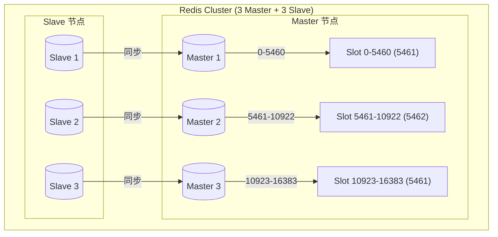
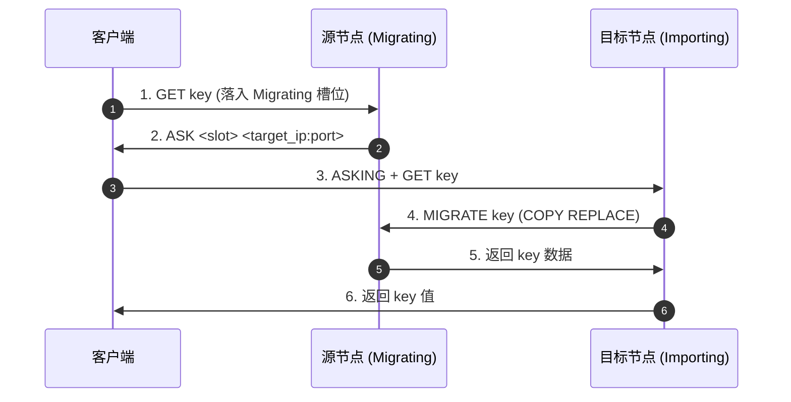
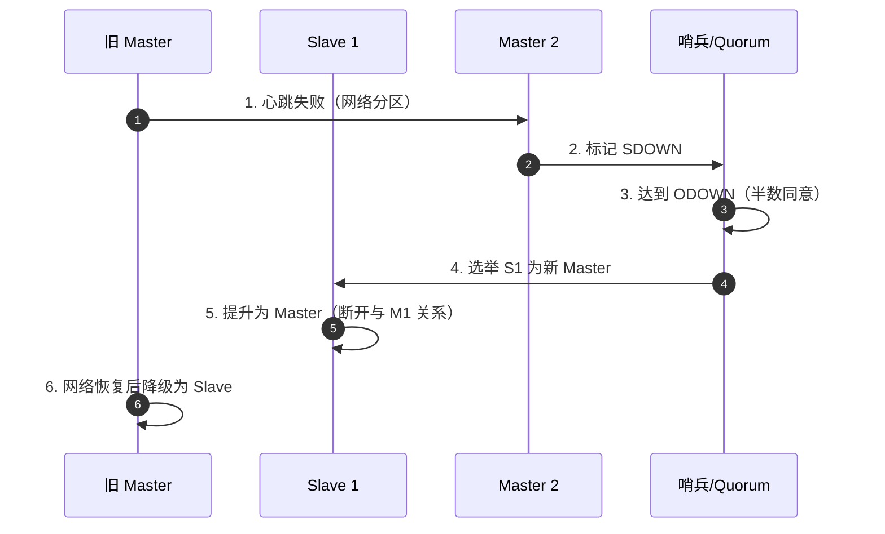

## Redis 高可用集群架构

生产级 Redis 架构需应对海量并发与故障切换。本章深入剖析 Redis Cluster 扩容缩容、PSYNC2 主从同步优化、混合持久化恢复，以及运维监控最佳实践。

---

## 一、 Redis Cluster 扩容缩容与槽位迁移

当业务增长超过单节点容量或 QPS 上限时，需要动态扩容 Redis Cluster。

### 1. Cluster 拓扑与槽位分配

Redis Cluster 固定 **16384 个哈希槽（Slot）**，每个 Master 节点负责部分槽位。



### 2. 动态扩容流程

#### 步骤 1：启动新节点并加入集群

```bash
# 启动新 Redis 实例（端口 7006）
redis-server redis.conf

# 加入集群（假设集群已有 3 个 Master）
redis-cli --cluster add-node 127.0.0.1:7006 127.0.0.1:7001
```

#### 步骤 2：分配槽位（Reshard）

```bash
# 从现有节点迁移 2000 个槽位到新节点
redis-cli --cluster reshard 127.0.0.1:7001 \
  --cluster-from all \
  --cluster-to new_node_id \
  --cluster-slots 2000 \
  --cluster-yes
```

**槽位迁移原理**：
1. **源节点标记槽位为 `IMPORTING` 状态**。
2. **目标节点标记槽位为 `MIGRATING` 状态**。
3. **迁移命令**：`MIGRATE <target_host> <target_port> <key> 0 <timeout> COPY REPLACE`。
4. **客户端透明**：客户端查询槽位时，若遇到 `ASK` 重定向，按指引跳转到目标节点。



#### 步骤 3：添加副本节点

```bash
# 将新 Master 7006 添加副本 7007
redis-cli --cluster add-node 127.0.0.1:7007 127.0.0.1:7001 --cluster-slave --cluster-master-id new_master_id
```

### 3. 动态缩容流程

#### 步骤 1：迁移槽位出目标节点

```bash
# 将目标节点的所有槽位迁移到其他节点
redis-cli --cluster reshard 127.0.0.1:7001 \
  --cluster-to existing_node_id \
  --cluster-slots all \
  --cluster-from target_node_id \
  --cluster-yes
```

#### 步骤 2：清空并移除节点

```bash
# 清空目标节点数据（可选）
redis-cli -h 127.0.0.1 -p 7006 FLUSHALL

# 从集群中移除节点
redis-cli --cluster del-node 127.0.0.1:7001 <target_node_id>
```

---

## 二、 PSYNC2 主从同步优化

Redis 2.8 引入的 **PSYNC2** 协议解决了旧版 PSYNC 的频繁全量同步问题。

### 1. PSYNC2 核心机制

| 组件 | 说明 |
| :--- | :--- |
| **`repl_backlog`（复制积压缓冲区）** | 循环缓冲区，默认 1MB，主节点写入命令即写入此缓冲区 |
| **`psync_repl_offset`（复制偏移量）** | 主从节点各自维护写入/复制偏移量 |
| **`master_replid`（复制 ID）** | 每个 Master 有一个唯一 ID，新 Master 晋升后 ID 变更 |

### 2. PSYNC 全量 vs 部分同步判断流程

```mermaid
graph TD
    A[Slave 发起 PSYNC] --> B{主节点 replid 匹配?}
    B -->|否| C[全量同步 (FULLRESYNC)]
    B -->|是| D{偏移量在 backlog 范围?}
    D -->|否| C
    D -->|是| E[部分同步 (CONTINUE)]
    E --> F[发送 backlog 增量数据]
```

**判断逻辑**：
1. **ReplID 匹配**：判断是否为同一主节点（避免主从切换后的 ID 变更导致误判）。
2. **偏移量范围检查**：`psync_offset >= master_repl_offset - backlog_size`。

### 3. 优化建议

- **调大复制积压缓冲区**：应对网络抖动场景

  ```text
  repl-backlog-size 1024mb  # 默认 1MB，高并发环境建议 512MB~1GB
  ```

- **配置从节点超时**：

  ```text
  repl-timeout 60  # 主从连接超时，默认 60 秒
  repl-diskless-sync-delay 5  # 无盘同步延迟，默认 5 秒
  ```

---

## 三、 混合持久化与恢复实战

### 1. 混合持久化原理

Redis 4.0+ 支持 AOF 重写时结合 RDB + AOF增量的混合模式。

```bash
# redis.conf 配置
aof-use-rdb-preamble yes
```

**混合文件结构**：

```text
+------------------+------------------+
|  RDB Header      |  AOF Incremental |
|  (Full Snapshot) |  (Delta Commands)|
|  Magic Number    |  APPENDONLY FILE |
|  DB Content      |  COMMANDS        |
+------------------+------------------+
```

### 2. 混合持久化的恢复流程

```bash
# Redis 启动时加载 AOF 文件流程
1. 读取 RDB 部分（快速加载全量数据）
2. 读取 AOF 增量部分（重放增量命令）
3. 完成数据恢复
```

### 3. RDB/AOF 混合故障恢复场景

| 故障场景 | 恢复策略 |
| :--- | :--- |
| **仅 AOF 损坏** | RDB 快照依然有效，先恢复 RDB，再重放部分 AOF |
| **仅 RDB 损坏** | 重放全部 AOF（速度较慢，但可恢复） |
| **两者都有效** | 混合恢复（最快） |
| **两者都损坏** | 数据永久丢失，依赖备份 |

**故障演练建议**：
1. 定期下载 RDB/AOF 文件，离线验证完整性。
2. 使用 `redis-check-rdb` 和 `redis-check-aof` 工具校验文件。

---

## 四、 运维监控与指标采集

### 1. 核心监控指标

| 指标 | 命令 | 阈值告警 |
| :--- | :--- | :--- |
| **内存使用率** | `INFO memory` → `used_memory_peak` / `maxmemory` | > 85% |
| **连接数** | `INFO clients` → `connected_clients` | > 80% maxclients |
| **慢查询** | `SLOWLOG GET 10` | 单命令 > 100ms |
| **Keyspace 命中率** | `INFO stats` → `keyspace_hits` / (`hits` + `misses`) | < 95% |
| **主从延迟** | `INFO replication` → `slave_repl_offset` | > 1 秒 |
| **AOF 写入延迟** | `INFO persistence` → `aof_delayed_fsync` | > 10 次/分钟 |

### 2. 常用运维命令

```bash
# 查看内存使用详情
redis-cli --memstats

# 分析大 Key（需 redis-cli --bigkeys 配合）
redis-cli -h 127.0.0.1 -p 6379 --scan --pattern "*" | xargs redis-cli --bigkeys

# 生成内存分析报告（需 redis-rdb-tools）
rdb -c memory redis dump.rdb > memory_report.csv

# 查看慢查询日志
redis-cli SLOWLOG GET 20

# 手动触发 AOF 重写
redis-cli BGREWRITEAOF

# 手动触发 RDB 快照
redis-cli BGSAVE
```

### 3. 自动化监控方案

- **Prometheus + Redis Exporter**：

  ```yaml
  # prometheus.yml
  - job_name: 'redis'
    static_configs:
      - targets: ['localhost:9121']
  ```

- **Grafana Dashboard**：导入 Redis 官方 Dashboard（ID: 11899）

---

## 五、 Cluster 故障转移实战

### 1. 故障转移触发条件

- **主观下线（SDOWN）**：单个节点判定节点失联（`cluster-node-timeout`，默认 15 秒）。
- **客观下线（ODOWN）**：半数以上 Master 节点投票判定下线。

### 2. 故障转移流程



### 3. 故障转移后的槽位重分配

```bash
# 查看集群状态
redis-cli --cluster info 127.0.0.1:7001

# 检查槽位分布
redis-cli --cluster check 127.0.0.1:7001

# 手动均衡槽位
redis-cli --cluster fix 127.0.0.1:7001
```

---

## 六、 高可用集群配置模板

### 1. Redis Cluster 配置（redis.conf）

```ini
# 基础配置
port 7001
cluster-enabled yes
cluster-config-file nodes.conf
cluster-node-timeout 15000
cluster-replica-validity-factor 10
cluster-migration-barrier 1
cluster-require-full-coverage no

# 持久化配置
appendonly yes
appendfsync everysec
aof-use-rdb-preamble yes
save 900 1
save 300 10
save 60 10000

# 内存配置
maxmemory 8gb
maxmemory-policy allkeys-lru

# 网络配置
bind 0.0.0.0
protected-mode yes
repl-backlog-size 1024mb
```

### 2. Sentinel 配置模板

```ini
sentinel monitor mymaster 127.0.0.1 6379 2
sentinel down-after-milliseconds mymaster 5000
sentinel failover-timeout mymaster 60000
sentinel parallel-syncs mymaster 1
```

---

## 七、 常见故障排查

### 1. 槽位未完全分配（CLUSTER_DOWN）

**现象**：`CLUSTERDOWN Hash slot not served`

**排查**：

```bash
# 检查槽位分布
redis-cli --cluster info 127.0.0.1:7001

# 修复集群
redis-cli --cluster fix 127.0.0.1:7001
```

### 2. 主从同步失败（FULLRESYNC）

**现象**：从节点持续触发全量同步

**排查**：

```bash
# 检查复制偏移量
redis-cli INFO replication | grep -E "master_repl_offset|slave_repl_offset"

# 检查 backlog 大小
redis-cli CONFIG GET repl-backlog-size
```

### 3. 内存突增（OOM）

**排查**：

```bash
# 查看内存明细
redis-cli INFO memory | grep -E "used_memory_human|used_memory_peak_human"

# 分析大 Key
redis-cli --bigkeys
```
