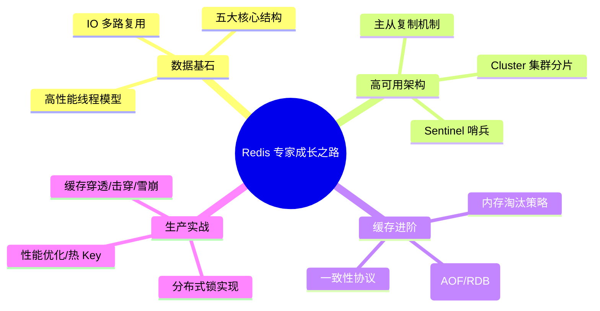

## Redis 高性能缓存体系

Redis 不仅仅是一个简单的 Key-Value 存储，它是构建现代高并发系统的核心基石。本专题深入探讨其数据结构底层设计、高可用架构及真实的生产级实战。

---

## 🗺️ Redis 技术进阶路线图

---

## 🚀 第一阶段：核心基石与线程模型 (Internal Architecture)

- [数据结构与内核 I/O 深度解析](datastructures-io.md)：探究跳表、压缩列表原理及 Redis 6.0 多线程 IO。
- [一致性模型与淘汰机制](consistency-eviction.md)：深入 LRU/LFU 算法实现与写回策略。

---

## 🏗️ 第二阶段：高可用集群架构 (High Availability)

- [主从、哨兵与集群全解](highavailability.md)：解构 Cluster 下的哈希槽（Slot）与故障自动转移。

---

## ⚡ 第三阶段：核心场景与面试复盘 (Workshop)

- [Redis 缓存实战与分布式锁](scenarios.md)：深度对齐缓存雪崩、热点 Key 探测及 Redlock。
- [Redis 核心面试真题复盘](interview-redis.md)：收录大厂真实高频考点。
