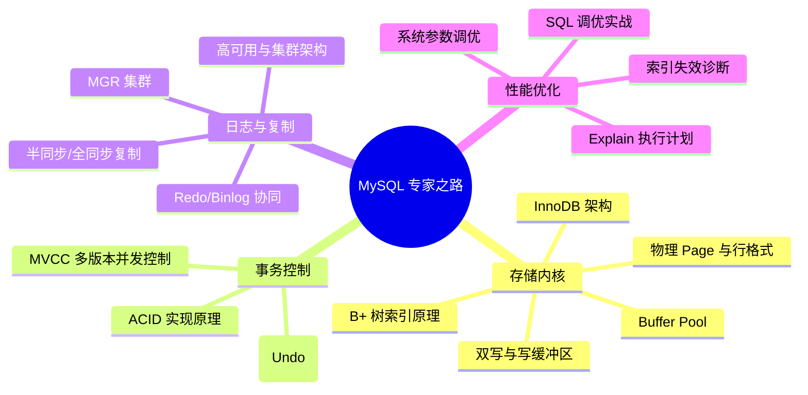

## MySQL 关系型数据库体系

本专题带你从底层的索引 B+ 树结构、InnoDB 存储引擎内核，一路深入到分库分表与性能调优的艺术。

---

## 🗺️ MySQL 核心进阶地图

---

## 🚀 第一阶段：内核基础与存储引擎 (Storage Engine)

- [索引原理、Buffer Pool 及 AHI](./core/1-index-engine.md)：为什么是 B+ 树？解密聚簇索引、自适应哈希索引与变体 LRU 淘汰缓存池。
- [InnoDB 存储引擎内核原理](./core/8-innodb-internals.md)：底层物理 Page 页结构、行格式（Compact/Dynamic）细节与 Change Buffer、Doublewrite Buffer 底层实现。
- [MVCC 与锁机制深度解析](./core/2-mvcc-locks.md)：读已提交、可重复读、ReadView 算法与自增锁/死锁排查与线上死锁日志剖析。

---

## 🏗️ 第二阶段：日志体系与高可用 (Reliability)

- [日志体系与复制原理](./core/3-logs-replication.md)：深入 Redo Log MTR 机制、Binlog 三阶段组提交（2PC）。
- [高可用与集群架构](./ha/ha-clustering.md)：深入 MGR (MySQL Group Replication) 原生分布式事务集群、InnoDB Cluster 全栈自动化部署及代理层路由 (ProxySQL/MySQL Router)。
- [分库分表与读写分离实战](./tuning/6-sharding.md)：主从延迟应对、垂直水平拆分、全局 ID 与跨库查询破局、不停机双写扩容平滑迁移。

---

## ⚡ 第三阶段：性能诊断与调优 (Performance Tuning)

- [MySQL 性能调优与参数调优](./tuning/5-optimization.md)：执行计划详解、生产慢查询优化，以及 InnoDB 核心参数（Buffer Pool/Thread/IO）运维调优指南。
- [MySQL SQL 调优与执行计划](./tuning/4-sql-tuning.md)：深入剖析 `EXPLAIN` 解析、索引失效场景与进阶实战技巧。
- [MySQL 核心面试真题复盘](../../interview/database/7-interview-mysql.md)：高频大厂必考点汇总，包含 MVCC、幻读解决、2PC 必要性、页分裂与双写等硬核剖析。
