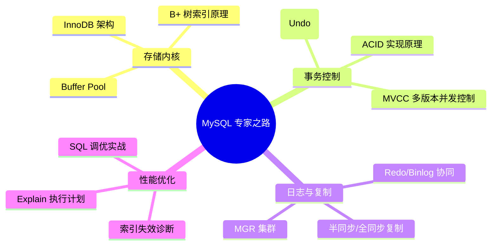

## MySQL 关系型数据库体系

本专题带你从底层的索引 B+ 树结构、InnoDB 存储引擎内核，一路深入到分库分表与性能调优的艺术。

---

## 🗺️ MySQL 核心进阶地图

---

## 🚀 第一阶段：内核基础与存储引擎 (Storage Engine)

- [索引原理、Buffer Pool 及 AHI](./1-index-engine.md)：为什么是 B+ 树？解密聚簇索引、自适应哈希索引与变体 LRU 淘汰缓存池。
- [MVCC 与锁机制深度解析](./2-mvcc-locks.md)：读已提交、可重复读、ReadView 算法与自增锁/死锁排查。

---

## 🏗️ 第二阶段：日志体系与高可用 (Reliability)

- [日志体系与复制原理](./3-logs-replication.md)：深入 Redo Log MTR 机制、Binlog 三阶段组提交（2PC）。
- [分库分表与读写分离实战](./6-sharding.md)：主从延迟应对、垂直水平拆分、全局 ID 与跨库查询破局。

---

## ⚡ 第三阶段：性能诊断与调优 (Performance Tuning)

- [MySQL 性能调优与双写扩容](./5-optimization.md)：执行计划详解、生产慢查询优化与不停机双写平滑扩容方案。
- [MySQL SQL 调优与执行计划](./4-sql-tuning.md)：深入剖析 `EXPLAIN` 解析、索引失效场景与进阶实战技巧。
- [MySQL 核心面试真题复盘](./7-interview-mysql.md)：高频大厂必考点汇总。
