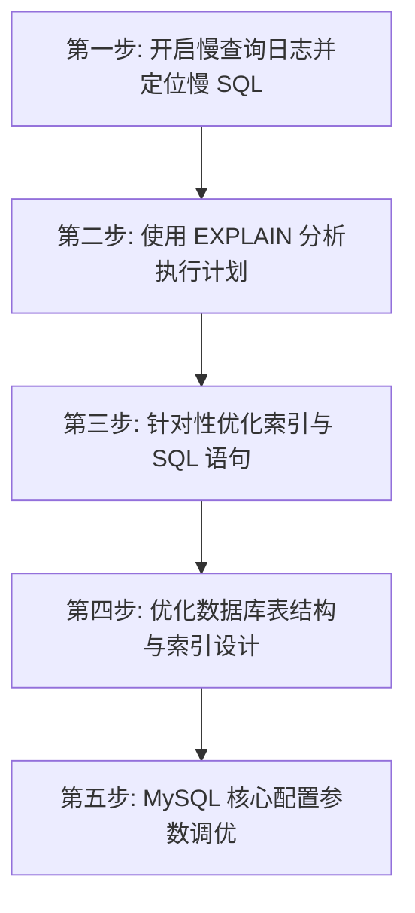

## MySQL 慢 SQL 优化与参数调优

在实际生产环境中，随着业务数据量的爆发式增长，单机数据库往往会遇到性能瓶颈。掌握慢 SQL 的排查与优化步骤，以及数据库内核参数的调优，是高级 Java 工程师和架构师的必修课。

---

## 一、 慢 SQL 排查与优化五步法

当线上系统出现数据库响应慢、CPU 飙高时，通常需要按照以下步骤进行系统化排查和优化：



### 1. 第一步：开启慢查询日志并定位慢 SQL

- 在配置文件 `my.cnf` 中配置慢查询日志：

  ```ini
  slow_query_log = 1                  # 开启慢查询日志
  long_query_time = 1                 # 超过 1 秒的 SQL 记录为慢 SQL
  slow_query_log_file = /var/log/mysql/slow.log # 日志路径
  ```

- 使用 **`mysqldumpslow`** 工具对慢日志进行分类汇总，找出执行次数最多、平均耗时最长的 Top SQL。
  例如：`mysqldumpslow -s t -t 10 /var/log/mysql/slow.log` 提取出最慢的 10 条 SQL。

### 2. 第二步：使用 EXPLAIN 分析执行计划

在慢 SQL 前面加上 `EXPLAIN` 关键字，查看 MySQL 优化器是如何执行该 SQL 的。
核心关注字段：
- **`type`（访问类型）**：
  - 性能好坏依次为：`system` > `const` > `eq_ref` > `ref` > `range` > `index` > `ALL`。
  - **调优要求**：生产环境中的 SQL 访问类型至少要达到 **`range`** 级别，力求达到 `ref`，**绝对避免 `ALL`（全表扫描）**和 `index`（全索引扫描）。
- **`key`**：实际用到的索引。如果为 `NULL`，说明没有用到索引，需要立刻优化。
- **`rows`**：估算需要扫描的行数。数值越小越好。
- **`Extra`（额外信息）**：
  - `Using filesort`：说明 MySQL 无法利用索引进行排序，需要进行外部排序，**必须优化**。
  - `Using index`：使用了覆盖索引，不需要回表，性能极佳。
  - `Using temporary`：使用了临时表（常见于 `GROUP BY` 或 `DISTINCT` 未能利用索引），**必须优化**。
  - `Using index condition`：使用了索引下推（ICP）技术，过滤效率更高。

### 3. 第三步：常见慢 SQL 优化套路

**索引失效口诀（模型数空运最快）**：
- **模**：模糊查询以 `%` 开头（如 `LIKE '%abc'`），无法利用 B+ 树最左前缀排序，索引失效。
- **型**：类型转换。字段是字符串 `varchar`，但查询时写数字 `WHERE phone = 13800000000`，导致隐式类型转换，索引失效。
- **数**：数学运算或函数操作（如 `WHERE YEAR(create_time) = 2026` 或 `WHERE age + 1 = 18`），索引失效。
- **空**：`IS NULL` 或 `IS NOT NULL`。如果表中大部分数据都是 NULL 或非 NULL，MySQL 优化器预估走全表扫描更便宜时，会放弃索引。
- **运**：使用 `OR` 连接。如果 `OR` 前后的列有一个没有建立索引，则整个 SQL 的索引失效。
- **最**：违背**最左匹配原则**。在联合索引 `(a, b, c)` 中，如果跳过了 `a` 直接查询 `b` 或 `c`，索引失效。
- **快**：范围查询（`>`、`<`、`between`）右边的列索引失效。在联合索引 `(a, b, c)` 中，如果 `WHERE a = 1 AND b > 2 AND c = 3`，则 `c` 字段无法走索引。

**超大分页（Deep Paging）优化**：
- **问题**：`LIMIT 1000000, 10` 会导致 MySQL 扫描 1000010 行数据，然后丢弃前 1000000 行，只返回最后 10 行，带来毁灭性的磁盘回表 I/O 开销。
- **优化方案（延迟关联）**：
  先通过覆盖索引（只查询主键 ID）快速分页定位，再通过主键关联查询整行数据，避免大范围的回表：

  ```sql
  -- 优化前
  SELECT * FROM user ORDER BY create_time LIMIT 1000000, 10;

  -- 优化后
  SELECT u.* FROM user u
  INNER JOIN (
      SELECT id FROM user ORDER BY create_time LIMIT 1000000, 10
  ) t ON u.id = t.id;
  ```

---

## 二、 第四步：优化数据库表结构与索引设计

即使 SQL 编写再完美，若表结构及索引规划不合理，随着数据膨胀依然会遭遇性能瓶颈。

### 1. 控制单表规模与字段优化

- **单表行数限制**：建议单表数据行数控制在 2000 万以内（若单行数据较大，则阈值应更小）。超过此规模应考虑归档历史数据，或平滑进行分库分表（参见 [分库分表与读写分离实战](./6-sharding.md)）。
- **小字段优先原则**：能用 `TINYINT` 的不用 `INT`，能用 `VARCHAR` 的不用 `TEXT`。字段所占空间越小，每个 16KB 页能存储的记录就越多，Buffer Pool 缓存的数据页就越多，内存命中率越高。
- **避免使用 NULL 值**：将字段声明为 `NOT NULL`，并提供默认值（如 `DEFAULT ''` 或 `DEFAULT 0`）。`NULL` 值会使索引的统计信息更复杂，占用额外的存储空间（每行记录的 NULL 值列表），且容易在查询中引发非预期逻辑。

### 2. 索引数量控制

- 一张表上的索引数量一般建议**不超过 5 个**。
- **副作用**：写入、更新和删除都会触发对所有 B+ 树索引的同步维护（包含脏页落盘、页分裂等），降低写入吞吐，同时消耗大量磁盘空间。

---

## 三、 第五步：MySQL 核心配置参数调优

当 SQL 调优到极致、索引完全覆盖后，如果并发量继续攀升，就必须对 MySQL 的系统参数进行调优，释放主机的物理极限。

### 1. 核心内存分配参数

- **`innodb_buffer_pool_size`**：
  - **建议值**：专用数据库服务器物理内存的 **50% ~ 75%**。
  - **原理**：这是 InnoDB 最核心的缓存池大小，决定了能缓存多少数据页 and 索引页。越接近物理限度，随机磁盘 I/O 越少。
- **`innodb_log_file_size`**：
  - **建议值**：每个重做日志文件（Redo Log）的大小建议设为 **1GB ~ 4GB**。
  - **原理**：若 Redo Log 文件太小，写满后会频繁触发急剧 Checkpoint（强行将 Buffer Pool 中的脏页刷盘以释放 Redo Log 空间），导致数据库瞬时出现写入“卡顿”和 CPU 飙升。理想状态应能容纳 1 小时以上的写入量。
- **`innodb_log_buffer_size`**：
  - **建议值**：**16MB ~ 64MB** 即可。这是 Redo Log 写入磁盘前的内存缓冲区。

### 2. 磁盘 I/O 与并发控制参数

- **`innodb_flush_method = O_DIRECT`**：
  - **原理**：直接将数据写入磁盘，绕过操作系统的 Page Cache，防止数据在 InnoDB Buffer Pool 和系统缓存中存两份（双重缓存问题），大幅降低操作系统的内存压力与 CPU 上下文切换开销。
- **`innodb_flush_neighbors = 0`**：
  - **原理**：在固态硬盘（SSD）上应将其**设为 0**（关闭刷新相邻页）。对于机械硬盘（HDD）才建议设为 1，因为机械硬盘寻道成本高，顺序刷新相邻页更划算；而在 SSD 上多余邻近刷盘只会徒增写入放大、折损 SSD 寿命。
- **`innodb_thread_concurrency = 0`**（或 CPU 核心数）：
  - **原理**：控制 InnoDB 并发工作线程的上限。设为 `0` 代表不限制，由引擎自适应。高并发且 CPU 负载极高时，将其限制在物理 CPU 核心数（或 2 倍），能显著降低线程上下文频繁切换的自旋锁消耗，防止 CPU 耗尽。
- **`table_open_cache`**：
  - **建议值**：**2048 ~ 4096**。控制 MySQL 能缓存的打开表文件描述符数量。值过小会导致高并发下文件描述符频繁开闭，增加 I/O 寻址开销。
