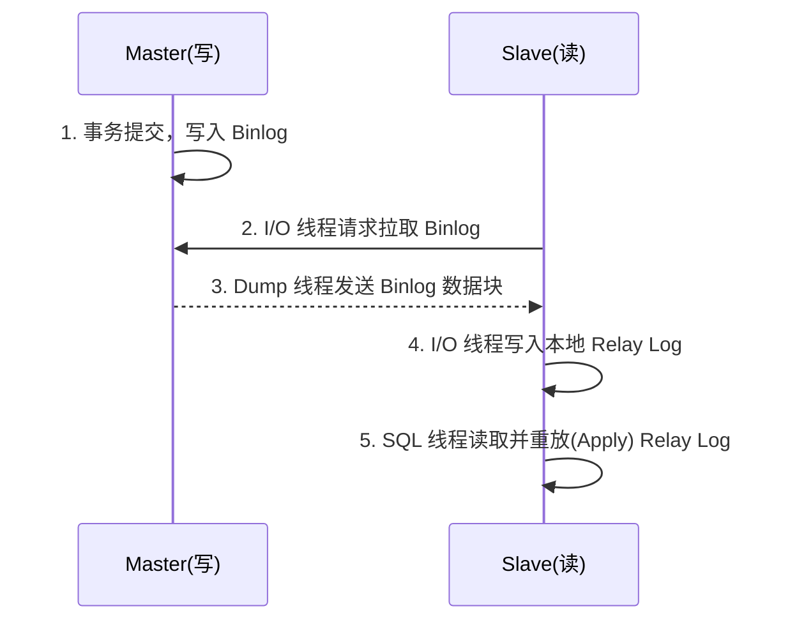

## MySQL 分库分表与读写分离实战

当单表业务数据量达到两千万甚至半亿级别，纵向优化（SQL 调优、加索引、增加服务器配置等）已无法彻底解决 I/O 瓶颈问题。此时，我们需要转向横向扩展架构，引入读写分离和分库分表（Sharding）策略。

---

## 一、 主从复制与读写分离 (Read/Write Splitting)

在超高并发互联网场景下，通常表现为**读多写少**。为了减轻主库（Master）的压力，我们搭建主从架构，令写请求打在主库，读请求分流到多个从库（Slave）。

### 1. 核心架构原理

核心依赖于 MySQL 的 **Binlog** 进行数据同步。

1. **主库 Binlog 刷盘**：主库事务提交时，把变更写入 Binlog。
2. **从库 I/O Thread**：从库利用 `I/O 线程` 连接主库，请求获取 Binlog 日志，并将其写到中继日志（Relay Log）中。
3. **主库 Dump Thread**：主库接收请求，利用 `Dump 线程` 把 Binlog 发送给从库。
4. **从库 SQL Thread**：从库利用 `SQL 线程` 读取 Relay Log 并进行数据重放，完成同步。

### 2. 主从延迟问题及应对策略

读写分离架构最大的痛点在于**主从延迟**（主库刚写完，立刻去读从库，很可能读不到最新数据）。

**延迟的根源**：主库由于并发写入是多线程的，而从库的 SQL 重放线程在 MySQL 旧版本中是单线程的。加上 DDL 或大量 DML，极易导致从库跟不上主库步伐。

**经典应对策略**：

- **强制走主库（推荐）**：对于支付后立刻查询订单等对数据强一致性要求极高的核心业务环节，使用 ShardingSphere 或 Mybatis-Plus 动态数据源注解（如 `@Master` 强制路由），将这段读请求直接发送给主库。
- **并行复制（MTS - Multi-Threaded Slave）**：MySQL 5.7+ 默认支持基于 Logical Clock 的并行重放，使得 SQL 线程也可以变成多线程并发执行（基于事务组或表级别），从而大幅缓解复制延迟。
- **缓存延迟双删策略**：将最新数据写入 Redis 或 Memcached 作为主库到从库之间的过渡缓冲，写库后刷新缓存。

---

## 二、 垂直与水平拆分 (Sharding)

当数据剧增到单库无法承受、或单表数据破千万（B+树可能恶化为四层带来多一次磁盘读写）时，单纯依靠读写分离已无法解决根本问题。这时必须进行数据切分（Sharding）。

### 1. 垂直拆分 (Vertical Sharding)

- **垂直分库**：按**业务功能**模块，将原先一个大库拆成用户库、订单库、商品库等。不仅分摊了磁盘与网络 I/O，同时契合微服务架构设计理念。
- **垂直分表**：针对一张表，将**高频查询且体积小**的列与**低频查询且体积大**的列（如 text 文本类型）拆分到不同表中。减小由于单表数据行过大导致的缓存页内可存放数据量的锐减。

### 2. 水平拆分 (Horizontal Sharding)

- **水平分表**：面对一张数亿级数据的大表，利用某种路由策略（如基于用户 ID 取模），把数据均匀散落到多张结构相同的子表中（如 `order_0`、`order_1` ... `order_99`）。此操作能有效缩减单表 B+树 索引的数据量。
- **水平分库**：当单台物理机的存储、CPU 和 I/O 天花板被触及，此时我们不但要分表，还要将这些表散步到多台不同的 MySQL 物理服务器或集群节点上（分库分表）。

### 3. 分片路由算法选用

- **最常用：Hash 取模算法**（例：`uid % 32`）
  - 优点：数据分布非常均匀，不存在明显热点问题。
  - 缺点：难以平滑扩缩容。一旦需要增加库表数量，由于除数变化，需要通过复杂的数据迁移重新打散全量历史数据。
- **范围划分算法**（例：按时间月度分表，或 ID 1~1000万为一张表）
  - 优点：对后期扩容极度友好，直接新增表即可，历史数据零迁移。
  - 缺点：因为业务多带有局部的“时间热点性”（比如用户大多在查询近 1 个月的订单），易导致新分配的库或表存在极端的写/读峰值（热点数据单点瓶颈）。

> **最佳实践**：采用 **Hash 分片 + 虚拟槽位 (Slot)** 或 **一致性 Hash 算法**的设计思想，结合迁移工具，实现在保持数据分布均衡的同时降低数据迁移量。

---

## 三、 分库分表带来的极少数副作用（及破解局限）

拆分虽好，但往往让本来一两句简单 SQL 就能搞定的业务场景，变得异常棘手和复杂：

1. **分布式事务（2PC 与 3PC 难题）**
   原本单库本地事务只需依靠 InnoDB 的 ACID 特性，分库后演变成了跨节点事务。通常需要采取如 Seata 框架（AT/TCC/SAGA 模式），或采用基于消息队列的最终一致性方案，来保证全局数据的一致性。
2. **跨库 JOIN 查询困局**
   分库后跨库的数据节点无法直接进行 `JOIN` 查询操作。
   - _应对_：通过在应用服务层编码分别查询各表后再于内存中组装（Scatter-Gather 模式）；或在各分片库中建立“全局表（字典表）/广播表”，将其复制到每一个分片库，允许原本需要在多库中 Join 的查询在单库内完成。
3. **全局自增唯一 ID（Distributed ID）**
   无法再依赖单表自增主键，当多个库并发插入数据时会产生 ID 冲突。必须引入分布式发号器（如雪花算法 Snowflake / 百度 UidGenerator / 美团 Leaf 等）提供全局唯一的趋势递增 ID 序列。
4. **多维度查询（基因法与 ElasticSearch）**
   如果订单表按用户 ID 进行了拆分，买家能极速查询订单，但卖家该如何按照店铺维度查找呢？
   - **方案 1 (异构冗余)**：利用 Canal 订阅 Binlog 把订单数据实时同步异构构建一套按卖家 ID 分库分表的新集群。
   - **方案 2 (外挂 ES 集群)**：把这亿级规模的数据和倒排索引，全部托付给大数据组件 ElasticSearch，实现全场景复杂检索引擎驱动。
