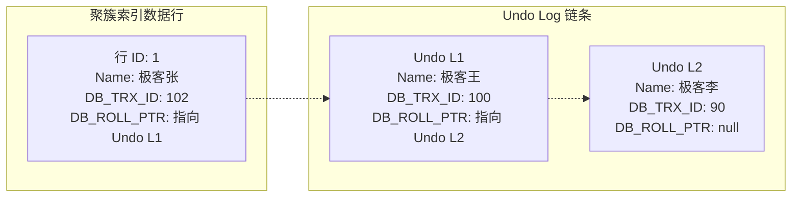
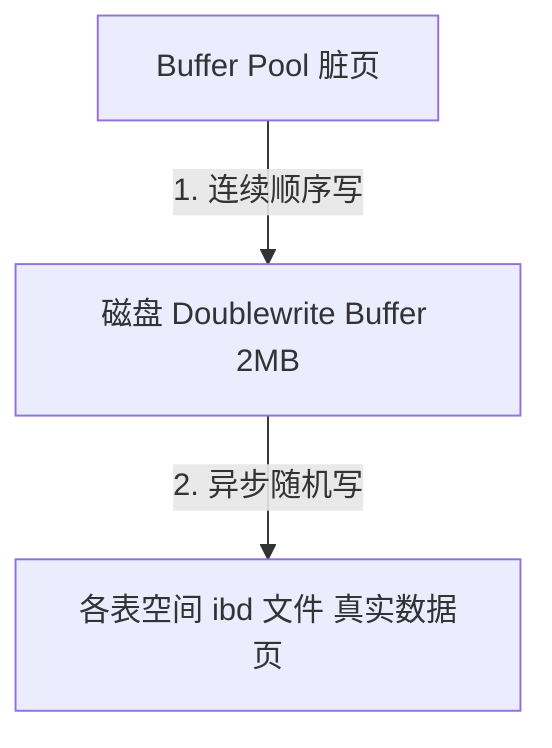

## MySQL 核心与 MVCC 面试真题

本专栏致力于为中高级 DBA 与 Java 架构师提供最硬核的 MySQL 底层原理与架构调优面试真题剖析。每个知识点都配有详尽的答案、核心源码机制、以及图文并茂的 B+ 树索引结构与 MVCC 多版本并发控制图解。

---

## 模块五：数据持久化与缓存高并发（MySQL 部分）

### Q1：MySQL InnoDB 引擎的 MVCC（多版本并发控制）底层是如何工作的？它是如何防止不可重复读漏洞的？

MVCC 机制使得数据库在读写并发时，做到了**读不加锁、读写互不阻塞**的高并发性能。其最底层依靠 3 大核心机制实现：**隐藏字段**、**Undo Log（回滚日志段）**、以及 **Read View（一致性视图）**。

#### 1. 核心原理结构：Undo Log 版本链

InnoDB 存储引擎中，聚簇索引每个数据行后面实际上都跟随有如下两个关键的隐藏字段：
- **`DB_TRX_ID`**：记录最后一次插入或修改该行记录的**事务 ID**。
- **`DB_ROLL_PTR`**：**回滚指针**。指向当前行写入到 `Undo Log` 对应版本链的历史备份节点。

当新事务执行修改，该记录被拷贝入 Undo Log。当前在线行数据的 `DB_ROLL_PTR` 顺次向下指代，版本链得以构建。

#### 2. 第二大利器：Read View 的可见性算法

当一个事务发起快照读（普通的 `SELECT`）时，系统会生成一个 **Read View** 一致性读视图，相当于给内存事务链截了个屏。主要包含四个核心分界边界：
- `m_ids`：生成该 Read View 时，当前线上所有**活跃未提交**的事务 ID 集合。
- `min_trx_id`：活跃未提交事务集合 `m_ids` 中的最小值。
- `max_trx_id`：系统分配给下一个潜在新事务的 ID（当前最大已分配 ID + 1）。
- `creator_trx_id`：创建该 Read View 的当前事务自身的 ID。

当当前事务拿着 Read View 沿着 Undo Log 版本链自顶向下比对对象的 `trx_id` 时，依据如下**可见性黄金法则判定可否读取**：

| 比对分支 | `trx_id` 取值区间 | 判定结果与读取原则 |
| :--- | :--- | :--- |
| **规则一** | `trx_id == creator_trx_id` | **可见**。因为这个版本就是当前事务自己修改创建的，可直接读取。 |
| **规则二** | `trx_id < min_trx_id` | **可见**。表明该版本的事务在生成 Read View 前已经提交完毕，安全可见。 |
| **规则三** | `trx_id >= max_trx_id` | **不可见**。表明生成该版本的事务在当前 Read View 生成之后才开启，不可见。 |
| **规则四** | `min_trx_id <= trx_id` 且 `trx_id < max_trx_id` | 判断是否在 `m_ids` 活跃集合中：在则不可见（尚未提交），不在则可见（快照前已提交）。 |

若判定当前 Undo 版本不可见，读线程顺着隐藏的 `DB_ROLL_PTR` 搜寻更早版本，直到找到可见版本为止，达成数据不加锁并发读。

#### 3. 解决“不可重复读”与“读已提交（RC）”、“可重复读（RR）”的隔离对比差异

- **读已提交（Read Committed, RC）**：
  **每次发起普通的 `SELECT` 操作时，都会去生成一个崭新的 Read View。**
  因为每次查询都在重新截屏拉取活跃区列表，如果之前没有提交的事务在你的两次查询期间提交了，第二次查自然就能读取。这无法做到重复度一致，导致“不可重复读”。
- **可重复读（Repeatable Read, RR）**：
  **只在同一个事务内、第一次发起快照读时，生成一个唯一的 Read View**。之后所有同一个事务里的查询动作都复用这个初始视图。
  即使在第两百万次查询，由于使用的是第一张老截图，仍能完好剔除期间任意已经提交的数据变更，从而**完美防范了不可重复读漏洞**！

---

### Q2：什么是幻读？InnoDB 是如何在可重复读（RR）隔离级别下解决幻读的？快照读和当前读有什么区别？

#### 1. 什么是幻读（Phantom Read）

幻读是指在一个事务内，多次执行相同的范围查询操作，后一次查询看到了前一次查询没有看到的“新插入的行”（像出现了幻觉）。
> [!IMPORTANT]
> 幻读**专指新插入的行**（Insert），原数据的修改（Update/Delete）导致前后查询不一致属于“不可重复读”，两者锁防范的逻辑不同。

#### 2. 快照读与当前读的区别

- **快照读（Snapshot Read）**：
  - **行为**：普通的 `SELECT` 语句。
  - **原理**：不加锁，通过 **MVCC** 读取数据的快照版本。
- **当前读（Current Read）**：
  - **行为**：`SELECT ... FOR UPDATE`、`SELECT ... LOCK IN SHARE MODE`，以及 `INSERT`、`UPDATE`、`DELETE` 等写操作。
  - **原理**：读取数据的最新版本，并且必须对读取的记录进行**加锁**（S 锁或 X 锁），防止其他事务并发修改。

#### 3. RR 级别下解决幻读的方案

InnoDB 针对快照读和当前读采用了两套不同的防范方案：
- **针对快照读下的幻读**：通过 **MVCC 机制**。由于复用第一次生成的 Read View，即使其他事务并发插入了新数据，根据可见性算法，这些新数据的 `DB_TRX_ID` 大于等于 `max_trx_id`，当前事务也绝对感知不到，从而在逻辑上杜绝了幻读。
- **针对当前读下的幻读**：通过 **Next-Key Lock（临键锁）**。当执行当前读（如 `SELECT * FROM t WHERE id > 10 FOR UPDATE`）时，InnoDB 不仅会锁住 `id > 10` 的已有记录（Record Lock），还会锁住索引项之间的间隙（Gap Lock）。这样，其他事务如果尝试在此范围内插入（Insert）新记录，会被间隙锁阻塞等待，无法插入，从而在物理锁层面上杜绝了当前读下的幻读。

---

### Q3：为什么说 Redo Log 和 Binlog 的两阶段提交（2PC）是必须的？如果不用两阶段提交，当数据库宕机时会发生什么数据不一致问题？

#### 1. 两阶段提交的引入背景

MySQL Server 层负责归档和复制（写 Binlog），InnoDB 存储引擎层负责崩溃恢复和持久化（写 Redo Log）。当修改一条记录时，两份日志都必须写入。
若在写入中途发生故障宕机，两份日志的数据必须保持逻辑一致。

#### 2. 如果不采用 2PC（直接单阶段提交）的灾难场景

假设我们有一条记录 `id=1, val=10`，执行 `UPDATE t SET val=20 WHERE id=1;`：
- **场景 A：先写完 Redo Log，在写 Binlog 前宕机**：
  - **重启后恢复**：由于 Redo Log 已经写入，存储引擎重启后利用 Redo Log 崩溃自愈，`val` 恢复为最新值 `20`。
  - **主从/备份**：由于 Binlog 没写进去，该事务没有广播。后续从库同步或通过该 Binlog 恢复历史数据时，`val` 依然是旧值 `10`。
  - **后果**：**主库数据为 20，从库数据为 10**，主从数据严重不一致！
- **场景 B：先写完 Binlog，在写 Redo Log 前宕机**：
  - **重启后恢复**：Redo Log 没写入，存储引擎重启后判定该事务未提交，回滚事务，`val` 保持旧值 `10`。
  - **主从/备份**：Binlog 已经写完了，从库通过 Binlog 重放执行了该事务，`val` 变成了 `20`。
  - **后果**：**主库数据为 10，从库数据为 20**，主从数据再次发生不一致！

#### 3. 两阶段提交（2PC）的协同恢复逻辑

通过把 Redo Log 的写入拆分为 **Prepare** 和 **Commit** 两阶段，确保两份日志的原子落盘：
1. **Prepare 阶段**：InnoDB 写入 Redo Log 并标记状态为 Prepare，随后向 Server 层确认。
2. **Commit 阶段**：Server 层将事务的逻辑写入 Binlog 物理落盘，随后调用引擎层将 Redo Log 状态标记为 Commit。

**崩溃自愈判断逻辑**：
当 MySQL 重启后，会扫描 Prepare 状态的 Redo Log：
- 如果该事务的 **XID**（全局事务唯一标识）在 **Binlog 中能够找到**：说明 Binlog 已经成功落盘，此时安全地执行 **提交（Commit）** 事务。
- 如果该事务的 **XID 在 Binlog 中找不到**：说明在写 Binlog 前就宕机了，此时安全地执行 **回滚（Rollback）** 事务。
通过 2PC，两份日志状态强制绑定，彻底防范了主从不一致问题。

---

### Q4：什么是 Page 页分裂和页合并？它们是如何发生的？在实际建表设计和索引使用中，如何防范页分裂以提高写入性能？

#### 1. 物理页的结构限制

InnoDB 的数据以**页（Page）**为基本单位，默认 16KB。页内的记录是按照主键（Key）大小顺序以单向链表组织在一起的。

#### 2. 页分裂（Page Split）的发生原理

- 当我们使用**随机主键**（如无序 UUID，或大量并发随机插入主键值）时：
- 新插入的记录 `id=5` 需要放入页 A。但此时页 A 已经写满了（16KB 装满）。
- 为了插入这行数据，InnoDB 必须向操作系统申请一个**新页 B**。
- 随后，InnoDB 会把页 A 中后半部分的数据（比如 50% 的记录）**拷贝**移动到新页 B 中，并将 `id=5` 插入合适的位置。
- 最后，重新调整前驱与后继双向链表指针。
> [!WARNING]
> 这个过程称为**页分裂**。页分裂会导致大量的物理数据拷贝、随机 I/O、磁盘碎片，并且使得页的物理填充率降低（分裂后两个页可能只装了 50% 空间），严重拖慢并发写入性能。

#### 3. 页合并（Page Merge）的发生原理

当对表执行 `DELETE` 或 `UPDATE`（将数据改小）时，记录并不会被物理删除，而是打上删除标记（delete_mark）。
- 当一个页内被删除的记录占比达到阈值（默认 `MERGE_THRESHOLD = 50%`）时，InnoDB 会寻找相邻的页。
- 如果相邻的页也存在较多的空闲空间，InnoDB 会将这两个页的数据合并到一个页中，释放多余的页。这个过程称为**页合并**。

#### 4. 生产防范与设计最佳实践

- **使用有序自增主键**（如自增 AUTO_INCREMENT 或趋势递增的雪花算法 ID）：
  新插入的数据总是往页的末尾追加，当页装满后直接顺序开辟新页写入即可，**几乎不会产生页分裂**（页填充率接近 100%）。
- **避免主键的频繁更新**：
  更新主键会导致记录物理位置的迁移，极易造成原有页和目标页的分裂与碎片。
- **合理估算列宽度**：
  尽量避免单行数据过大。如果单行数据逼近 8KB，一个页只能装 2 行，稍微插入就必然触发页分裂和行溢出。

---

### Q5：既然有了 Redo Log 保证 Crash-Safe 崩溃恢复，为什么还需要 Doublewrite Buffer（双写缓冲区）？两者有什么本质区别？

#### 1. 核心痛点：部分页面写失效（Partial Page Write）

操作系统的物理磁盘 I/O 扇区（Sector）通常是 512 字节，而操作系统的文件系统缓存页通常是 4KB。
InnoDB 的 Page 页默认大小为 **16KB**。
当 InnoDB 将 Buffer Pool 中的一个 16KB 脏页刷写到磁盘时，需要执行 4 次操作系统物理写入。
如果在写入第 2 次（写了 8KB）时，服务器突然发生**断电宕机**，这会导致磁盘上的数据页处于损坏状态（半写，数据页头部和尾部的 LSN 校验码不一致）。

#### 2. 为什么 Redo Log 此时无法恢复？

Redo Log 记录的是**物理偏置日志**（例如：“在表空间 5，页号 10，偏移量 100 处，修改数值为 20”）。
- **Redo Log 的恢复前提**：**原始的物理页必须是完整的、没有损坏的**。
- 如果物理页本身已经被写得缺胳膊少腿（半写损坏），其内部的物理槽位、记录控制块已经错乱，Redo Log 就根本无法找到对应的偏移量去应用修改，进而导致崩溃自愈失败。

#### 3. 双写缓冲区（Doublewrite Buffer）的工作原理

双写缓冲区是磁盘上一块**连续**的物理存储空间（通常 2MB）。
在脏页刷盘时，InnoDB 采用两步写：
1. **第一步（顺序写）**：将 Buffer Pool 中要刷盘的 16KB 脏页，先拷贝到内存中的双写缓冲区，再通过一次**顺序 I/O** 写入磁盘上连续的双写缓冲区物理区段（由于是顺序写，性能极高）。
2. **第二步（随机写）**：在双写缓冲区数据写入安全落盘后，InnoDB 再把这些脏页随机写入到各自真实的表空间物理位置。

**故障恢复场景**：
- 如果在**第二步**将脏页写入 ibd 表空间时发生断电半写：
  - 重启恢复时，InnoDB 发现 ibd 表空间的数据页校验和错误（损坏）。
  - InnoDB 会去磁盘的 **Doublewrite Buffer** 中找到该页的**完整副本**，将副本拷贝回 ibd 表空间覆盖受损页，恢复其原本模样。
  - 随后，再应用 **Redo Log** 执行重做。
- 如果在**第一步**顺序写 Doublewrite Buffer 时断电：
  - 此时 ibd 表空间的原始页依然是完整无损的，重启后直接使用 Redo Log 就可以成功恢复。
通过双写缓冲，MySQL 在低成本顺序写入的代价下，杜绝了 Partial Page Write 的致命隐患。
