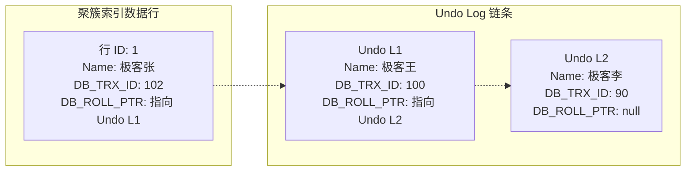

## MySQL 核心与 MVCC 面试真题

本专栏致力于为中高级 DBA 与 Java 架构师提供最硬核的 MySQL 底层原理与架构调优面试真题剖析。每个知识点都配有详尽的答案、核心源码机制、以及图文并茂的 B+ 树索引结构与 MVCC 多版本并发控制图解。

---

## 模块五：数据持久化与缓存高并发（MySQL 部分）

### Q1：MySQL InnoDB 引擎的 MVCC（多版本并发控制）底层是如何工作的？它是如何防止不可重复读漏洞的？

MVCC 机制使得数据库在读写并发时，做到了**读不加锁、读写互不阻塞**的高并发性能。其最底层依靠 $3$ 大核心机制实现：**隐藏字段**、**Undo Log（回滚日志段）**、以及 **Read View（一致性视图）**。

#### 1. 核心原理结构：Undo Log 版本链

InnoDB 存储引擎中，聚簇索引每个数据行后面实际上都跟随有如下两个关键的隐藏字段：

- **`DB_TRX_ID`**：记录最后一次插入或修改该行记录的**事务 ID**。

- **`DB_ROLL_PTR`**：**回滚指针**。指向当前行写入到 `Undo Log` 对应版本链的历史备份节点。

当新事务执行修改，该记录被拷贝入 Undo Log。当前在线行数据的 `DB_ROLL_PTR` 顺次向下指代，版本链得以构建。

#### 2. 第二大利器：Read View 的可见性算法

当一个事务发起快照读（普通的 `SELECT`）时，系统会生成一个 **Read View** 一致性读视图，相当于给内存事务链截了个屏。主要包含四个核心分界边界：

- `m_ids`：生成该 Read View 时，当前线上所有**活跃未提交**的事务 ID 集合。

- `min_trx_id`：活跃未提交事务集合 `m_ids` 中的最小值。

- `max_trx_id`：系统分配给下一个潜在新事务的 ID（当前最大已分配 ID + 1）。

- `creator_trx_id`：创建该 Read View 的当前事务自身的 ID。

当当前事务拿着 Read View 沿着 Undo Log 版本链自顶向下比对对象的 `trx_id` 时，依据如下**可见性黄金法则判定可否读取**：

| 比对分支 | `trx_id` 取值区间 | 判定结果与读取原则 |
| :--- | :--- | :--- |
| **规则一** | `trx_id == creator_trx_id` | **可见**。因为这个版本就是当前事务自己修改创建的，可直接读取。 |
| **规则二** | `trx_id < min_trx_id` | **可见**。表明该版本的事务在生成 Read View 前已经提交完毕，安全可见。 |
| **规则三** | `trx_id >= max_trx_id` | **不可见**。表明生成该版本的事务在当前 Read View 生成之后才开启，不可见。 |
| **规则四** | `min_trx_id <= trx_id < max_trx_id` | 判断是否在 `m_ids` 活跃集合中：在则不可见（尚未提交），不在则可见（快照前已提交）。 |

若判定当前 Undo 版本不可见，读线程顺着隐藏的 `DB_ROLL_PTR` 搜寻更早版本，直到找到可见版本为止，达成数据不加锁并发读。

#### 3. 解决“不可重复读”与“读已提交（RC）”、“可重复读（RR）”的隔离对比差异

- **读已提交（Read Committed, RC）**：

  **每次发起普通的 `SELECT` 操作时，都会去生成一个崭新的 Read View。**
  因为每次查询都在重新截屏拉取活跃区列表，如果之前没有提交的事务在你的两次查询期间提交了，第二次查自然就能读取。这无法做到重复度一致，导致“不可重复读”。

- **可重复读（Repeatable Read, RR）**：

  **只在同一个事务内、第一次发起快照读时，生成一个唯一的 Read View**。之后所有同一个事务里的查询动作都复用这个初始视图。
  即使在第两百万次查询，由于使用的是第一张老截图，仍能完好剔除期间任意已经提交的数据变更，从而**完美防范了不可重复读漏洞**！
