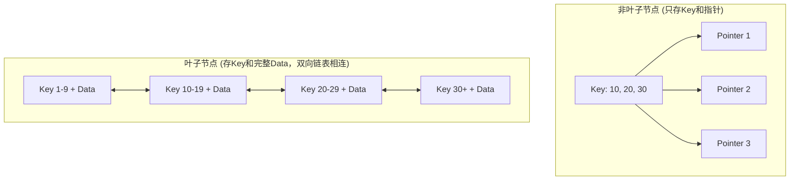
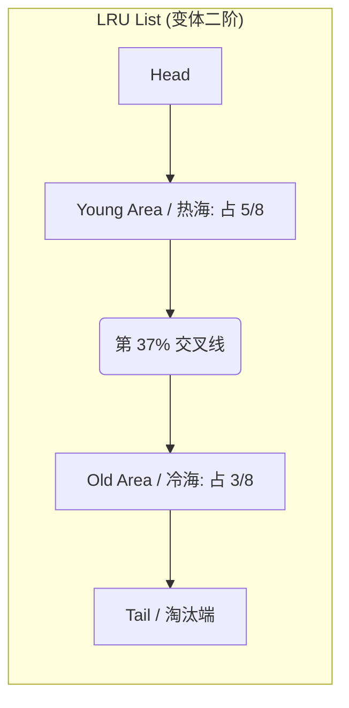

## MySQL B+树索引与 InnoDB 引擎

在关系型数据库中，MySQL 的 InnoDB 存储引擎是绝对的主流。深入理解 InnoDB 的索引结构（B+树）、聚簇索引与非聚簇索引的区别，以及 B+树的数学估算，是高级 Java/DBA 面试的必考点。

---

## 一、 B+树索引原理

MySQL 的索引是在**存储引擎层**实现的。InnoDB 引擎采用 **B+树** 作为索引的数据结构。

### 1. 为什么选择 B+树？（与其他数据结构的对比）

在数据库中，我们需要一种能够支持高效**单行查询** and **范围查询**，且**磁盘 I/O 次数极少**的数据结构。

- **二叉查找树 / 红黑树**：
  - **缺点**：树的高度过高。随着数据量增加，树的高度呈对数增长。每次查找一个节点都可能对应一次磁盘 I/O，树太高会导致 I/O 次数过多，性能极差。此外，它们不支持高效的范围查询。
- **B 树（B-Tree）**：
  - **特点**：B 树的每个节点（包括非叶子节点）都存储了 Key 和 Data。
  - **缺点**：由于非叶子节点也存储了 Data，导致每个节点（通常是一页，16KB）能存储的 Key 数量变少。为了存储相同数量的数据，B 树的高度会比 B+树更高，增加磁盘 I/O 次数。
- **B+树（B+Tree）**：
  - **特点**：
    1. **非叶子节点只存储 Key 和指针**，不存储实际的 Data。这使得每个非叶子节点可以容纳更多的索引项，极大地降低了树的高度（通常为 3~4 层）。
    2. **所有 Data 都存储在叶子节点中**，查询性能更稳定（每次查询都必须走到叶子节点）。
    3. **叶子节点之间通过双向链表相连**，这使得范围查询和排序变得极其高效，只需在叶子节点层进行链表遍历即可，无需返回上层节点。



---

## 二、 聚簇索引与非聚簇索引

### 1. 聚簇索引（Clustered Index）

- **定义**：索引结构与数据行存储在一起的索引。B+树的叶子节点存储的就是**完整的整行数据**。
- **限制**：一张表**有且仅有一个**聚簇索引。
- **InnoDB 的聚簇索引选择规则**：
  1. 优先选择显式定义的主键（Primary Key）作为聚簇索引。
  2. 如果没有主键，选择第一个非空的唯一索引（Unique Index）作为聚簇索引。
  3. 如果连唯一索引也没有，InnoDB 会在后台自动生成一个 6 字节的隐式自增 row_id 作为聚簇索引。

### 2. 非聚簇索引（Secondary Index / 辅助索引）

- **定义**：索引结构与数据行分开存储的索引。B+树的叶子节点存储的是**索引列的值以及对应主键的值**，而不是完整的整行数据。
- **回表查询（Look Up）**：
  - 当我们通过非聚簇索引（如 `name` 字段的索引）查询数据时：
    1. 先在非聚簇索引的 B+树中查找到对应的叶子节点，获取到主键 ID。
    2. 再拿着主键 ID 去聚簇索引的 B+树中查找完整的整行数据。
  - 这个过程被称为**回表**。

如果查询的列刚好就是索引列本身（或者主键），那么在非聚簇索引的叶子节点中就已经能拿到所需的数据，无需再进行回表操作。这被称为**覆盖索引**，能极大地提高查询效率。

```sql
-- 覆盖索引：不需要回表
SELECT name, id FROM user WHERE name = 'Jack';

-- 非覆盖索引：需要回表查询 age 和 address
SELECT name, age, address FROM user WHERE name = 'Jack';
```

---

## 三、 B+树的高度与数据量估算（硬核计算）

在面试中，面试官常问：“**一个 3 层的 B+树，大概能存放多少行数据？**”

### 1. 计算前提

- InnoDB 的最小存储单元是**页（Page）**，默认大小为 **16KB**（16384 字节）。
- 无论是叶子节点还是非叶子节点，都占用一个页的空间。

### 2. 估算步骤

设主键为 `bigint` 类型，占用 **8 字节**。
指针在 InnoDB 中占用 **6 字节**。
因此，一个索引项（Key + 指针）占用：`8 + 6 = 14 字节`
一个 16KB 的非叶子节点页，能存放的索引项数量为：`数量 = (16 * 1024) / 14 ≈ 1170 个`

设单行数据的大小为 **1KB**（包含所有字段）。
那么一个 16KB 的叶子节点页，能存放的数据行数为：`行数 = 16KB / 1KB = 16 行`

- **第 1 层（根节点）**：1 个页，存放 1170 个指针。
- **第 2 层**：1170 个页，每个页存放 1170 个指针。总指针数为：`1170 * 1170 = 1,368,900 个`
- **第 3 层（叶子节点）**：1,368,900 个页，每个页存放 16 行数据。
- **总数据量**：`1,368,900 * 16 ≈ 21,900,000 行（约 2200 万行）`

> **结论**：在单行数据大小为 1KB 的情况下，一个 3 层的 B+树可以轻松存储 **2000 万左右** 的数据。这也是为什么阿里《Java开发手册》建议单表数据量达到 2000 万左右时需要考虑分库分表的原因（因为再增加数据，树可能会膨胀到 4 层，导致多一次磁盘 I/O，性能开始下降）。

---

## 四、 Buffer Pool 缓存池存储机制

为了减少对磁盘物理 I/O 的频繁操作，InnoDB 在系统内存中建立了一个连续的预读缓冲区 —— **Buffer Pool**。

### 1. 内存结构与三种链表（List）

Buffer Pool 默认按固定的 **16KB 页（Page）** 大小进行管理，内部维护了控制块（Control Block，约占比 5%）和实际的物理缓存页。
为了精准并高效地管理缓存块的状态，InnoDB 内部通过三种链表将其紧密组织：

- **Free List (空闲链表)**：记录 Buffer Pool 中所有未使用的物理空闲页控制块。
- **Flush List (脏页链表)**：记录所有在内存中被修改过、尚未落盘的数据页控制块。其上的节点，正是在内存里与磁盘暂时不符的“脏页”，等待后台线程异步刷盘。
- **LRU List (淘汰链表)**：这是最核心的链表，负责决定当 Buffer Pool 空间不足时淘汰哪些页面。

### 2. 变体变频 LRU 淘汰机制与冷热流转

如果使用最原始的 LRU 链表，一旦发生 **全表扫描（Table Scan）** 或 **预读失效（Read-Ahead Failure）**，瞬时加载的海量冷数据会瞬间将链表中的热数据全部挤压清空，导致极高的缓存污染率。
为此，InnoDB 设计了 **`3:5` 黄金比例切分的变体 LRU 链表**：



- **冷热分区**：
  - **Young 区（热数据区/MRU）**：链表前半部分，占比约 63%。
  - **Old 区（冷数据区/LRU）**：链表后半部分，占比约 37%（通过参数 `innodb_old_blocks_pct` 可调）。
- **冷热流转算法机制**：
  - **首次加载**：任何新加载的磁盘数据页（包括预读引发的页面），优先放入 **Old 区的头部**，而不是传统 LRU 链表的 Young 区头部。
  - **双重晋升防御机制**：
    1. 如果该页在 Old 区驻留的时间小于 1 秒（默认值，由 `innodb_old_blocks_time` 控制），即使它被后续多次读取，**也不会被晋升到 Young 区**。由于全表扫描重放的速度极快，页面被扫描加载后很快就会在这个“时间屏障”内结束读取，从而保证其安心待在 Old 区直至被无情清除。
    2. 如果该页在 Old 区驻留时间 $\ge 1$ 秒，且期间再次被访问，则会**被无缝晋升（Move）到 Young 区的头部**，成为热数据。
  - **Young 区优化**：为了避免 Young 区头部数据节点由于高并发频繁访问导致指针变动带来的自旋锁开销，InnoDB 规定：**只有当访问的节点位于 Young 区前 1/4 之后的区间时，才执行移动到头部的操作**；前 1/4 的极热节点被读触碰时保持原地不动。

---

## 五、 自适应哈希索引 (Adaptive Hash Index, AHI)

B+树即便只有 3~4 层，寻址一次依然要沿着树节点做 3~4 次二分检索。

- **原理**：系统自动监控 B+树索引被访问的频率与具体检索条件。如果发现某些对非叶子、二级索引的**等值查询**（如 `WHERE c1 = 'xxx'`）在短期内高频发生，InnoDB 就会直接利用这个特定的 Key 在内存里快速建立一个**自适应哈希索引（AHI）**，将 B+树叶子节点的数据页地址缓存到 Hash 表中。
- **性能跨越**：自适应哈希索引将原本的 $O(\log N)$（B+树检索）查询复杂度瞬间缩减至 **$O(1)$** 极速，完美契合了关系型向非关系型（NoSQL 级高速）的体验跃迁。
- **配置与场景缺陷**：可以通过配置项 `innodb_adaptive_hash_index` 控制。AHI 仅针对“等值查询”有效，若生产上充斥着大面积的“范围检索”或“模糊匹配”，AHI 会退化从而抢占宝贵的 CPU 锁定资源，在此种场景下通常建议直接关闭。

---

## 六、 高可用集群架构概览

在企业级生产环境中，单点数据库无法保证业务的连续性。为了实现 99.99% 的高可用性，通常需要构建数据库集群。

MySQL 官方及业界提供了多种成熟的高可用方案：
- **MGR (MySQL Group Replication)**：原生强一致性分布式事务集群，基于 Paxos 协议实现。
- **InnoDB Cluster**：基于 MGR 构建的全栈自动化高可用运维方案，集成了 MySQL Shell 和 MySQL Router 代理层。
- **ProxySQL / MySQL Router**：轻量级或高性能的数据库代理，负责实现高并发下的读写分离与流量治理。

> [!NOTE]
> 关于高可用集群的架构组成、Paxos 共识机制、自动化部署及故障切换的详细实战步骤，请参考专属文档：
> [MySQL 高可用集群架构](../ha/ha-clustering.md)。
