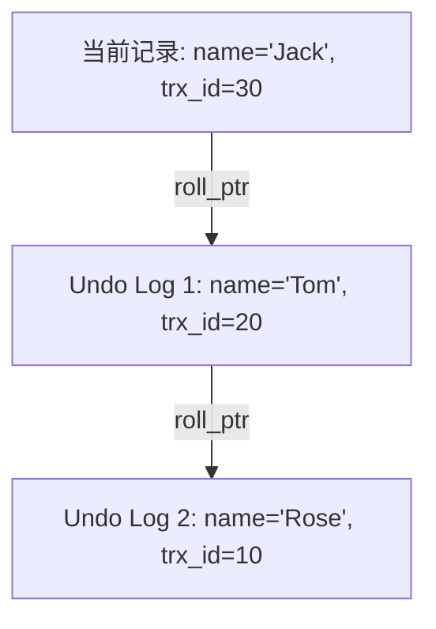
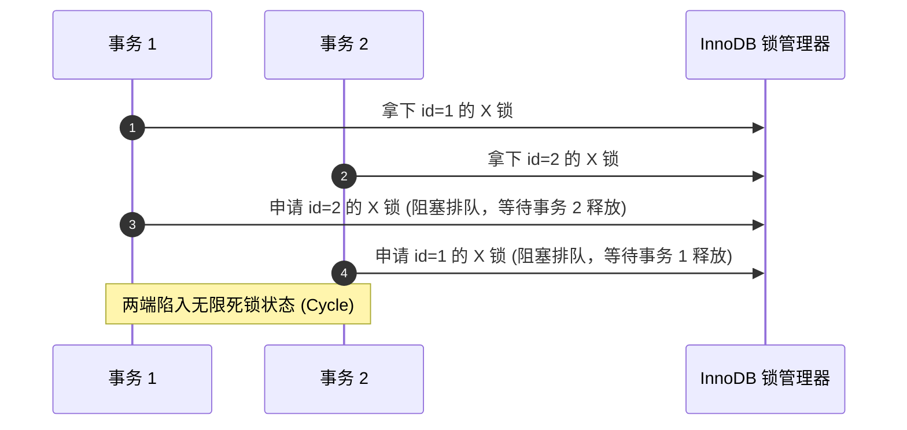

## MySQL MVCC 机制与锁机制

在数据库并发控制中，如何保证多个事务同时读写时的数据一致性与隔离性，是数据库设计的核心难题。MySQL InnoDB 引擎通过 **MVCC（多版本并发控制）** 和 **锁机制** 完美地解决了这一问题。

---

## 一、 MVCC (Multi-Version Concurrency Control) 实现原理

MVCC 是一种无锁化的并发控制机制，用于实现 **RC（读已提交）** 和 **RR（可重复读）** 隔离级别下的**一致性非锁定读**。它使得“读-写”操作互不阻塞，极大地提高了数据库的并发性能。

### 1. MVCC 的三大基石

MVCC 的实现主要依赖于：**隐藏字段**、**Undo Log（回滚日志）** 和 **ReadView（一致性视图）**。

**隐藏字段**：

- InnoDB 在每行数据后面都会自动添加三个隐藏字段：
  - **`DB_TRX_ID` (6字节)**：最近一次插入或修改该行数据的**事务 ID**。
  - **`DB_ROLL_PTR` (7字节)**：**回滚指针**，指向该行数据的 Undo Log。如果该行数据被更新，回滚指针就指向旧版本的数据。
  - **`DB_ROW_ID` (6字节)**：隐式自增 ID（若无主键和唯一索引则自动生成）。

**Undo Log（回滚日志）**：

- 一个事务修改某行数据时，InnoDB 会把修改前的数据写入 Undo Log 中。
- 通过隐藏字段 `DB_ROLL_PTR`，将这些不同版本的 Undo Log 连接起来，就形成了一条**版本链**。



**ReadView（一致性视图）**：

- ReadView 是事务在进行快照读（SELECT）时产生的一个结构，用于判断当前事务能看到版本链中的哪个版本。
- ReadView 包含 4 个核心字段：
  - **`m_ids`**：在创建 ReadView 时，当前系统中**活跃且未提交**的事务 ID 列表。
  - **`min_trx_id`**：创建 ReadView 时，当前系统中活跃的最小事务 ID（即 `m_ids` 中的最小值）。
  - **`max_trx_id`**：创建 ReadView 时，系统应该分配给下一个事务的 ID（即当前最大事务 ID + 1）。
  - **`creator_trx_id`**：创建该 ReadView 的当前事务 ID。

---

### 2. 版本可见性算法

当事务读取某行数据时，会顺着版本链向下寻找，用每个版本的 `trx_id` 与当前事务的 ReadView 进行比对，规则如下：

1. 如果 `trx_id == creator_trx_id`：说明这个版本是当前事务自己修改的，**可见**。
2. 如果 `trx_id < min_trx_id`：说明这个版本在创建 ReadView 之前就已经提交了，**可见**。
3. 如果 `trx_id >= max_trx_id`：说明这个版本是在创建 ReadView 之后才开启的事务修改的，**不可见**。
4. 如果 `min_trx_id <= trx_id < max_trx_id`：
   - 若 `trx_id` 在 `m_ids` 列表中：说明修改该版本的事务尚未提交，**不可见**。
   - 若 `trx_id` 不在 `m_ids` 列表中：说明修改该版本的事务已经提交，**可见**。

---

### 3. RC 与 RR 隔离级别下 ReadView 的生成时机差异

这是面试中的高频深挖点

**RC（Read Committed）**：**每次执行 SELECT 语句时，都会重新生成一个全新的 ReadView**。因此，如果其他事务在两次 SELECT 之间提交了数据，后一次 SELECT 就能看到最新提交的数据，导致**不可重复读**

**RR（Repeatable Read）**：**只在事务第一次执行 SELECT 语句时生成一个 ReadView**，后续的所有 SELECT 都复用这同一个 ReadView。因此，即使其他事务中途提交了修改，当前事务看到的依然是第一次查询时的快照，实现了**可重复读**。

---

## 二、 InnoDB 锁机制

当发生“写-写”竞争时，MVCC 无法解决，必须依赖锁机制。

### 1. 锁的粒度分类

- **表级锁（Table Lock）**：锁定整张表。开销小，加锁快；不会出现死锁；锁定粒度大，并发度最低。
- **行级锁（Row Lock）**：锁定单行数据。开销大，加锁慢；**会出现死锁**；锁定粒度最小，并发度最高。

### 2. 行锁的分类（InnoDB 特有）

InnoDB 的行锁是通过**给索引上的索引项加锁**来实现的，而不是针对记录加锁。如果查询没有走索引，InnoDB 会使用表锁。

- **Record Lock（记录锁）**：仅仅锁住单个索引记录。
  - 例如：`SELECT * FROM t WHERE id = 1 FOR UPDATE;` 会在 `id=1` 的索引记录上加记录锁。
- **Gap Lock（间隙锁）**：锁定一个范围，但不包含记录本身。目的是防止其他事务在这个范围内插入新数据，从而**防止幻读**。
  - 例如：`SELECT * FROM t WHERE id BETWEEN 5 AND 10 FOR UPDATE;` 会锁住 $(5, 10)$ 这个区间，其他事务无法插入 `id=6, 7, 8, 9` 的记录。
- **Next-Key Lock（临键锁）**：**记录锁 + 间隙锁的组合**，既锁住记录本身，又锁住索引前后的间隙。是一个左开右闭的区间。
  - 例如：锁住区间 $(5, 10]$。

---

## 三、 RR 隔离级别下如何解决幻读？

**幻读**：在一个事务内，多次范围查询，后一次查询看到了前一次查询没有看到的“新插入的行”（像出现了幻觉）。

InnoDB 在 **RR（可重复读）** 隔离级别下，通过以下两种方式共同解决了幻读问题：

- 通过 **MVCC** 机制。由于复用第一次生成的 ReadView，即使其他事务插入了新数据，在当前事务的版本可见性算法下也是不可见的，从而避免了快照读下的幻读。

**当前读（SELECT ... FOR UPDATE / LOCK IN SHARE MODE, UPDATE, DELETE）**：

- 通过 **Next-Key Lock（临键锁）**。在进行当前读时，InnoDB 会对读取的范围加 Next-Key Lock，锁住记录和间隙，阻止其他事务在这个范围内插入新数据，从而在硬件/锁层面杜绝了当前读下的幻读。

---

## 四、 意向锁与自增锁 (Intention & Auto-Inc Locks)

除了行锁和表锁，为了支持多粒度共存并提升高并发性能，InnoDB 还定义了以下特殊的锁：

### 1. 意向锁 (Intention Locks) —— 避免全表扫描

意向锁是**表级锁**，由 InnoDB 在申请行锁时自动加上，不需要用户显式干预。

- **意向共享锁 (IS Lock)**：表示事务有意向对表中的某些行加共享锁（S 锁）。
- **意向排他锁 (IX Lock)**：表示事务有意向对表中的某些行加排他锁（X 锁）。

**意向锁解决的痛点**：
若事务 A 锁住了表中某一行数据（加了行级 X 锁）。此时事务 B 想要对整张表加表级 X 锁。

- **无意向锁时**：事务 B 必须去逐行检索整张表的所有行，看是否有行被锁住，效率是沉重的 $O(N)$。
- **有意向锁时**：由于事务 A 在加行锁前，已经自动在表级加了 **IX 锁**。事务 B 只需要检查表级是否存在 IX 锁即可。因为表级 X 锁与 IX 锁互斥，事务 B 瞬间被阻塞。无须扫描表，检索效率瞬间跃升为 **$O(1)$**。

### 2. 自增锁 (AUTO-INC Locks) —— 支撑高并发自增写入

自增锁是一种特殊的表级锁，专门用于处理表中 `AUTO_INCREMENT` 列的并发插入行为。其核心通过参数 `innodb_autoinc_lock_mode` 控制：

- **`0` (traditional / 传统模式)**：所有自增插入都要获取表级 AUTO-INC 锁，直到 SQL 执行结束才释放，高并发写入下性能低。
- **`1` (consecutive / 连续模式，默认)**：对于“简单插入”（提前确定行数），通过轻量级互斥量（Mutex）分配，分配完立即释放，无需全表锁定；对于“批量插入”（如 `INSERT ... SELECT`），仍然采用传统表级锁。
- **`2` (interleaved / 交叉模式)**：所有插入都不用 AUTO-INC 表级锁，通过轻量级 Mutex 分割，多个插入可交错自增。**写入性能最高，但会导致同一个批次内的主键 ID 产生空洞或不连续**。在使用 ROW 格式 Binlog 的主从复制下是安全的。

---

## 五、 死锁（Deadlock）深度分析与线上排查

### 1. 经典死锁产生时序推演

当两个或多个事务在执行过程中，因争夺相同锁资源而造成的一种互相等待、无法自动退出的僵局。



### 2. InnoDB 的死锁自愈机制

- **死锁检测（Deadlock Detection）**：默认开启（`innodb_deadlock_detect = on`），InnoDB 会主动维护一个**锁信息等待图 (Wait-For Graph)**。一旦检测到环（Cycle），会主动选择**持有排他锁（X 锁）最少、回滚成本最低的事务**进行强行中断并回滚（报错 `1213 - Deadlock found`），让另一个事务顺利走完。
- **死锁等待超时（Deadlock Timeout）**：即便关闭了死锁检测，InnoDB 在达到限制时间（`innodb_lock_wait_timeout`，默认 50 秒）后也会强制超时该排队事务。

### 3. 三步排查法剖析线上死锁

1. **获取最近一次死锁日志**：
   在线上执行命令，打印出 InnoDB 的核心状态数据：

   ```sql
   SHOW ENGINE INNODB STATUS;
   ```

   在输出内容中，寻找 `LATEST DETECTED DEADLOCK` 这一重磅板块。
2. **分析死锁日志的事务 SQL 与持锁状态**：
   - 寻找 `*** (1) TRANSACTION` 与 `*** (2) TRANSACTION`：记录了两个死锁事务正在执行哪句特定的 SQL。
   - 寻找 `*** (1) WAITING FOR THIS LOCK TO BE GRANTED`：表示事务 1 正在排队等待哪张表、哪个索引（如主键或辅助索引）上的什么锁。
   - 寻找 `*** (2) HOLDS THE LOCK(S)`：表示事务 2 当前已经死死拿下了什么物理锁。
3. **定位业务源码做调优**：
   - 根据死锁日志中暴露的 SQL，回溯项目中的 Service / Mapper 文件，看是否存在由于业务逻辑错乱导致两个接口加锁顺序不一致的问题。
   - **防范策略**：统一物理接口的**加锁访问顺序**（先排队加锁 id=1，再加锁 id=2）；尽量在业务逻辑中降低事务的整体持锁周期，长事务拆分为小短事务。

---

### 4. 线上死锁日志案例实战拆解

以下是一段真实的 `SHOW ENGINE INNODB STATUS` 输出的死锁日志，该案例是典型的**并发 Insert 导致间隙锁与插入意向锁冲突**引发的死锁：

```sql
------------------------
LATEST DETECTED DEADLOCK
------------------------
2026-07-16 14:33:53 0x7f8c1c0a5700
*** (1) TRANSACTION:
TRANSACTION 284300, ACTIVE 5 sec inserting
mysql tables in use 1, locked 1
LOCK WAIT 3 lock struct(s), heap size 1136, 2 row lock(s)
MySQL thread id 12, OS thread handle 140240026216192, query id 98 localhost root update
INSERT INTO orders (id, order_no, status) VALUES (6, '20260716006', 1)

*** (1) WAITING FOR THIS LOCK TO BE GRANTED:
RECORD LOCKS space id 45 page no 3 n bits 72 index PRIMARY of table `test`.`orders` trx id 284300 lock_mode X insert intention waiting
Record lock, heap no 1 PHYSICAL RECORD: n_fields 1; compact format; info bits 0
 0: len 8; hex 800000000000000a; asc         ;;

*** (2) TRANSACTION:
TRANSACTION 284301, ACTIVE 4 sec inserting
mysql tables in use 1, locked 1
3 lock struct(s), heap size 1136, 2 row lock(s)
MySQL thread id 13, OS thread handle 140240026269440, query id 99 localhost root update
INSERT INTO orders (id, order_no, status) VALUES (7, '20260716007', 1)

*** (2) HOLDS THE LOCK(S):
RECORD LOCKS space id 45 page no 3 n bits 72 index PRIMARY of table `test`.`orders` trx id 284301 lock mode Gaps
Record lock, heap no 5 PHYSICAL RECORD: n_fields 5; compact format; info bits 0
 0: len 8; hex 800000000000000a; asc         ;;

*** (2) WAITING FOR THIS LOCK TO BE GRANTED:
RECORD LOCKS space id 45 page no 3 n bits 72 index PRIMARY of table `test`.`orders` trx id 284301 lock_mode X insert intention waiting
Record lock, heap no 1 PHYSICAL RECORD: n_fields 1; compact format; info bits 0
 0: len 8; hex 800000000000000a; asc         ;;

*** WE ROLL BACK TRANSACTION (1)
```

#### 日志深度诊断

1. **事务 1 (`*** (1) TRANSACTION`)**：
   - 事务 ID 为 `284300`，已活跃 5 秒，当前正在执行 `inserting` 操作：`INSERT INTO orders ... (6)`。
   - 此时它处于 `LOCK WAIT` 状态。
2. **事务 1 等待的锁 (`*** (1) WAITING FOR THIS LOCK TO BE GRANTED`)**：
   - 在表 `test`.`orders` 的主键索引 `PRIMARY` 上等待一个 `lock_mode X insert intention waiting`（**排他插入意向锁**）。
   - 该锁作用于物理页 `page no 3`。
3. **事务 2 (`*** (2) TRANSACTION`)**：
   - 事务 ID 为 `284301`，已活跃 4 秒，当前也在执行 `inserting` 操作：`INSERT INTO orders ... (7)`。
4. **事务 2 持有的锁 (`*** (2) HOLDS THE LOCK(S)`)**：
   - 占有了 `lock mode Gaps`（**间隙锁**），范围在主键值为 `10`（十六进制 `hex 800000000000000a` 代表 10）的前面。
5. **事务 2 等待的锁 (`*** (2) WAITING FOR THIS LOCK TO BE GRANTED`)**：
   - 同样在等待 `lock_mode X insert intention waiting`（**排他插入意向锁**），主键为 `10`。
6. **死锁成因剖析**：
   - 事务 1 和事务 2 在之前某个时间，均在区间 `(5, 10)` 内申请了 **Gap Lock**（可能由于执行了类似 `SELECT ... WHERE id = 6 FOR UPDATE` 的当前读，但当时 `id=6` 记录并不存在）。
   - **注意**：间隙锁（Gap Lock）之间是**兼容**的，所以事务 1 和事务 2 可以同时持有同一个区间的间隙锁。
   - 随后，事务 1 执行 `INSERT` 试图插入 `id=6`，需要先获取该区间的**插入意向锁（Insert Intention Lock）**。然而，插入意向锁与事务 2 占有的 Gap Lock **互斥**，导致事务 1 阻塞等待事务 2 释放间隙锁。
   - 紧接着，事务 2 执行 `INSERT` 试图插入 `id=7`，同样需要获取该区间的插入意向锁。然而，这又与事务 1 占有的 Gap Lock **互斥**，导致事务 2 阻塞等待事务 1 释放间隙锁。
   - 两个事务形成闭环等待：**T1 等待 T2 释放 Gap Lock，T2 也在等待 T1 释放 Gap Lock**。
   - InnoDB 监测到该等待环，决定回滚持有锁较少的事务 1（`*** WE ROLL BACK TRANSACTION (1)`）。
