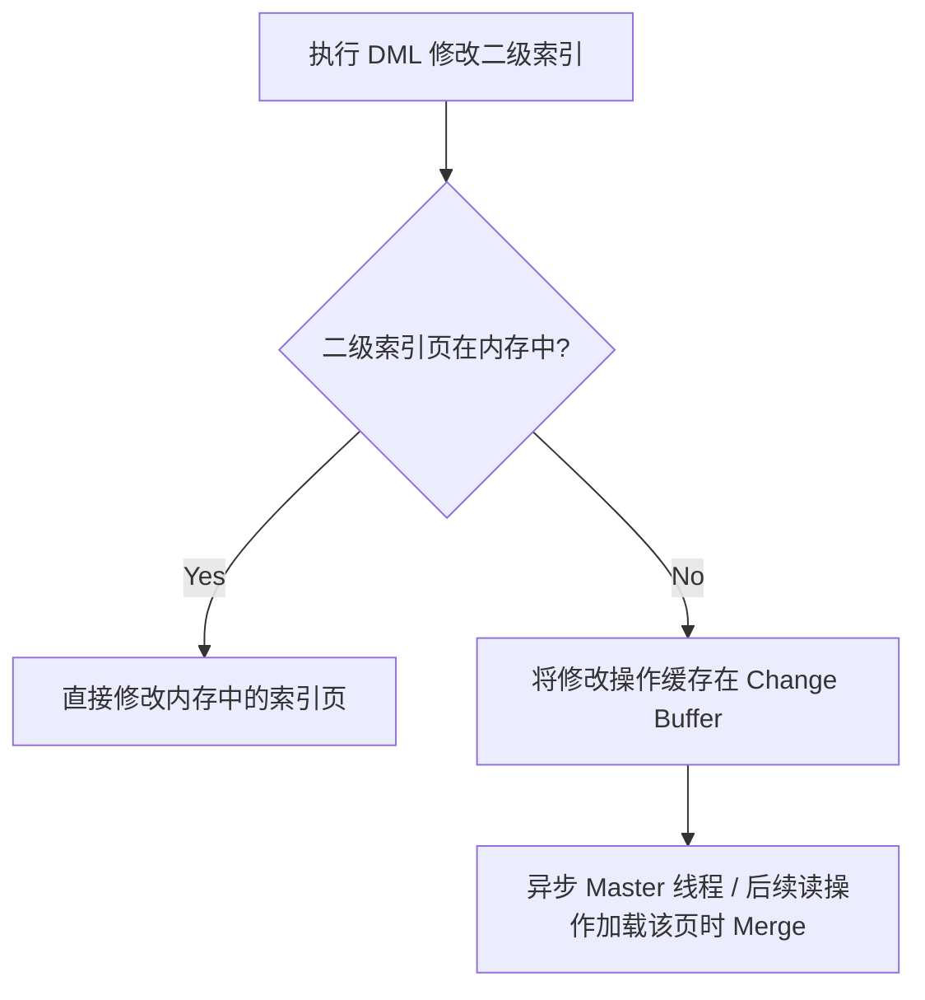
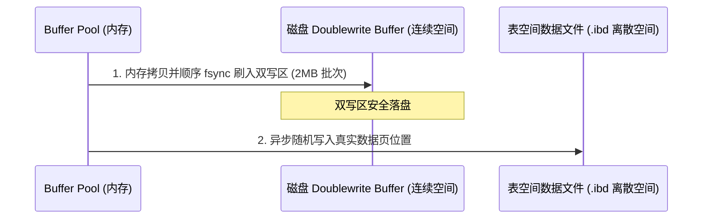

## InnoDB 存储引擎内核原理

作为 MySQL 的默认存储引擎，InnoDB 的高性能与高可靠性源于其精妙的底层物理存储结构与缓冲/写优化机制。本章深入剖析 InnoDB 的物理页结构、行记录格式、Change Buffer 写缓冲以及 Doublewrite Buffer 双写缓冲区。

---

## 一、 InnoDB 物理 Page 页结构

InnoDB 存储数据的基本单位是**页（Page）**，默认大小为 **16KB**。一个 Page 在磁盘上的物理结构由以下 7 个核心区域组成：

```text
+-----------------------------------+
|  File Header (文件头 - 38B)       | -> 记录页的校验和、页号、双向链表前后指针
+-----------------------------------+
|  Page Header (页头 - 56B)         | -> 记录页内记录数量、槽（Slot）数量等
+-----------------------------------+
|  Infimum + Supremum (最小/最大记录)| -> 虚拟的边界记录，界定用户记录的头尾
+-----------------------------------+
|  User Records (用户记录)          | -> 真正存储行数据的地方，按主键单链表相连
+-----------------------------------+
|  Free Space (空闲空间)            | -> 尚未被使用的空白内存空间
+-----------------------------------+
|  Page Directory (页目录)          | -> 槽位索引，用于在页内进行二分查找
+-----------------------------------+
|  File Trailer (文件尾 - 8B)       | -> 校验刷盘完整性的校验码
+-----------------------------------+
```

### 1. 页目录（Page Directory）二分检索机制

如果一个页内存储了数百条记录，要在页内查找某条记录，若从头顺着单链表往后遍历，时间复杂度为 $O(N)$，效率低下。
为此，InnoDB 设计了 **Page Directory**：
- **记录分组**：页内的记录被分为若干个组，每个组包含 4~8 条记录。
- **槽位（Slot）映射**：每个组中主键值最大的那条记录（即组内最后一条记录）在页的尾部 **Page Directory** 里对应一个槽位，记录其相对偏移量。
- **二分查找**：当检索某个主键时：
  1. 先在 Page Directory 的槽位数组里利用**二分法**快速定位其所属的槽（即确定数据在哪一个分组）。
  2. 找到槽后，拿着该槽前一个槽所指向的记录，作为该分组单链表的起点。
  3. 顺着单链表向后遍历该分组的几条记录，精准定位数据。
  通过这种设计，页内检索的时间复杂度瞬间降至 **$O(\log M)$**（$M$ 为槽的个数）。

### 2. 文件尾（File Trailer）校验机制

为了防范 16KB 页刷盘到磁盘中途遭遇断电等意外（Partial Page Write），`File Trailer` 包含了 8 字节的校验和（Checksum）及 LSN。
- 每次刷写时，页头和页尾都会记录相同的 Checksum 值。
- 重启自检时，如果页头 Checksum 与页尾不一致，说明该页刷写不完整（受损），系统将通过双写缓冲进行数据修复。

---

## 二、 InnoDB 行记录格式 (Row Format)

表中的具体行数据是在 Page 内的 `User Records` 区域存储的。InnoDB 支持多种行格式，最常用的是 **Compact** 和 **Dynamic**。

### 1. Compact 格式物理剖析

Compact 格式将行记录分为“记录的额外信息”和“记录的真实数据”两部分：

```text
+----------------------- 记录的额外信息 -----------------------+---------- 记录的真实数据 ----------+
| 变长字段长度列表 | NULL值列表 | 记录头信息 (5字节)             | DB_TRX_ID | DB_ROLL_PTR | 列1 | 列2 | ...
+--------------------------------------------------------------+-------------------------------------+
```

- **变长字段长度列表**：逆序存放所有变长字段（如 `VARCHAR`）在当前行的实际占用字节长度。
- **NULL 值列表**：用二进制位（Bit Map）记录哪些列的值是 NULL。每个 Bit 对应一个可为 NULL 的列，逆序排列。若列值为 NULL，对应 Bit 记为 1。
- **记录头信息 (Record Header - 5字节)**：
  - `delete_mask` (1-bit)：标记该行是否已被删除（逻辑删除）。
  - `n_owned` (4-bit)：该记录在 Page Directory 组内所占有的记录数。
  - `next_record` (16-bit)：指向下一条记录的**相对偏移量**（页内单链表指针）。

- **记录的真实数据**：
  - 除了我们定义的业务列外，还包含三个隐藏列：
    - `DB_TRX_ID` (6字节)：最近修改该行的事务 ID。
    - `DB_ROLL_PTR` (7字节)：回滚指针，指向 Undo Log。
    - `DB_ROW_ID` (6字节)：隐式自增 ID（在无显式主键/唯一索引时生成）。

### 2. 溢出页（Off-page）与 Dynamic 格式

- **行溢出成因**：MySQL 一个 Page 只有 16KB，如果某列数据（如 `VARCHAR(65535)` 或 `TEXT`）的宽度远大于 16KB，一页就装不下整行记录。
- **Compact 处理方案**：在 Compact 格式中，如果发生行溢出，行的真实数据处只存储该列的前 **768 字节**，并在末尾保留一个 20 字节的指针，指向其他溢出页（Overflow Page）。
- **Dynamic 格式（MySQL 8.0 默认）**：Dynamic 格式对大字段做了更彻底的优化。在行的真实数据处**完全不存储大字段的任何前缀数据**，只存储一个 20 字节的指针指向溢出页，所有大字段数据彻底移至外挂的溢出页中，进一步提高了缓存页的利用效率与扫描性能。

---

## 三、 写缓冲区 (Change Buffer)

当我们在表中插入、更新或删除一条记录时，除了要维护聚簇索引外，还需要更新表上的**非唯一二级索引**（Secondary Index）。
- **痛点**：非唯一二级索引的数据分布通常是极其无序和离散的。如果每次修改都直接去磁盘读取二级索引页并修改，会导致大量的**随机磁盘 I/O**，性能急剧下滑。
- **破局：Change Buffer**：
  当修改非唯一二级索引时，如果对应的索引页尚不在 Buffer Pool（内存）中，InnoDB 并不会立即从磁盘读取该页，而是**先将这个修改操作记录在 Change Buffer 中**。
  后续当该二级索引页由于其他查询被加载到内存中时，再执行 **Merge**（合并修改）。



### 1. 为什么唯一索引（Unique Index）无法使用 Change Buffer？

- **唯一性约束校验**：对于唯一索引，插入数据时必须判断该值在表中是否已存在。为了校验唯一性，InnoDB **必须先把对应的索引页从磁盘读入内存中**进行校验。
- **无缓冲必要**：既然索引页已经被强制读入了内存，那么直接在内存页中修改即可，完全不需要再放入 Change Buffer 去做延迟缓存。
- **结论**：Change Buffer 只对**非唯一二级索引**的写操作生效。

### 2. Change Buffer Merge 的触发时机

- **主动读取**：业务 SQL 查询了该二级索引页，导致其被加载到 Buffer Pool，此时顺便合并 Change Buffer 里的对应记录。
- **后台线程**：后台 Master Thread 定期进行异步 Merge。
- **安全关闭**：数据库正常 Shutdown 时，会强制将 Change Buffer 全量刷盘合并。

---

## 四、 双写缓冲区 (Doublewrite Buffer)

双写缓冲区是 InnoDB 保证数据持久性与 Crash-Safe 的核心基石，用于防范操作系统的 **Partial Page Write（部分页面写失效）**。

### 1. Partial Page Write（半写）灾难

- 操作系统的物理磁盘扇区一般是 512 字节，文件系统的 Page 一般是 4KB。
- InnoDB 的 Page 默认是 16KB。
- 当 InnoDB 将内存中的 16KB 脏页写入磁盘时，需要执行 4 次物理写入。如果写到一半（比如写了 8KB）时服务器断电，磁盘上的这个数据页就处于受损状态（LSN 校验错乱）。
- **Redo Log 此时无法救场**：Redo Log 记录的是增量修改（物理偏置日志）。如果基盘页本身已经残缺不全、物理结构错乱，Redo Log 就无法找到正确的偏移位置去应用重做，导致崩溃恢复失败。

### 2. 双写缓冲运行逻辑

双写缓冲区在磁盘上是一块连续的物理空间（大小为 2MB，划分为 128 个页）。
当脏页需要刷盘时：
1. **第一步（内存拷贝与顺序写）**：InnoDB 先将脏页拷贝到内存中的双写缓冲区，然后通过一次**顺序 I/O** 写入磁盘上连续的双写缓冲区（性能极高）。
2. **第二步（随机写表空间）**：在双写缓冲区数据成功落盘后，InnoDB 再将脏页异步随机写入到各自真实的 `.ibd` 表空间数据文件中。



### 3. 崩溃自愈逻辑

- 如果在**第二步**写数据文件时发生断电，导致 `.ibd` 页损坏：
  - 重启时，InnoDB 发现数据页的 Checksum 校验失败。
  - InnoDB 自动去磁盘 **Doublewrite Buffer** 中找到该页的**完整干净副本**，用其覆盖受损的 `.ibd` 数据页。
  - 页恢复完整后，再应用 Redo Log，顺利完成崩溃自愈。
- 如果在**第一步**写 Doublewrite Buffer 时断电：
  - 此时真实的数据文件 `.ibd` 页完好无损，重启后直接使用 Redo Log 就可以成功恢复。
